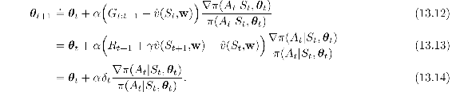
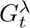

# 13.5  Actor–Critic Methods

Although the REINFORCE-with-baseline method learns both a policy and a state-value function, we do not consider it to be an actor–critic method because its state-value function is used only as a baseline, not as a critic. That is, it is not used for bootstrapping (updating the value estimate for a state from the estimated values of subsequent states), but only as a baseline for the state whose estimate is being updated. This is a useful distinction, for only through bootstrapping do we introduce bias and an asymptotic dependence on the quality of the function approximation. As we have seen, the bias introduced through bootstrapping and reliance on the state representation is often beneficial because it reduces variance and accelerates learning. REINFORCE with baseline is unbiased and will converge asymptotically to a local minimum, but like all Monte Carlo methods it tends to learn slowly (produce estimates of high variance) and to be inconvenient to implement online or for continuing problems. As we have seen earlier in this book, with temporal-difference methods we can eliminate these inconveniences, and through multi-step methods we can flexibly choose the degree of bootstrapping. In order to gain these advantages in the case of policy gradient methods we use actor–critic methods with a bootstrapping critic.

First consider one-step actor–critic methods, the analog of the TD methods introduced in Chapter 6 such as TD(0), Sarsa(0), and Q-learning. The main appeal of one-step methods is that they are fully online and incremental, yet avoid the complexities of eligibility traces. They are a special case of the eligibility trace methods, and not as general, but easier to understand. One-step actor–critic methods replace the full return of REINFORCE ([13.11](part0022_split_004.html#x1-153002r11)) with the one-step return (and use a learned state-value function as the baseline) as follows:

The natural state-value-function learning method to pair with this is semi-gradient TD(0). Pseudocode for the complete algorithm is given in the box on the next page. Note that it is now a fully online, incremental algorithm, with states, actions, and rewards processed as they occur and then never revisited.

**One-step Actor–Critic (episodic), for estimating *π****θ*** ≈ *π*\***

Input: a differentiable policy parameterization *π*(*a*|*s,* ***θ***)

Input: a differentiable state-value function parameterization  (*s,* **w**)

Parameters: step sizes *α****θ*** > 0, *α***w** > 0

Initialize policy parameter ***θ*** ∈ ℝ*d*′ and state-value weights **w** ∈ ℝ*d* (e.g., to **0**)

Loop forever (for each episode):

Initialize *S* (first state of episode)

*I* ← 1

Loop while *S* is not terminal (for each time step):

*A ∼ π*(·|*S,* ***θ***)

Take action *A*, observe *S*′*, R*

*δ* ← *R* + *γ*  (*S*′, **w**) − (*S,* **w**)         (if *S*′ is terminal, then  (*S*′, **w**)≐0)

**w** ← **w** + *α***w** *δ* ∇ (*S,* **w**)

***θ*** ← ***θ*** + *α****θ*** *I δ* ∇ln*π*(*A*|*S,* ***θ***)

*I* ← *γ I*

*S* ← *S*′

The generalizations to the forward view of *n*-step methods and then to a *λ*-return algorithm are straightforward. The one-step return in ([13.12](part0022_split_005.html#x1-154001r12)) is merely replaced by G*t*:*t*+*n* or  respectively. The backward view of the *λ*-return algorithm is also straightforward, using separate eligibility traces for the actor and critic, each after the patterns in Chapter 12. Pseudocode for the complete algorithm is given in the box below.

**Actor–Critic with Eligibility Traces (episodic), for estimating *π****θ*** ≈ *π*\***

Input: a differentiable policy parameterization *π*(*a*|*s,* ***θ***)

Input: a differentiable state-value function parameterization  (*s,* **w**)

Parameters: trace-decay rates *λ****θ*** ∈ [0, 1], *λ***w** ∈ [0, 1]; step sizes *α****θ*** > 0, *α***w** > 0

Initialize policy parameter ***θ*** ∈ ℝ*d*′ and state-value weights **w** ∈ ℝ*d* (e.g., to **0**)

Loop forever (for each episode):

Initialize *S* (first state of episode)

**z*****θ*** ←**0** (*d*′-component eligibility trace vector)

**z****w** ←**0** (*d*-component eligibility trace vector)

*I* ← 1

Loop while *S* is not terminal (for each time step):

*A ∼ π*(·|*S,* ***θ***)

Take action *A*, observe *S*′*, R*

*δ* ← *R* + *γ*  (*S*′, **w**) − (*S,* **w**)         (if *S*′ is terminal, then  (*S*′, **w**)≐0)

**z****w** ← *γ λ***w****z****w** + ∇ (*S,* **w**)

**z*****θ*** ← *γ λ****θ*****z*****θ*** + *I* ∇ln*π*(*A*|*S,* ***θ***)

**w** ← **w** + *α***w** *δ* **z****w**

***θ*** ← ***θ*** + *α****θ*** *δ* **z*****θ***

*I* ← *γ I*

*S* ← *S*′
