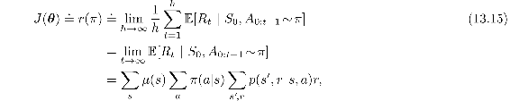
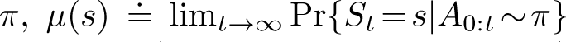
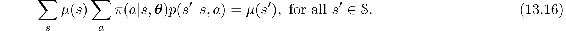
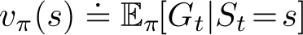
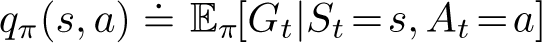
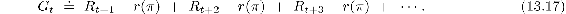
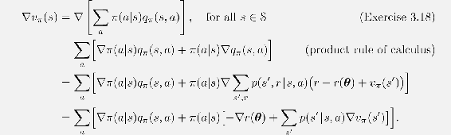
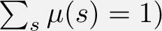
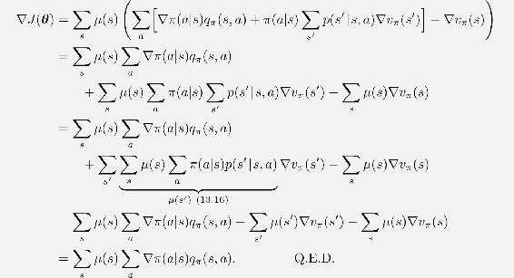

# 13.6  Policy Gradient for Continuing Problems

As discussed in Section 10.3, for continuing problems without episode boundaries we need to define performance in terms of the average rate of reward per time step:

where *μ* is the steady-state distribution under , which is assumed to exist and to be independent of *S*0 (an ergodicity assumption). Remember that this is the special distribution under which, if you select actions according to *π*, you remain in the same distribution:

Complete pseudocode for the actor–critic algorithm in the continuing case (backward view) is given in the box below.

**Actor–Critic with Eligibility Traces (continuing), for estimating *π****θ*** ≈ *π*\***

Input: a differentiable policy parameterization *π*(*a*|*s,* ***θ***)

Input: a differentiable state-value function parameterization  (*s,* **w**)

Algorithm parameters: *λ***w** ∈ [0, 1], *λ****θ*** ∈ [0, 1], *α***w** > 0, *α****θ*** > 0, *α**R* > 0

Initialize *R* ∈ ℝ (e.g., to 0)

Initialize state-value weights **w** ∈ ℝ*d* and policy parameter ***θ*** ∈ ℝ*d*′ (e.g., to **0**)

Initialize *S* ∈𝒮 (e.g., to *s*0)

**z****w** ←**0** (*d*-component eligibility trace vector)

**z*****θ*** ←**0** (*d*′-component eligibility trace vector)

Loop forever (for each time step):

*A ∼ π*(·|*S,* ***θ***)

Take action *A*, observe *S*′*, R*

*δ* ← *R* −*R* +  (*S*′, **w**) − (*S,* **w**)

*R* ←*R* + *α**R* *δ*

**z****w** ← *λ***w****z****w** + ∇ (*S,* **w**)

**z*****θ*** ← *λ****θ*****z*****θ*** + ∇ln*π*(*A*|*S,* ***θ***)

**w** ←**w** + *α***w** *δ* **z****w**

***θ*** ←***θ*** + *α****θ*** *δ* **z*****θ***

*S* ← *S*′

Naturally, in the continuing case, we define values,  and , with respect to the differential return:

With these alternate definitions, the policy gradient theorem as given for the episodic case ([13.5](part0022_split_002.html#x1-151018r5)) remains true for the continuing case. A proof is given in the box on the next page. The forward and backward view equations also remain the same.

**Proof of the Policy Gradient Theorem (continuing case)**

The proof of the policy gradient theorem for the continuing case begins similarly to the episodic case. Again we leave it implicit in all cases that *π* is a function of ***θ*** and that the gradients are with respect to ***θ***. Recall that in the continuing case *J*(***θ***) = *r*(*π*) ([13.15](part0022_split_006.html#x1-155001r15)) and that *vπ* and *qπ* denote values with respect to the differential return ([13.17](part0022_split_006.html#x1-155003r17)). The gradient of the state-value function can be written, for any *s* ∈𝒮, as

After re-arranging terms, we obtain

Notice that the left-hand side can be written ∇*J*(***θ***), and that it does not depend on *s*. Thus the right-hand side does not depend on *s* either, and we can safely sum it over all *s* ∈𝒮, weighted by *μ*(*s*), without changing it (because ):

