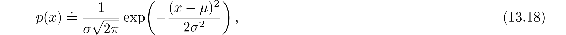
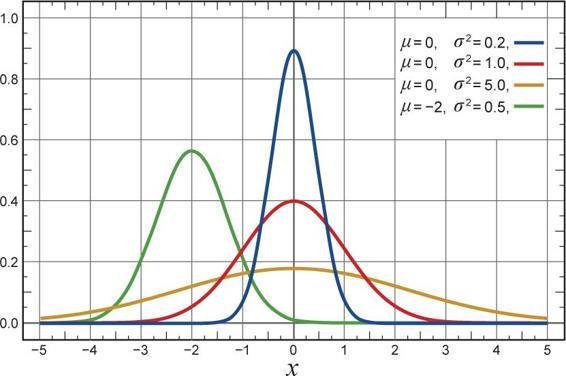
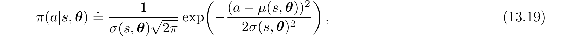
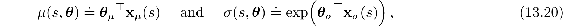
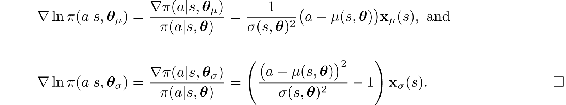

# 13.7  Policy Parameterization for Continuous Actions

Policy-based methods offer practical ways of dealing with large actions spaces, even continuous spaces with an infinite number of actions. Instead of computing learned probabilities for each of the many actions, we instead learn statistics of the probability distribution. For example, the action set might be the real numbers, with actions chosen from a normal (Gaussian) distribution.

The probability density function for the normal distribution is conventionally written

where *μ* and *σ* here are the mean and standard deviation of the normal distribution, and of course *π* here is just the number *π* ≈ 3.14159. The probability density functions for several different means and standard deviations are shown to the right. The value *p*(*x*) is the *density* of the probability at *x*, not the probability. It can be greater than 1; it is the total area under *p*(*x*) that must sum to 1. In general, one can take the integral under *p*(*x*) for any range of *x* values to get the probability of *x* falling within that range.

To produce a policy parameterization, the policy can be defined as the normal probability density over a real-valued scalar action, with mean and standard deviation given by parametric function approximators that depend on the state. That is,

where *μ* : 𝒮× ℝ*d*′ *→* ℝ and *σ* : 𝒮× ℝ*d*′ *→* ℝ+ are two parameterized function approximators. To complete the example we need only give a form for these approximators. For this we divide the policy’s parameter vector into two parts, ***θ*** = [***θ****μ*, ***θ****σ*]⊤, one part to be used for the approximation of the mean and one part for the approximation of the standard deviation. The mean can be approximated as a linear function. The standard deviation must always be positive and is better approximated as the exponential of a linear function. Thus

where **x***μ*(*s*) and **x***σ*(*s*) are state feature vectors perhaps constructed by one of the methods described in Chapter 9. With these definitions, all the algorithms described in the rest of this chapter can be applied to learn to select real-valued actions.

*Exercise 13.4* Show that for the gaussian policy parameterization ([13.19](part0022_split_007.html#x1-156002r19)) the eligibility vector has the following two parts:

*Exercise 13.5* A *Bernoulli-logistic unit* is a stochastic neuron-like unit used in some ANNs (Section 9.7). Its input at time *t* is a feature vector **x**(*S**t*); its output, *A**t*, is a random variable having two values, 0 and 1, with Pr{*A**t* = 1} = P*t* and Pr{*A**t* = 0} = 1 – *P**t* (the Bernoulli distribution). Let *h*(*s,* 0, ***θ***) and *h*(*s,* 1, ***θ***) be the preferences in state *s* for the unit’s two actions given policy parameter ***θ***. Assume that the difference between the action preferences is given by a weighted sum of the unit’s input vector, that is, assume that *h*(*s,* 1, ***θ***) − *h*(*s,* 0, ***θ***) = ***θ***⊤**x**(*s*), where ***θ*** is the unit’s weight vector.

> (a) Show that if the exponential soft-max distribution ([13.2](part0022_split_001.html#x1-150001r2)) is used to convert action preferences to policies, then *P**t* = *π*(1|*S**t*, ***θ****t*) = 1/(1 + exp(−***θ****t*⊤**x**(*S**t*))) (the logistic function).
>
> (b) What is the Monte-Carlo REINFORCE update of ***θ****t* to ***θ****t*+1 upon receipt of return G*t*?
>
> (c) Express the eligibility ∇ln*π*(*a*|*s,* ***θ***) for a Bernoulli-logistic unit, in terms of *a*, **x**(*s*), and *π*(*a*|*s,* ***θ***) by calculating the gradient.

Hint: separately for each action compute the derivative of the logarithm first with respect to *P**t* = *π*(*a*|*s,* ***θ****t*), combine the two results into one expression that depends on *a* and *P**t*, and then use the chain rule, noting that the derivative of the logistic function *f*(*x*) is *f*(*x*)(1 − *f*(*x*)).

□
