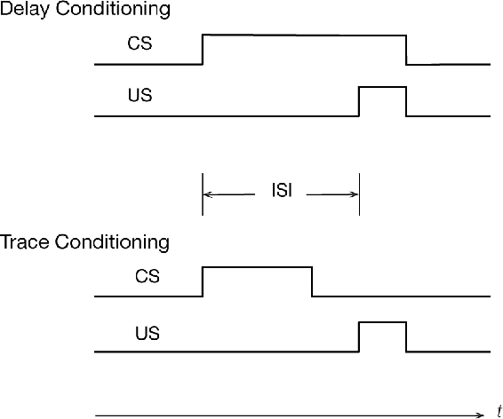

# 14.2  Classical Conditioning

While studying the activity of the digestive system, the celebrated Russian physiologist Ivan Pavlov found that an animal’s innate responses to certain triggering stimuli can come to be triggered by other stimuli that are quite unrelated to the inborn triggers. His experimental subjects were dogs that had undergone minor surgery to allow the intensity of their salivary reflex to be accurately measured. In one case he describes, the dog did not salivate under most circumstances, but about 5 seconds after being presented with food it produced about six drops of saliva over the next several seconds. After several repetitions of presenting another stimulus, one not related to food, in this case the sound of a metronome, shortly before the introduction of food, the dog salivated in response to the sound of the metronome in the same way it did to the food. “The activity of the salivary gland has thus been called into play by impulses of sound—a stimulus quite alien to food” (Pavlov, 1927, p. 22). Summarizing the significance of this finding, Pavlov wrote:

> It is pretty evident that under natural conditions the normal animal must respond not only to stimuli which themselves bring immediate benefit or harm, but also to other physical or chemical agencies—waves of sound, light, and the like—which in themselves only *signal* the approach of these stimuli; though it is not the sight and sound of the beast of prey which is in itself harmful to the smaller animal, but its teeth and claws. (Pavlov, 1927, p. 14)

Connecting new stimuli to innate reflexes in this way is now called classical, or Pavlovian, conditioning. Pavlov (or more exactly, his translators) called inborn responses (e.g., salivation in his demonstration described above) “unconditioned responses” (URs), their natural triggering stimuli (e.g., food) “unconditioned stimuli” (USs), and new responses triggered by predictive stimuli (e.g., here also salivation) “conditioned responses” (CRs). A stimulus that is initially neutral, meaning that it does not normally elicit strong responses (e.g., the metronome sound), becomes a “conditioned stimulus” (CS) as the animal learns that it predicts the US and so comes to produce a CR in response to the CS. These terms are still used in describing classical conditioning experiments (though better translations would have been “conditional” and “unconditional” instead of conditioned and unconditioned). The US is called a reinforcer because it reinforces producing a CR in response to the CS.

The arrangement of stimuli in two common types of classical conditioning experiments is shown to the right. In *delay conditioning*, the CS extends throughout the interstimulus interval, or ISI, which is the time interval between the CS onset and the US onset (with the CS ending when the US ends in a common version shown here). In *trace conditioning*, the US begins after the CS ends, and the time interval between CS offset and US onset is called the trace interval.

The salivation of Pavlov’s dogs to the sound of a metronome is just one example of classical conditioning, which has been intensively studied across many response systems of many species of animals. URs are often preparatory in some way, like the salivation of Pavlov’s dog, or protective in some way, like an eye blink in response to something irritating to the eye, or freezing in response to seeing a predator. Experiencing the CS-US predictive relationship over a series of trials causes the animal to learn that the CS predicts the US so that the animal can respond to the CS with a CR that prepares the animal for, or protects it from, the predicted US. Some CRs are similar to the UR but begin earlier and differ in ways that increase their effectiveness. In one intensively studied type of experiment, for example, a tone CS reliably predicts a puff of air (the US) to a rabbit’s eye, triggering a UR consisting of the closure of a protective inner eyelid called the nictitating membrane. After one or more trials, the tone comes to trigger a CR consisting of membrane closure that begins before the air puff and eventually becomes timed so that peak closure occurs just when the air puff is likely to occur. This CR, being initiated in anticipation of the air puff and appropriately timed, offers better protection than simply initiating closure as a reaction to the irritating US. The ability to act in anticipation of important events by learning about predictive relationships among stimuli is so beneficial that it is widely present across the animal kingdom.
