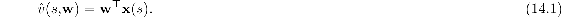
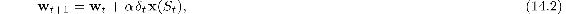
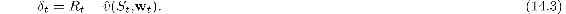

## 14.2.2  The Rescorla–Wagner Model

Rescorla and Wagner created their model mainly to account for blocking. The core idea of the Rescorla–Wagner model is that an animal only learns when events violate its expectations, in other words, only when the animal is surprised (although without necessarily implying any *conscious* expectation or emotion). We first present Rescorla and Wagner’s model using their terminology and notation before shifting to the terminology and notation we use to describe the TD model.

Here is how Rescorla and Wagner described their model. The model adjusts the “associative strength” of each component stimulus of a compound CS, which is a number representing how strongly or reliably that component is predictive of a US. When a compound CS consisting of several component stimuli is presented in a classical conditioning trial, the associative strength of each component stimulus changes in a way that depends on an associative strength associated with the entire stimulus compound, called the “aggregate associative strength,” and not just on the associative strength of each component itself.

Rescorla and Wagner considered a compound CS AX, consisting of component stimuli A and X, where the animal may have already experienced stimulus A, and stimulus X might be new to the animal. Let *V*A, *V*X, and *V*AX respectively denote the associative strengths of stimuli A, X, and the compound AX. Suppose that on a trial the compound CS AX is followed by a US, which we label stimulus Y. Then the associative strengths of the stimulus components change according to these expressions:

where *α*A*β*Y and *α*X*β*Y are the step-size parameters, which depend on the identities of the CS components and the US, and *R*Y is the asymptotic level of associative strength that the US Y can support. (Rescorla and Wagner used *λ* here instead of *R*, but we use *R* to avoid confusion with our use of *λ* and because we usually think of this as the magnitude of a reward signal, with the caveat that the US in classical conditioning is not necessarily rewarding or penalizing.) A key assumption of the model is that the aggregate associative strength *V*AX is equal to *V*A + *V*X. The associative strengths as changed by these Δs become the associative strengths at the beginning of the next trial.

To be complete, the model needs a response-generation mechanism, which is a way of mapping values of *V*s to CRs. Because this mapping would depend on details of the experimental situation, Rescorla and Wagner did not specify a mapping but simply assumed that larger *V*s would produce stronger or more likely CRs, and that negative *V*s would mean that there would be no CRs.

The Rescorla–Wagner model accounts for the acquisition of CRs in a way that explains blocking. As long as the aggregate associative strength, *V*AX, of the stimulus compound is below the asymptotic level of associative strength, *R*Y, that the US Y can support, the prediction error *R*Y− *V*AX is positive. This means that over successive trials the associative strengths *V*A and *V*X of the component stimuli increase until the aggregate associative strength *V*AX equals *R*Y, at which point the associative strengths stop changing (unless the US changes). When a new component is added to a compound CS to which the animal has already been conditioned, further conditioning with the augmented compound produces little or no increase in the associative strength of the added CS component because the error has already been reduced to zero, or to a low value. The occurrence of the US is already predicted nearly perfectly, so little or no error—or surprise—is introduced by the new CS component. Prior learning blocks learning to the new component.

To transition from Rescorla and Wagner’s model to the TD model of classical conditioning (which we just call the TD model), we first recast their model in terms of the concepts that we are using throughout this book. Specifically, we match the notation we use for learning with linear function approx. (Section 9.4), and we think of the conditioning process as one of learning to predict the “magnitude of the US” on a trial on the basis of the compound CS presented on that trial, where the magnitude of a US Y is the *R*Y of the Rescorla–Wagner model as given above. We also introduce states. Because the Rescorla–Wagner model is a *trial-level* model, meaning that it deals with how associative strengths change from trial to trial without considering any details about what happens within and between trials, we do not have to consider how states change during a trial until we present the full TD model in the following section. Instead, here we simply think of a state as a way of labeling a trial in terms of the collection of component CSs that are present on the trial.

Therefore, assume that trial-type, or state, *s* is described by a real-valued vector of features x(*s*) = (*x*1(*s*),*x*2(*s*),...,*xd*(*s*))⊤ where *x**i*(*s*) = 1 if CS*i*, the *i*th component of a compound CS, is present on the trial and 0 otherwise. Then if the *d*-dimensional vector of associative strengths is **w**, the aggregate associative strength for trial-type *s* is

This corresponds to a *value estimate* in reinforcement learning, and we think of it as the *US prediction*.

Now temporally let *t* denote the number of a complete trial and not its usual meaning as a time step (we revert to *t*’s usual meaning when we extend this to the TD model below), and assume that *S**t* is the state corresponding to trial *t*. Conditioning trial *t* updates the associative strength vector **w***t* to **w***t*+1 as follows:

where *α* is the step-size parameter, and—because here we are describing the Rescorla–Wagner model—*δ**t* is the *prediction error*

*R**t* is the target of the prediction on trial *t*, that is, the magnitude of the US, or in Rescorla and Wagner’s terms, the associative strength that the US on the trial can support. Note that because of the factor **x**(*S**t*) in ([14.2](part0024_split_004.html#x1-164002r2)), only the associative strengths of CS components present on a trial are adjusted as a result of that trial. You can think of the prediction error as a measure of surprise, and the aggregate associative strength as the animal’s expectation that is violated when it does not match the target US magnitude.

From the perspective of machine learning, the Rescorla–Wagner model is an error-correction supervised learning rule. It is essentially the same as the Least Mean Square (LMS), or Widrow-Hoff, learning rule (Widrow and Hoff, 1960) that finds the weights—here the associative strengths—that make the average of the squares of all the errors as close to zero as possible. It is a “curve-fitting,” or regression, algorithm that is widely used in engineering and scientific applications (see Section 9.4).[3](part0024_split_013.html#fn3x17)

The Rescorla–Wagner model was very influential in the history of animal learning theory because it showed that a “mechanistic” theory could account for the main facts about blocking without resorting to more complex cognitive theories involving, for example, an animal’s explicit recognition that another stimulus component had been added and then scanning its short-term memory backward to reassess the predictive relationships involving the US. The Rescorla–Wagner model showed how traditional contiguity theories of conditioning—that temporal contiguity of stimuli was a necessary and sufficient condition for learning—could be adjusted in a simple way to account for blocking (Moore and Schmajuk, 2008).

The Rescorla–Wagner model provides a simple account of blocking and some other features of classical conditioning, but it is not a complete or perfect model of classical conditioning. Different ideas account for a variety of other observed effects, and progress is still being made toward understanding the many subtleties of classical conditioning. The TD model, which we describe next, though also not a complete or perfect model model of classical conditioning, extends the Rescorla–Wagner model to address how within-trial and between-trial timing relationships among stimuli can influence learning and how higher-order conditioning might arise.
