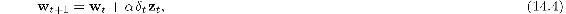
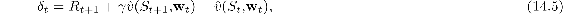
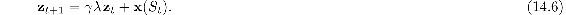

## 14.2.3  The TD Model

The TD model is a *real-time* model, as opposed to a trial-level model like the Rescorla–Wagner model. A single step *t* in the Rescorla–Wagner model represents an entire conditioning trial. The model does not apply to details about what happens during the time a trial is taking place, or what might happen between trials. Within each trial an animal might experience various stimuli whose onsets occur at particular times and that have particular durations. These timing relationships strongly influence learning. The Rescorla–Wagner model also does not include a mechanism for higher-order conditioning, whereas for the TD model, higher-order conditioning is a natural consequence of the bootstrapping idea that is at the base of TD algorithms.

To describe the TD model we begin with the formulation of the Rescorla–Wagner model above, but *t* now labels time steps within or between trials instead of complete trials. Think of the time between *t* and *t* + 1 as a small time interval, say.01 second, and think of a trial as a sequences of states, one associated with each time step, where the state at step *t* now represents details of how stimuli are represented at *t* instead of just a label for the CS components present on a trial. In fact, we can completely abandon the idea of trials. From the point of view of the animal, a trial is just a fragment of its continuing experience interacting with its world. Following our usual view of an agent interacting with its environment, imagine that the animal is experiencing an endless sequence of states *s*, each represented by a feature vector **x**(*s*). That said, it is still often convenient to refer to trials as fragments of time during which patterns of stimuli repeat in an experiment.

State features are not restricted to describing the external stimuli that an animal experiences; they can describe neural activity patterns that external stimuli produce in an animal’s brain, and these patterns can be history-dependent, meaning that they can be persistent patterns produced by sequences of external stimuli. Of course, we do not know exactly what these neural activity patterns are, but a real-time model like the TD model allows one to explore the consequences on learning of different hypotheses about the internal representations of external stimuli. For these reasons, the TD model does not commit to any particular state representation. In addition, because the TD model includes discounting and eligibility traces that span time intervals between stimuli, the model also makes it possible to explore how discounting and eligibility traces interact with stimulus representations in making predictions about the results of classical conditioning experiments.

Below we describe some of the state representations that have been used with the TD model and some of their implications, but for the moment we stay agnostic about the representation and just assume that each state *s* is represented by a feature vector x(*s*) = (*x*1(*s*), *x*2(*s*),..., *xn*(*s*))⊤. Then the aggregate associative strength corresponding to a state *s* is given by ([14.1](part0024_split_004.html#x1-164001r1)), the same as for the Rescorla-Wgner model, but the TD model updates the associative strength vector, **w**, differently. With *t* now labeling a time step instead of a complete trial, the TD model governs learning according to this update:

which replaces **x***t*(*S**t*) in the Rescorla–Wagner update ([14.2](part0024_split_004.html#x1-164002r2)) with **z***t*, a vector of eligibility traces, and instead of the *δ**t* of ([14.3](part0024_split_004.html#x1-164003r3)), here *δ**t* is a TD error:

where *γ* is a discount factor (between 0 and 1), *R**t* is the prediction target at time *t*, and  (*S**t*+1, **w***t*) and  (*S**t*, **w***t*) are aggregate associative strengths at *t* + 1 and *t* as defined by ([14.1](part0024_split_004.html#x1-164001r1)).

Each component *i* of the eligibility-trace vector **z***t* increments or decrements according to the component *x**i*(*S**t*) of the feature vector **x**(*S**t*), and otherwise decays with a rate determined by *γλ*:

Here *λ* is the usual eligibility trace decay parameter.

Note that if *γ* = 0, the TD model reduces to the Rescorla–Wagner model with the exceptions that: the meaning of *t* is different in each case (a trial number for the Rescorla–Wagner model and a time step for the TD model), and in the TD model there is a one-time-step lead in the prediction target *R*. The TD model is equivalent to the backward view of the semi-gradient TD(*λ*) algorithm with linear function approx. (Chapter 12), except that *R**t* in the model does not have to be a reward signal as it does when the TD algorithm is used to learn a value function for policy-improvement.
