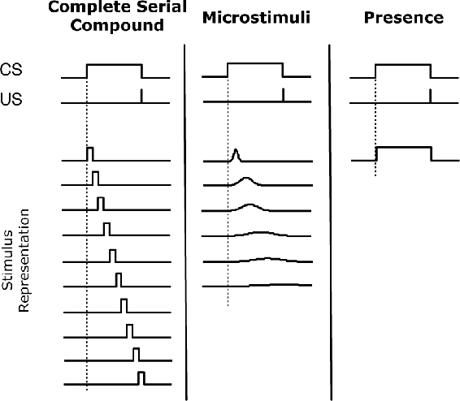
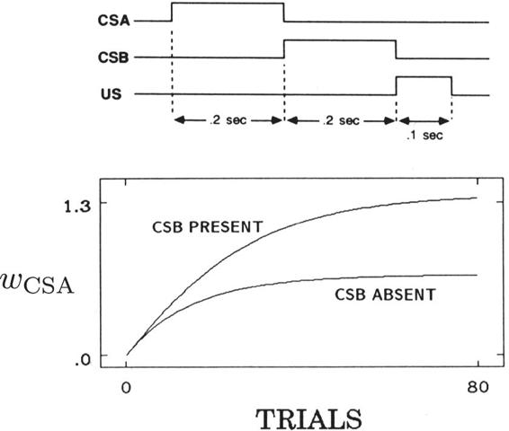
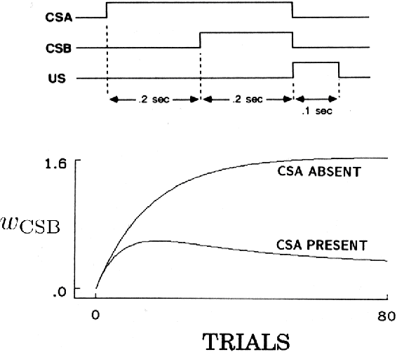
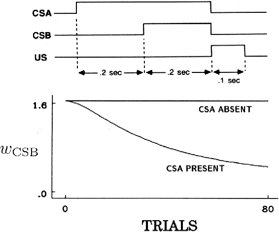
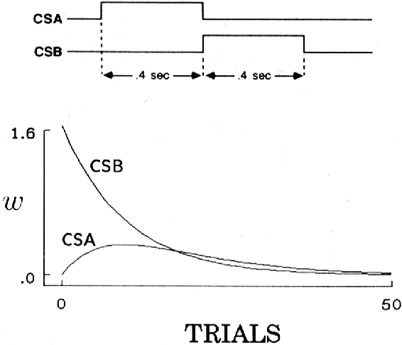
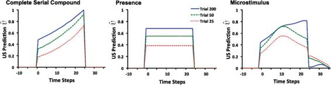

## 14.2.4  TD Model Simulations

Real-time conditioning models like the TD model are interesting primarily because they make predictions for a wide range of situations that cannot be represented by trial-level models. These situations involve the timing and durations of conditionable stimuli, the timing of these stimuli in relation to the timing of the US, and the timing and shapes of CRs. For example, the US generally must begin after the onset of a neutral stimulus for conditioning to occur, with the rate and effectiveness of learning depending on the inter-stimulus interval, or ISI, the interval between the onsets of the CS and the US. When CRs appear, they generally begin before the appearance of the US and their temporal profiles change during learning. In conditioning with compound CSs, the component stimuli of the compound CSs may not all begin and end at the same time, sometimes forming what is called a *serial compound* in which the component stimuli occur in a sequence over time. Timing considerations like these make it important to consider how stimuli are represented, how these representations unfold over time during and between trials, and how they interact with discounting and eligibility traces.

[Figure 14.1](part0024_split_006.html#fig14-1) shows three of the stimulus representations that have been used in exploring the behavior of the TD model: the *complete serial compound* (CSC), the *microstimulus* (MS), and the *presence* representations (Ludvig, Sutton, and Kehoe, 2012). These representations differ in the degree to which they force generalization among nearby time points during which a stimulus is present.

[Figure 14.1](part0024_split_006.html#C_fig14-1): Three stimulus representations (in columns) sometimes used with the TD model. Each row represents one element of the stimulus representation. The three representations vary along a temporal generalization gradient, with no generalization between nearby time points in the complete serial compound (left column) and complete generalization between nearby time points in the presence representation (right column). The microstimulus representation occupies a middle ground. The degree of temporal generalization determines the temporal granularity with which US predictions are learned. Adapted with minor changes from *Learning & Behavior*, Evaluating the TD Model of Classical Conditioning, volume 40, 2012, p. 311, E. A. Ludvig, R. S. Sutton, E. J. Kehoe. With permission of Springer.

The simplest of the representations shown in [Figure 14.1](part0024_split_006.html#fig14-1) is the presence representation in the figure’s right column. This representation has a single feature for each component CS present on a trial, where the feature has value 1 whenever that component is present, and 0 otherwise.[4](part0024_split_013.html#fn4x17) The presence representation is not a realistic hypothesis about how stimuli are represented in an animal’s brain, but as we describe below, the TD model with this representation can produce many of the timing phenomena seen in classical conditioning.

For the CSC representation (left column of [Figure 14.1](part0024_split_006.html#fig14-1)), the onset of each external stimulus initiates a sequence of precisely-timed short-duration internal signals that continues until the external stimulus ends.[5](part0024_split_013.html#fn5x17) This is like assuming the animal’s nervous system has a clock that keeps precise track of time during stimulus presentations; it is what engineers call a “tapped delay line.” Like the presence representation, the CSC representation is unrealistic as a hypothesis about how the brain internally represents stimuli, but Ludvig et al. (2012) call it a “useful fiction” because it can reveal details of how the TD model works when relatively unconstrained by the stimulus representation. The CSC representation is also used in most TD models of dopamine-producing neurons in the brain, a topic we take up in Chapter 15. The CSC representation is often viewed as an essential part of the TD model, although this view is mistaken.

The MS representation (center column of [Figure 14.1](part0024_split_006.html#fig14-1)) is like the CSC representation in that each external stimulus initiates a cascade of internal stimuli, but in this case the internal stimuli—the microstimuli—are not of such limited and non-overlapping form; they are extended over time and overlap. As time elapses from stimulus onset, different sets of microstimuli become more or less active, and each subsequent microstimulus becomes progressively wider in time and reaches a lower maximal level. Of course, there are many MS representations depending on the nature of the microstimuli, and a number of examples of MS representations have been studied in the literature, in some cases along with proposals for how an animal’s brain might generate them (see the Bibliographic and Historical Comments at the end of this chapter). MS representations are more realistic than the presence or CSC representations as hypotheses about neural representations of stimuli, and they allow the behavior of the TD model to be related to a broader collection of phenomena observed in animal experiments. In particular, by assuming that cascades of microstimuli are initiated by USs as well as by CSs, and by studying the significant effects on learning of interactions between microstimuli, eligibility traces, and discounting, the TD model is helping to frame hypotheses to account for many of the subtle phenomena of classical conditioning and how an animal’s brain might produce them. We say more about this below, particularly in Chapter 15 where we discuss reinforcement learning and neuroscience.

Even with the simple presence representation, however, the TD model produces all the basic properties of classical conditioning that are accounted for by the Rescorla–Wagner model, plus features of conditioning that are beyond the scope of trial-level models. For example, as we have already mentioned, a conspicuous feature of classical conditioning is that the US generally must begin *after* the onset of a neutral stimulus for conditioning to occur, and that after conditioning, the CR begins *before* the appearance of the US. In other words, conditioning generally requires a positive ISI, and the CR generally anticipates the US. How the strength of conditioning (e.g., the percentage of CRs elicited by a CS) depends on the ISI varies substantially across species and response systems, but it typically has the following properties: it is negligible for a zero or negative ISI, i.e., when the US onset occurs simultaneously with, or earlier than, the CS onset (although research has found that associative strengths sometimes increase slightly or become negative with negative ISIs); it increases to a maximum at a positive ISI where conditioning is most effective; and it then decreases to zero after an interval that varies widely with response systems. The precise shape of this dependency for the TD model depends on the values of its parameters and details of the stimulus representation, but these basic features of ISI-dependency are core properties of the TD model.

Facilitation of remote associations in the TD model

One of the theoretical issues arising with serial-compound conditioning, that is, conditioning with a compound CS whose components occur in a sequence, concerns the facilitation of remote associations. It has been found that if the empty trace interval between a first CS (CSA) and the US is filled with a second CS (CSB) to form a serial-compound stimulus, then conditioning to CSA is facilitated. Shown to the right is the behavior of the TD model with the presence representation in a simulation of such an experiment whose timing details are shown above. Consistent with the experimental results (Kehoe, 1982), the model shows facilitation of both the rate of conditioning and the asymptotic level of conditioning of the first CS due to the presence of the second CS.

The Egger-Miller effect in the TD model

A well-known demonstration of the effects on conditioning of temporal relationships among stimuli within a trial is an experiment by Egger and Miller (1962) that involved two overlapping CSs in a delay configuration as shown to the right (top). Although CSB was in a better temporal relationship with the US, the presence of CSA substantially reduced conditioning to CSB as compared to controls in which CSA was absent. Directly to the right is shown the same result being generated by the TD model in a simulation of this experiment with the presence representation.

The TD model accounts for blocking because it is an error-correcting learning rule like the Rescorla–Wagner model. Beyond accounting for basic blocking results, however, the TD model predicts (with the presence representation and more complex representations as well) that blocking is reversed if the blocked stimulus is moved earlier in time so that its onset occurs before the onset of the blocking stimulus (like CSA in the diagram to the right). This feature of the TD model’s behavior deserves attention because it had not been observed at the time of the model’s introduction. Recall that in blocking, if an animal has already learned that one CS predicts a US, then learning that a newly-added second CS also predicts the US is much reduced, i.e., is blocked. But if the newly-added second CS begins earlier than the pretrained CS, then—according to the TD model—learning to the newly-added CS is not blocked. In fact, as training continues and the newly-added CS gains associative strength, the pretrained CS loses associative strength. The behavior of the TD model under these conditions is shown in the lower part of [Figure 14.2](part0024_split_006.html#fig14-2). This simulation experiment differed from the Egger-Miller experiment (bottom of the preceding page) in that the shorter CS with the later onset was given prior training until it was fully associated with the US. This surprising prediction led Kehoe, Schreurs, and Graham (1987) to conduct the experiment using the well-studied rabbit nictitating membrane preparation. Their results confirmed the model’s prediction, and they noted that non-TD models have considerable difficulty explaining their data.

[Figure 14.2](part0024_split_006.html#C_fig14-2): Temporal primacy overriding blocking in the TD model.

With the TD model, an earlier predictive stimulus takes precedence over a later predictive stimulus because, like all the prediction methods described in this book, the TD model is based on the backing-up or bootstrapping idea: updates to associative strengths shift the strengths at a particular state toward the strength at later states. Another consequence of bootstrapping is that the TD model provides an account of higher-order conditioning, a feature of classical conditioning that is beyond the scope of the Rescoral-Wagner and similar models. As we described above, higher-order conditioning is the phenomenon in which a previously-conditioned CS can act as a US in conditioning another initially neutral stimulus. [Figure 14.3](part0024_split_006.html#fig14-3) shows the behavior of the TD model (again with the presence representation) in a higher-order conditioning experiment—in this case it is second-order conditioning. In the first phase (not shown in the figure), CSB is trained to predict a US so that its associative strength increases, here to 1.65. In the second phase, CSA is paired with CSB in the absence of the US, in the sequential arrangement shown at the top of the figure. CSA acquires associative strength even though it is never paired with the US. With continued training, CSA’s associative strength reaches a peak and then decreases because the associative strength of CSB, the secondary reinforcer, decreases so that it loses its ability to provide secondary reinforcement. CSB’s associative strength decreases because the US does not occur in these higher-order conditioning trials. These are *extinction trials* for CSB because its predictive relationship to the US is disrupted so that its ability to act as a reinforcer decreases. This same pattern is seen in animal experiments. This extinction of conditioned reinforcement in higher-order conditioning trials makes it difficult to demonstrate higher-order conditioning unless the original predictive relationships are periodically refreshed by occasionally inserting first-order trials.

[Figure 14.3](part0024_split_006.html#C_fig14-3): Second-order conditioning with the TD model.

The TD model produces an analog of second- and higher-order conditioning because *γ*  (*S**t*+1, **w***t*) − (*S**t*, **w***t*) appears in the TD error *δ**t* ([14.5](part0024_split_005.html#x1-165002r5)). This means that as a result of previous learning, *γ*  (*S**t*+1, **w***t*) can differ from  (*S**t*, **w***t*), making *δ**t* non-zero (a temporal difference). This difference has the same status as *R**t*+1 in ([14.5](part0024_split_005.html#x1-165002r5)), implying that as far as learning is concerned there is no difference between a temporal difference and the occurrence of a US. In fact, this feature of the TD algorithm is one of the major reasons for its development, which we now understand through its connection to dynamic programming as described in Chapter 6. Bootstrapping values is intimately related to second-order, and higher-order, conditioning.

In the examples of the TD model’s behavior described above, we examined only the changes in the associative strengths of the CS components; we did not look at what the model predicts about properties of an animal’s conditioned responses (CRs): their timing, shape, and how they develop over conditioning trials. These properties depend on the species, the response system being observed, and parameters of the conditioning trials, but in many experiments with different animals and different response systems, the magnitude of the CR, or the probability of a CR, increases as the expected time of the US approaches. For example, in classical conditioning of a rabbit’s nictitating membrane response that we mentioned above, over conditioning trials the delay from CS onset to when the nictitating membrane begins to move across the eye decreases over trials, and the amplitude of this anticipatory closure gradually increases over the interval between the CS and the US until the membrane reaches maximal closure at the expected time of the US. The timing and shape of this CR is critical to its adaptive significance—covering the eye too early reduces vision (even though the nictitating membrane is translucent), while covering it too late is of little protective value. Capturing CR features like these is challenging for models of classical conditioning.

The TD model does not include as part of its definition any mechanism for translating the time course of the US prediction,  (*S**t*, **w***t*), into a profile that can be compared with the properties of an animal’s CR. The simplest choice is to let the time course of a simulated CR equal the time course of the US prediction. In this case, features of simulated CRs and how they change over trials depend only on the stimulus representation chosen and the values of the model’s parameters *α*, *γ*, and *λ*.

[Figure 14.4](part0024_split_006.html#fig14-4) shows the time courses of US predictions at different points during learning with the three representations shown in [Figure 14.1](part0024_split_006.html#fig14-1). For these simulations the US occurred 25 time steps after the onset of the CS, and *α* =.05, *λ* =.95 and *γ* =.97. With the CSC representation ([Figure 14.4](part0024_split_006.html#fig14-4) left), the curve of the US prediction formed by the TD model increases exponentially throughout the interval between the CS and the US until it reaches a maximum exactly when the US occurs (at time step 25). This exponential increase is the result of discounting in the TD model learning rule. With the presence representation ([Figure 14.4](part0024_split_006.html#fig14-4) middle), the US prediction is nearly constant while the stimulus is present because there is only one weight, or associative strength, to be learned for each stimulus. Consequently, the TD model with the presence representation cannot recreate many features of CR timing. With an MS representation ([Figure 14.4](part0024_split_006.html#fig14-4) right), the development of the TD model’s US prediction is more complicated. After 200 trials the prediction’s profile is a reasonable approximation of the US prediction curve produced with the CSC representation.

[Figure 14.4](part0024_split_006.html#C_fig14-4): Time course of US prediction over the course of acquisition for the TD model with three different stimulus representations. Left: With the complete serial compound (CSC), the US prediction increases exponentially through the interval, peaking at the time of the US. At asymptote (trial 200), the US prediction peaks at the US intensity (1 in these simulations). Middle: With the presence representation, the US prediction converges to an almost constant level. This constant level is determined by the US intensity and the length of the CS–US interval. Right: With the microstimulus representation, at asymptote, the TD model approximates the exponentially increasing time course depicted with the CSC through a linear combination of the different microstimuli. Adapted with minor changes from *Learning & Behavior,* Evaluating the TD Model of Classical Conditioning, volume 40, 2012, E. A. Ludvig, R. S. Sutton, E. J. Kehoe. With permission of Springer.

The US prediction curves shown in [Figure 14.4](part0024_split_006.html#fig14-4) were not intended to precisely match profiles of CRs as they develop during conditioning in any particular animal experiment, but they illustrate the strong influence that the stimulus representation has on predictions derived from the TD model. Further, although we can only mention it here, how the stimulus representation interacts with discounting and eligibility traces is important in determining properties of the US prediction profiles produced by the TD model. Another dimension beyond what we can discuss here is the influence of different response-generation mechanisms that translate US predictions into CR profiles; the profiles shown in [Figure 14.4](part0024_split_006.html#fig14-4) are “raw” US prediction profiles. Even without any special assumption about how an animal’s brain might produce overt responses from US predictions, however, the profiles in [Figure 14.4](part0024_split_006.html#fig14-4) for the CSC and MS representations increase as the time of the US approaches and reach a maximum at the time of the US, as is seen in many animal conditioning experiments.

The TD model, when combined with particular stimulus representations and response-generation mechanisms, is able to account for a surprisingly wide range of phenomena observed in animal classical conditioning experiments, but it is far from being a perfect model. To generate other details of classical conditioning the model needs to be extended, perhaps by adding model-based elements and mechanisms for adaptively altering some of its parameters. Other approaches to modeling classical conditioning depart significantly from the Rescorla–Wagner-style error-correction process. Bayesian models, for example, work within a probabilistic framework in which experience revises probability estimates. All of these models usefully contribute to our understanding of classical conditioning.

Perhaps the most notable feature of the TD model is that it is based on a theory—the theory we have described in this book—that suggests an account of what an animal’s nervous system is *trying to do* while undergoing conditioning: it is trying to form accurate *long-term predictions*, consistent with the limitations imposed by the way stimuli are represented and how the nervous system works. In other words, it suggests a *normative account* of classical conditioning in which long-term, instead of immediate, prediction is a key feature.

The development of the TD model of classical conditioning is one instance in which the explicit goal was to model some of the details of animal learning behavior. In addition to its standing as an *algorithm*, then, TD learning is also the basis of this *model* of aspects of biological learning. As we discuss in Chapter 15, TD learning has also turned out to underlie an influential model of the activity of neurons that produce dopamine, a chemical in the brain of mammals that is deeply involved in reward processing. These are instances in which reinforcement learning theory makes detailed contact with animal behavioral and neural data.

We now turn to considering correspondences between reinforcement learning and animal behavior in instrumental conditioning experiments, the other major type of laboratory experiment studied by animal learning psychologists.
