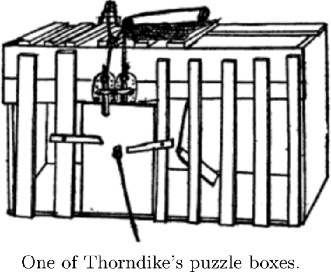

# 14.3  Instrumental Conditioning

In *instrumental conditioning* experiments learning depends on the consequences of behavior: the delivery of a reinforcing stimulus is contingent on what the animal does. In classical conditioning experiments, in contrast, the reinforcing stimulus—the US—is delivered independently of the animal’s behavior. Instrumental conditioning is usually considered to be the same as *operant conditioning*, the term B. F. Skinner (1938, 1963) introduced for experiments with behavior-contingent reinforcement, though the experiments and theories of those who use these two terms differ in a number of ways, some of which we touch on below. We will exclusively use the term instrumental conditioning for experiments in which reinforcement is contingent upon behavior. The roots of instrumental conditioning go back to experiments performed by the American psychologist Edward Thorndike one hundred years before publication of the first edition of this book.

Thorndike observed the behavior of cats when they were placed in “puzzle boxes,” such as the one at the right, from which they could escape by appropriate actions. For example, a cat could open the door of one box by performing a sequence of three separate actions: depressing a platform at the back of the box, pulling a string by clawing at it, and pushing a bar up or down. When first placed in a puzzle box, with food visible outside, all but a few of Thorndike’s cats displayed “evident signs of discomfort” and extraordinarily vigorous activity “to strive instinctively to escape from confinement” (Thorndike, 1898).

Reprinted from Thorndike, Animal Intelligence: An Experimental Study of the Associative Processes in Animals, *The Psychological Review, Series of Monograph Supplements* II(4), Macmillan, New York, 1898.

In experiments with different cats and boxes with different escape mechanisms, Thorndike recorded the amounts of time each cat took to escape over multiple experiences in each box. He observed that the time almost invariably decreased with successive experiences, for example, from 300 seconds to 6 or 7 seconds. He described cats’ behavior in a puzzle box like this:

> The cat that is clawing all over the box in her impulsive struggle will probably claw the string or loop or button so as to open the door. And gradually all the other non-successful impulses will be stamped out and the particular impulse leading to the successful act will be stamped in by the resulting pleasure, until, after many trials, the cat will, when put in the box, immediately claw the button or loop in a definite way. (Thorndike 1898, p. 13)

These and other experiments (some with dogs, chicks, monkeys, and even fish) led Thorndike to formulate a number of “laws” of learning, the most influential being the *Law of Effect*, a version of which we quoted in Chapter 1. This law describes what is generally known as learning by trial and error. As mentioned in Chapter 1, many aspects of the Law of Effect have generated controversy, and its details have been modified over the years. Still the law—in one form or another—expresses an enduring principle of learning.

Essential features of reinforcement learning algorithms correspond to features of animal learning described by the Law of Effect. First, reinforcement learning algorithms are *selectional*, meaning that they try alternatives and select among them by comparing their consequences. Second, reinforcement learning algorithms are *associative*, meaning that the alternatives found by selection are associated with particular situations, or states, to form the agent’s policy. Like learning described by the Law of Effect, reinforcement learning is not just the process of *finding* actions that produce a lot of reward, but also of *connecting* these actions to situations or states. Thorndike used the phrase learning by “selecting and connecting” (Hilgard, 1956). Natural selection in evolution is a prime example of a selectional process, but it is not associative (at least as it is commonly understood); supervised learning is associative, but it is not selectional because it relies on instructions that directly tell the agent how to change its behavior.

In computational terms, the Law of Effect describes an elementary way of combining *search* and *memory*: search in the form of trying and selecting among many actions in each situation, and memory in the form of associations linking situations with the actions found—so far—to work best in those situations. Search and memory are essential components of all reinforcement learning algorithms, whether memory takes the form of an agent’s policy, value function, or environment model.

A reinforcement learning algorithm’s need to search means that it has to explore in some way. Animals clearly explore as well, and early animal learning researchers disagreed about the degree of guidance an animal uses in selecting its actions in situations like Thorndike’s puzzle boxes. Are actions the result of “absolutely random, blind groping” (Woodworth, 1938, p. 777), or is there some degree of guidance, either from prior learning, reasoning, or other means? Although some thinkers, including Thorndike, seem to have taken the former position, others favored more deliberate exploration. Reinforcement learning algorithms allow wide latitude for how much guidance an agent can employ in selecting actions. The forms of exploration we have used in the algorithms presented in this book, such as *ε*-greedy and upper-confidence-bound action selection, are merely among the simplest. More sophisticated methods are possible, with the only stipulation being that there has to be *some* form of exploration for the algorithms to work effectively.

The feature of our treatment of reinforcement learning allowing the set of actions available at any time to depend on the environment’s current state echoes something Thorndike observed in his cats’ puzzle-box behaviors. The cats selected actions from those that they instinctively perform in their current situation, which Thorndike called their “instinctual impulses.” First placed in a puzzle box, a cat instinctively scratches, claws, and bites with great energy: a cat’s instinctual responses to finding itself in a confined space. Successful actions are selected from these and not from every possible action or activity. This is like the feature of our formalism where the action selected from a state *s* belongs to a set of admissible actions, 𝒜(*s*). Specifying these sets is an important aspect of reinforcement learning because it can radically simplify learning. They are like an animal’s instinctual impulses. On the other hand, Thorndike’s cats might have been exploring according to an instinctual context-specific *ordering* over actions rather than by just selecting from a set of instinctual impulses. This is another way to make reinforcement learning easier.

Among the most prominent animal learning researchers influenced by the Law of Effect were Clark Hull (e.g., Hull, 1943) and B. F. Skinner (e.g., Skinner, 1938). At the center of their research was the idea of selecting behavior on the basis of its consequences. Reinforcement learning has features in common with Hull’s theory, which included eligibility-like mechanisms and secondary reinforcement to account for the ability to learn when there is a significant time interval between an action and the consequent reinforcing stimulus (see Section 14.4). Randomness also played a role in Hull’s theory through what he called “behavioral oscillation” to introduce exploratory behavior.

Skinner did not fully subscribe to the memory aspect of the Law of Effect. Being averse to the idea of associative linkages, he instead emphasized selection from spontaneously-emitted behavior. He introduced the term “operant” to emphasize the key role of an action’s effects on an animal’s environment. Unlike the experiments of Thorndike and others, which consisted of sequences of separate trials, Skinner’s operant conditioning experiments allowed animal subjects to behave for extended periods of time without interruption. He invented the operant conditioning chamber, now called a “Skinner box,” the most basic version of which contains a lever or key that an animal can press to obtain a reward, such as food or water, which would be delivered according to a well-defined rule, called a reinforcement schedule. By recording the cumulative number of lever presses as a function of time, Skinner and his followers could investigate the effect of different reinforcement schedules on the animal’s rate of lever-pressing. Modeling results from experiments likes these using the reinforcement learning principles we present in this book is not well developed, but we mention some exceptions in the Bibliographic and Historical Remarks section at the end of this chapter.

Another of Skinner’s contributions resulted from his recognition of the effectiveness of training an animal by reinforcing successive approximations of the desired behavior, a process he called *shaping*. Although this technique had been used by others, including Skinner himself, its significance was impressed upon him when he and colleagues were attempting to train a pigeon to bowl by swiping a wooden ball with its beak. After waiting for a long time without seeing any swipe that they could reinforce, they

> … decided to reinforce any response that had the slightest resemblance to a swipe—perhaps, at first, merely the behavior of looking at the ball—and then to select responses which more closely approximated the final form. The result amazed us. In a few minutes, the ball was caroming off the walls of the box as if the pigeon had been a champion squash player. (Skinner, 1958, p. 94)

Not only did the pigeon learn a behavior that is unusual for pigeons, it learned quickly through an interactive process in which its behavior and the reinforcement contingencies changed in response to each other. Skinner compared the process of altering reinforcement contingencies to the work of a sculptor shaping clay into a desired form. Shaping is a powerful technique for computational reinforcement learning systems as well. When it is difficult for an agent to receive any non-zero reward signal at all, either due to sparseness of rewarding situations or their inaccessibility given initial behavior, starting with an easier problem and incrementally increasing its difficulty as the agent learns can be an effective, and sometimes indispensable, strategy.

A concept from psychology that is especially relevant in the context of instrumental conditioning is *motivation*, which refers to processes that influence the direction and strength, or vigor, of behavior. Thorndike’s cats, for example, were motivated to escape from puzzle boxes because they wanted the food that was sitting just outside. Obtaining this goal was rewarding to them and reinforced the actions allowing them to escape. It is difficult to link the concept of motivation, which has many dimensions, in a precise way to reinforcement learning’s computational perspective, but there are clear links with some of its dimensions.

In one sense, a reinforcement learning agent’s reward signal is at the base of its motivation: the agent is motivated to maximize the total reward it receives over the long run. A key facet of motivation, then, is what makes an agent’s experience rewarding. In reinforcement learning, reward signals depend on the state of the reinforcement learning agent’s environment and the agent’s actions. Further, as pointed out in Chapter 1 (page 15), the state of the agent’s environment not only includes information about what is external to the machine, like an organism or a robot, that houses the agent, but also what is internal to this machine. Some internal state components correspond to what psychologists call an animal’s *motivational state*, which influences what is rewarding to the animal. For example, an animal will be more rewarded by eating when it is hungry than when it has just finished a satisfying meal. The concept of state dependence is broad enough to allow for many types of modulating influences on the generation of reward signals.

Value functions provide a further link to psychologists’ concept of motivation. If the most basic motive for selecting an action is to obtain as much reward as possible, for a reinforcement learning agent that selects actions using a value function, a more proximal motive is to *ascend the gradient of its value function*, that is, to select actions expected to lead to the most highly-valued next states (or what is essentially the same thing, to select actions with the greatest action-values). For these agents, value functions are the main driving force determining the direction of their behavior.

Another dimension of motivation is that an animal’s motivational state not only influences learning, but also influences the strength, or vigor, of the animal’s behavior after learning. For example, after learning to find food in the goal box of a maze, a hungry rat will run faster to the goal box than one that is not hungry. This aspect of motivation does not link so cleanly to the reinforcement learning framework we present here, but in the Bibliographical and Historical Remarks section at the end of this chapter we cite several publications that propose theories of behavioral vigor based on reinforcement learning.

We turn now to the subject of learning when reinforcing stimuli occur well after the events they reinforce. The mechanisms used by reinforcement learning algorithms to enable learning with delayed reinforcement—eligibility traces and TD learning—closely correspond to psychologists’ hypotheses about how animals can learn under these conditions.
