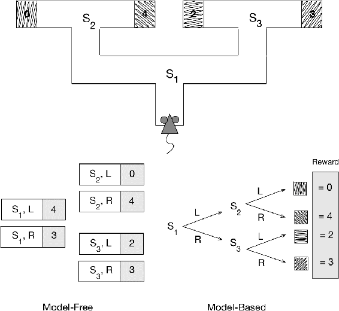

# 14.6  Habitual and Goal-directed Behavior

The distinction between model-free and model-based reinforcement learning algorithms corresponds to the distinction psychologists make between *habitual* and *goal-directed* control of learned behavioral patterns. Habits are behavior patterns triggered by appropriate stimuli and then performed more-or-less automatically. Goal-directed behavior, according to how psychologists use the phrase, is purposeful in the sense that it is controlled by knowledge of the value of goals and the relationship between actions and their consequences. Habits are sometimes said to be controlled by antecedent stimuli, whereas goal-directed behavior is said to be controlled by its consequences (Dickinson, 1980, 1985). Goal-directed control has the advantage that it can rapidly change an animal’s behavior when the environment changes its way of reacting to the animal’s actions. While habitual behavior responds quickly to input from an accustomed environment, it is unable to quickly adjust to changes in the environment. The development of goal-directed behavioral control was likely a major advance in the evolution of animal intelligence.

[Figure 14.5](part0024_split_010.html#fig14-5) illustrates the difference between model-free and model-based decision strategies in a hypothetical task in which a rat has to navigate a maze that has distinctive goal boxes, each delivering an associated reward of the magnitude shown ([Figure 14.5](part0024_split_010.html#fig14-5) top). Starting at S1, the rat has to first select left (L) or right (R) and then has to select L or R again at S2 or S3 to reach one of the goal boxes. The goal boxes are the terminal states of each episode of the rat’s episodic task. A model-free strategy ([Figure 14.5](part0024_split_010.html#fig14-5) lower left) relies on stored values for state–action pairs. These action values are estimates of the highest return the rat can expect for each action taken from each (nonterminal) state. They are obtained over many trials of running the maze from start to finish. When the action values have become good enough estimates of the optimal returns, the rat just has to select at each state the action with the largest action value in order to make optimal decisions. In this case, when the action-value estimates become accurate enough, the rat selects L from S1 and R from S2 to obtain the maximum return of 4. A different model-free strategy might simply rely on a cached policy instead of action values, making direct links from S1 to L and from S2 to R. In neither of these strategies do decisions rely on an environment model. There is no need to consult a state-transition model, and no connection is required between the features of the goal boxes and the rewards they deliver.

[Figure 14.5](part0024_split_010.html#C_fig14-5): Model-based and model-free strategies to solve a hypothetical sequential action-selection problem. Top: a rat navigates a maze with distinctive goal boxes, each associated with a reward having the value shown. Lower left: a model-free strategy relies on stored action values for all the state–action pairs obtained over many learning trials. To make decisions the rat just has to select at each state the action with the largest action value for that state. Lower right: in a model-based strategy, the rat learns an environment model, consisting of knowledge of state–action-next-state transitions and a reward model consisting of knowledge of the reward associated with each distinctive goal box. The rat can decide which way to turn at each state by using the model to simulate sequences of action choices to find a path yielding the highest return. Adapted from *Trends in Cognitive Science*, volume 10, number 8, Y. Niv, D. Joel, and P. Dayan, A Normative Perspective on Motivation, p. 376, 2006, with permission from Elsevier.

[Figure 14.5](part0024_split_010.html#fig14-5) (lower right) illustrates a model-based strategy. It uses an environment model consisting of a state-transition model and a reward model. The state-transition model is shown as a decision tree, and the reward model associates the distinctive features of the goal boxes with the rewards to be found in each. (The rewards associated with states S1, S2, and S3 are also part of the reward model, but here they are zero and are not shown.) A model-based agent can decide which way to turn at each state by using the model to simulate sequences of action choices to find a path yielding the highest return. In this case the return is the reward obtained from the outcome at the end of the path. Here, with a sufficiently accurate model, the rat would select L and then R to obtain reward of 4. Comparing the predicted returns of simulated paths is a simple form of planning, which can be done in a variety of ways as discussed in Chapter 8.

When the environment of a model-free agent changes the way it reacts to the agent’s actions, the agent has to acquire new experience in the changed environment during which it can update its policy and/or value function. In the model-free strategy shown in [Figure 14.5](part0024_split_010.html#fig14-5) (lower left), for example, if one of the goal boxes were to somehow shift to delivering a different reward, the rat would have to traverse the maze, possibly many times, to experience the new reward upon reaching that goal box, all the while updating either its policy or its action-value function (or both) based on this experience. The key point is that for a model-free agent to change the action its policy specifies for a state, or to change an action value associated with a state, it has to move to that state, act from it, possibly many times, and experience the consequences of its actions.

A model-based agent can accommodate changes in its environment without this kind of ‘personal experience’ with the states and actions affected by the change. A change in its model automatically (through planning) changes its policy. Planning can determine the consequences of changes in the environment that have never been linked together in the agent’s own experience. For example, again referring to the maze task of [Figure 14.5](part0024_split_010.html#fig14-5), imagine that a rat with a previously learned transition and reward model is placed directly in the goal box to the right of S2 to find that the reward available there now has value 1 instead of 4. The rat’s reward model will change even though the action choices required to find that goal box in the maze were not involved. The planning process will bring knowledge of the new reward to bear on maze running without the need for additional experience in the maze; in this case changing the policy to right turns at both S1 and S3 to obtain a return of 3.

Exactly this logic is the basis of *outcome-devaluation experiments* with animals. Results from these experiments provide insight into whether an animal has learned a habit or if its behavior is under goal-directed control. Outcome-devaluation experiments are like latent-learning experiments in that the reward changes from one stage to the next. After an initial rewarded stage of learning, the reward value of an outcome is changed, including being shifted to zero or even to a negative value.

An early important experiment of this type was conducted by Adams and Dickinson (1981). They trained rats via instrumental conditioning until the rats energetically pressed a lever for sucrose pellets in a training chamber. The rats were then placed in the same chamber with the lever retracted and allowed non-contingent food, meaning that pellets were made available to them independently of their actions. After 15-minutes of this free-access to the pellets, rats in one group were injected with the nausea-inducing poison lithium chloride. This was repeated for three sessions, in the last of which none of the injected rats consumed any of the non-contingent pellets, indicating that the reward value of the pellets had been decreased—the pellets had been devalued. In the next stage taking place a day later, the rats were again placed in the chamber and given a session of extinction training, meaning that the response lever was back in place but disconnected from the pellet dispenser so that pressing it did not release pellets. The question was whether the rats that had the reward value of the pellets decreased would lever-press less than rats that did not have the reward value of the pellets decreased, even without experiencing the devalued reward as a result of lever-pressing. It turned out that the injected rats had significantly lower response rates than the non-injected rats *right from the start of the extinction trials*.

Adams and Dickinson concluded that the injected rats associated lever pressing with consequent nausea by means of a cognitive map linking lever pressing to pellets, and pellets to nausea. Hence, in the extinction trials, the rats “knew” that the consequences of pressing the lever would be something they did not want, and so they reduced their lever-pressing right from the start. The important point is that they reduced lever-pressing without ever having experienced lever-pressing directly followed by being sick: no lever was present when they were made sick. They seemed able to combine knowledge of the outcome of a behavioral choice (pressing the lever will be followed by getting a pellet) with the reward value of the outcome (pellets are to be avoided) and hence could alter their behavior accordingly. Not every psychologist agrees with this “cognitive” account of this kind of experiment, and it is not the only possible way to explain these results, but the model-based planning explanation is widely accepted.

Nothing prevents an agent from using both model-free and model-based algorithms, and there are good reasons for using both. We know from our own experience that with enough repetition, goal-directed behavior tends to turn into habitual behavior. Experiments show that this happens for rats too. Adams (1982) conducted an experiment to see if extended training would convert goal-directed behavior into habitual behavior. He did this by comparing the effect of outcome devaluation on rats that experienced different amounts of training. If extended training made the rats less sensitive to devaluation compared to rats that received less training, this would be evidence that extended training made the behavior more habitual. Adams’ experiment closely followed the Adams and Dickinson (1981) experiment just described. Simplifying a bit, rats in one group were trained until they made 100 rewarded lever-presses, and rats in the other group—the overtrained group—were trained until they made 500 rewarded lever-presses. After this training, the reward value of the pellets was decreased (using lithium chloride injections) for rats in both groups. Then both groups of rats were given a session of extinction training. Adams’ question was whether devaluation would effect the rate of lever-pressing for the overtrained rats less than it would for the non-overtrained rats, which would be evidence that extended training reduces sensitivity to outcome devaluation. It turned out that devaluation strongly decreased the lever-pressing rate of the non-overtrained rats. For the overtrained rats, in contrast, devaluation had little effect on their lever-pressing; in fact, if anything, it made it more vigorous. (The full experiment included control groups showing that the different amounts of training did not by themselves significantly effect lever-pressing rates after learning.) This result suggested that while the non-overtrained rats were acting in a goal-directed manner sensitive to their knowledge of the outcome of their actions, the overtrained rats had developed a lever-pressing habit.

Viewing this and other results like it from a computational perspective provides insight as to why one might expect animals to behave habitually in some circumstances, in a goal-directed way in others, and why they shift from one mode of control to another as they continue to learn. While animals undoubtedly use algorithms that do not exactly match those we have presented in this book, one can gain insight into animal behavior by considering the tradeoffs that various reinforcement learning algorithms imply. An idea developed by computational neuroscientists Daw, Niv, and Dayan (2005) is that animals use both model-free and model-based processes. Each process proposes an action, and the action chosen for execution is the one proposed by the process judged to be the more trustworthy of the two as determined by measures of confidence that are maintained throughout learning. Early in learning the planning process of a model-based system is more trustworthy because it chains together short-term predictions which can become accurate with less experience than long-term predictions of the model-free process. But with continued experience, the model-free process becomes more trustworthy because planning is prone to making mistakes due to model inaccuracies and short-cuts necessary to make planning feasible, such as various forms of “tree-pruning”: the removal of unpromising search tree branches. According to this idea one would expect a shift from goal-directed behavior to habitual behavior as more experience accumulates. Other ideas have been proposed for how animals arbitrate between goal-directed and habitual control, and both behavioral and neuroscience research continues to examine this and related questions.

The distinction between model-free and model-based algorithms is proving to be useful for this research. One can examine the computational implications of these types of algorithms in abstract settings that expose basic advantages and limitations of each type. This serves both to suggest and to sharpen questions that guide the design of experiments necessary for increasing psychologists’ understanding of habitual and goal-directed behavioral control.
