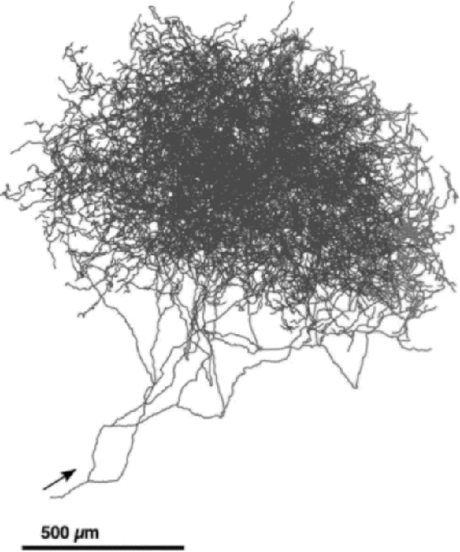
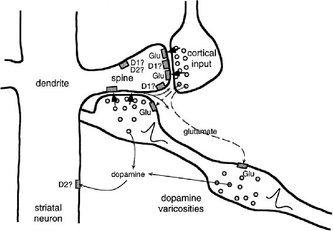

# 15.4  Dopamine

Dopamine is produced as a neurotransmitter by neurons whose cell bodies lie mainly in two clusters of neurons in the midbrain of mammals: the substantia nigra pars compacta (SNpc) and the ventral tegmental area (VTA). Dopamine plays essential roles in many processes in the mammalian brain. Prominent among these are motivation, learning, action-selection, most forms of addiction, and the disorders schizophrenia and Parkinson’s disease. Dopamine is called a neuromodulator because it performs many functions other than direct fast excitation or inhibition of targeted neurons. Although much remains unknown about dopamine’s functions and details of its cellular effects, it is clear that it is fundamental to reward processing in the mammalian brain. Dopamine is not the only neuromodulator involved in reward processing, and its role in aversive situations—punishment—remains controversial. Dopamine also can function differently in non-mammals. But no one doubts that dopamine is essential for reward-related processes in mammals, including humans.

An early, traditional view is that dopamine neurons broadcast a reward signal to multiple brain regions implicated in learning and motivation. This view followed from a famous 1954 paper by James Olds and Peter Milner that described the effects of electrical stimulation on certain areas of a rat’s brain. They found that electrical stimulation to particular regions acted as a very powerful reward in controlling the rat’s behavior: “…the control exercised over the animal’s behavior by means of this reward is extreme, possibly exceeding that exercised by any other reward previously used in animal experimentation” (Olds and Milner, 1954). Later research revealed that the sites at which stimulation was most effective in producing this rewarding effect excited dopamine pathways, either directly or indirectly, that ordinarily are excited by natural rewarding stimuli. Effects similar to these were also observed with human subjects. These observations strongly suggested that dopamine neuron activity signals reward.

But if the reward prediction error hypothesis is correct—even if it accounts for only some features of a dopamine neuron’s activity—this traditional view of dopamine neuron activity is not entirely correct: phasic responses of dopamine neurons signal reward prediction errors, not reward itself. In reinforcement learning’s terms, a dopamine neuron’s phasic response at a time *t* corresponds to *δ**t*−1 = *R**t* + *γV*(*S**t*) − *V* (*S**t*−1), not to *R**t*.

Reinforcement learning theory and algorithms help reconcile the reward-prediction-error view with the conventional notion that dopamine signals reward. In many of the algorithms we discuss in this book, *δ* functions as a reinforcement signal, meaning that it is the main driver of learning. For example, *δ* is the critical factor in the TD model of classical conditioning, and *δ* is the reinforcement signal for learning both a value function and a policy in an actor–critic architecture (Sections 13.5 and 15.7). Action-dependent forms of *δ* are reinforcement signals for Q-learning and Sarsa. The reward signal *R**t* is a crucial component of *δ**t*−1, but it is not the complete determinant of its reinforcing effect in these algorithms. The additional term *γV*(*S**t*) − *V* (*S**t*−1) is the higher-order reinforcement part of *δ**t*−1, and even if reward occurs (*R**t*≠0), the TD error can be silent if the reward is fully predicted (which is fully explained in Section 15.6 below).

A closer look at Olds’ and Milner’s 1954 paper, in fact, reveals that it is mainly about the reinforcing effect of electrical stimulation in an instrumental conditioning task. Electrical stimulation not only energized the rats’ behavior—through dopamine’s effect on motivation—it also led to the rats quickly learning to stimulate themselves by pressing a lever, which they would do frequently for long periods of time. The activity of dopamine neurons triggered by electrical stimulation reinforced the rats’ lever pressing.

More recent experiments using optogenetic methods clinch the role of phasic responses of dopamine neurons as reinforcement signals. These methods allow neuroscientists to precisely control the activity of selected neuron types at a millisecond timescale in awake behaving animals. Optogenetic methods introduce light-sensitive proteins into selected neuron types so that these neurons can be activated or silenced by means of flashes of laser light. The first experiment using optogenetic methods to study dopamine neurons showed that optogenetic stimulation producing phasic activation of dopamine neurons in mice was enough to condition the mice to prefer the side of a chamber where they received this stimulation as compared to the chamber’s other side where they received no, or lower-frequency, stimulation (Tsai et al. 2009). In another example, Steinberg et al. (2013) used optogenetic activation of dopamine neurons to create artificial bursts of dopamine neuron activity in rats at the times when rewarding stimuli were expected but omitted—times when dopamine neuron activity normally pauses. With these pauses replaced by artificial bursts, responding was sustained when it would ordinarily decrease due to lack of reinforcement (in extinction trials), and learning was enabled when it would ordinarily be blocked due to the reward being already predicted (the blocking paradigm; Section 14.2.1).

Additional evidence for the reinforcing function of dopamine comes from optogenetic experiments with fruit flies, except in these animals dopamine’s effect is the opposite of its effect in mammals: optically triggered bursts of dopamine neuron activity act just like electric foot shock in reinforcing avoidance behavior, at least for the population of dopamine neurons activated (Claridge-Chang et al. 2009). Although none of these optogenetic experiments showed that phasic dopamine neuron activity is specifically like a TD error, they convincingly demonstrated that phasic dopamine neuron activity acts just like *δ* acts (or perhaps like *minus δ* acts in fruit flies) as the reinforcement signal in algorithms for both prediction (classical conditioning) and control (instrumental conditioning).

Axonal arbor of a single neuron producing dopamine as a neurotransmitter. These axons make synaptic contacts with a huge number of dendrites of neurons in targeted brain areas.

Adapted from *The Journal of Neuroscience,* Matsuda, Furuta, Nakamura, Hioki, Fujiyama, Arai, and Kaneko, volume 29, 2009, page 451.

Dopamine neurons are
particularly well suited to broadcasting a reinforcement signal to many areas of the brain. These neurons have huge axonal arbors, each releasing dopamine at 100 to 1,000 times more synaptic sites than reached by the axons of typical neurons. Shown to the right is the axonal arbor of a single dopamine neuron whose cell body is in the SNpc of a rat’s brain. Each axon of a SNpc or VTA dopamine neuron makes roughly 500,000 synaptic contacts on the dendrites of neurons in targeted brain areas.

If dopamine neurons broadcast a reinforcement signal like reinforcement learning’s *δ*, then because this is a scalar signal, i.e., a single number, all dopamine neurons in both the SNpc and VTA would be expected to activate more-or-less identically so that they would act in near synchrony to send the same signal to all of the sites their axons target. Although it has been a common belief that dopamine neurons do act together like this, modern evidence is pointing to the more complicated picture that different subpopulations of dopamine neurons respond to input differently depending on the structures to which they send their signals and the different ways these signals act on their target structures. Dopamine has functions other than signaling RPEs, and even for dopamine neurons that do signal RPEs, it can make sense to send different RPEs to different structures depending on the roles these structures play in producing reinforced behavior. This is beyond what we treat in any detail in this book, but vector-valued RPE signals make sense from the perspective of reinforcement learning when decisions can be decomposed into separate sub-decisions, or more generally, as a way to address the *structural* version of the credit assignment problem: How do you distribute credit for success (or blame for failure) of a decision among the many component structures that could have been involved in producing it? We say a bit more about this in Section 15.10 below.

The axons of most dopamine neurons make synaptic contact with neurons in the frontal cortex and the basal ganglia, areas of the brain involved in voluntary movement, decision making, learning, and cognitive functions such as planning. Because most ideas relating dopamine to reinforcement learning focus on the basal ganglia, and the connections from dopamine neurons are particularly dense there, we focus on the basal ganglia here. The basal ganglia are a collection of neuron groups, or nuclei, lying at the base of the forebrain. The main input structure of the basal ganglia is called the striatum. Essentially all of the cerebral cortex, among other structures, provides input to the striatum. The activity of cortical neurons conveys a wealth of information about sensory input, internal states, and motor activity. The axons of cortical neurons make synaptic contacts on the dendrites of the main input/output neurons of the striatum, called medium spiny neurons. Output from the striatum loops back via other basal ganglia nuclei and the thalamus to frontal areas of cortex, and to motor areas, making it possible for the striatum to influence movement, abstract decision processes, and reward processing. Two main subdivisions of the striatum are important for reinforcement learning: the dorsal striatum, primarily implicated in influencing action selection, and the ventral striatum, thought to be critical for different aspects of reward processing, including the assignment of affective value to sensations.

The dendrites of medium spiny neurons are covered with spines on whose tips the axons of neurons in the cortex make synaptic contact. Also making synaptic contact with these spines—in this case contacting the spine stems—are axons of dopamine neurons ([Figure 15.1](part0025_split_004.html#fig15-1)). This arrangement brings together presynaptic activity of cortical neurons, postsynaptic activity of medium spiny neurons, and input from dopamine neurons. What actually occurs at these spines is complex and not completely understood. [Figure 15.1](part0025_split_004.html#fig15-1) hints at the complexity by showing two types of receptors for dopamine, receptors for glutamate—the neurotransmitter of the cortical inputs—and multiple ways that the various signals can interact. But evidence is mounting that changes in the efficacies of the synapses on the pathway from the cortex to the striatum, which neuroscientists call *corticostriatal synapses*, depend critically on appropriately-timed dopamine signals.

[Figure 15.1](part0025_split_004.html#C_fig15-1): Spine of a striatal neuron showing input from both cortical and dopamine neurons. Axons of cortical neurons influence striatal neurons via corticostriatal synapses releasing the neurotransmitter glutamate at the tips of spines covering the dendrites of striatal neurons. An axon of a VTA or SNpc dopamine neuron is shown passing by the spine (from the lower right). “Dopamine varicosities” on this axon release dopamine at or near the spine stem, in an arrangement that brings together presynaptic input from cortex, postsynaptic activity of the striatal neuron, and dopamine, making it possible that several types of learning rules govern the plasticity of corticostriatal synapses. Each axon of a dopamine neuron makes synaptic contact with the stems of roughly 500,000 spines. Some of the complexity omitted from our discussion is shown here by other neurotransmitter pathways and multiple receptor types, such as D1 an D2 dopamine receptors by which dopamine can produce different effects at spines and other postsynaptic sites. From *Journal of Neurophysiology*, W. Schultz, vol. 80, 1998, page 10.
