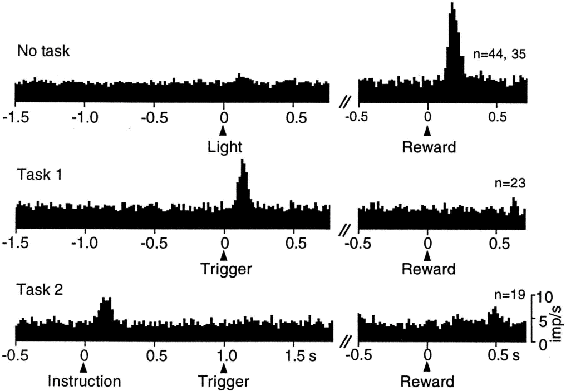
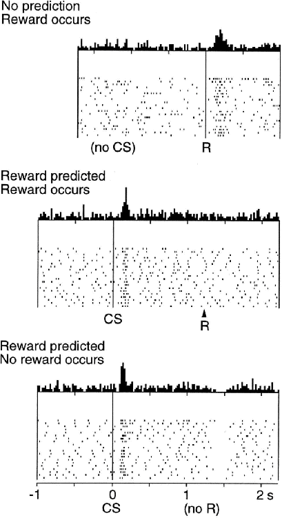

# 15.5  Experimental Support for the Reward Prediction Error Hypothesis

Dopamine neurons respond with bursts of activity to intense, novel, or unexpected visual and auditory stimuli that trigger eye and body movements, but very little of their activity is related to the movements themselves. This is surprising because degeneration of dopamine neurons is a cause of Parkinson’s disease, whose symptoms include motor disorders, particularly deficits in self-initiated movement. Motivated by the weak relationship between dopamine neuron activity and stimulus-triggered eye and body movements, Romo and Schultz (1990) and Schultz and Romo (1990) took the first steps toward the reward prediction error hypothesis by recording the activity of dopamine neurons and muscle activity while monkeys moved their arms.

They trained two monkeys to reach from a resting hand position into a bin containing a bit of apple, a piece of cookie, or a raisin, when the monkey saw and heard the bin’s door open. The monkey could then grab and bring the food to its mouth. After a monkey became good at this, it was trained on two additional tasks. The purpose of the first task was to see what dopamine neurons do when movements are self-initiated. The bin was left open but covered from above so that the monkey could not see inside but could reach in from below. No triggering stimuli were presented, and after the monkey reached for and ate the food morsel, the experimenter usually (though not always), silently and unseen by the monkey, replaced food in the bin by sticking it onto a rigid wire. Here too, the activity of the dopamine neurons Romo and Schultz monitored was not related to the monkey’s movements, but a large percentage of these neurons produced phasic responses whenever the monkey first touched a food morsel. These neurons did not respond when the monkey touched just the wire or explored the bin when no food was there. This was good evidence that the neurons were responding to the food and not to other aspects of the task.

The purpose of Romo and Schultz’s second task was to see what happens when movements are triggered by stimuli. This task used a different bin with a movable cover. The sight and sound of the bin opening triggered reaching movements to the bin. In this case, Romo and Schultz found that after some period of training, the dopamine neurons no longer responded to the touch of the food but instead responded to the sight and sound of the opening cover of the food bin. The phasic responses of these neurons had shifted from the reward itself to stimuli predicting the availability of the reward. In a followup study, Romo and Schultz found that most of the dopamine neurons whose activity they monitored did not respond to the sight and sound of the bin opening outside the context of the behavioral task. These observations suggested that the dopamine neurons were responding neither to the initiation of a movement nor to the sensory properties of the stimuli, but were rather signaling an expectation of reward.

Schultz’s group conducted many additional studies involving both SNpc and VTA dopamine neurons. A particular series of experiments was influential in suggesting that the phasic responses of dopamine neurons correspond to TD errors and not to simpler errors like those in the Rescorla–Wagner model ([14.3](part0024_split_004.html#x1-164003r3)). In the first of these experiments (Ljungberg, Apicella, and Schultz, 1992), monkeys were trained to depress a lever after a light was illuminated as a ‘trigger cue’ to obtain a drop of apple juice. As Romo and Schultz had observed earlier, many dopamine neurons initially responded to the reward—the drop of juice ([Figure 15.2](part0025_split_005.html#fig15-2), top panel). But many of these neurons lost that reward response as training continued and developed responses instead to the illumination of the light that predicted the reward ([Figure 15.2](part0025_split_005.html#fig15-2), middle panel). With continued training, lever pressing became faster while the number of dopamine neurons responding to the trigger cue decreased.

[Figure 15.2](part0025_split_005.html#C_fig15-2): The response of dopamine neurons shifts from initial responses to primary reward to earlier predictive stimuli. These are plots of the number of action potentials produced by monitored dopamine neurons within small time intervals, averaged over all the monitored dopamine neurons (ranging from 23 to 44 neurons for these data). Top: dopamine neurons are activated by the unpredicted delivery of drop of apple juice. Middle: with learning, dopamine neurons developed responses to the reward-predicting trigger cue and lost responsiveness to the delivery of reward. Bottom: with the addition of an instruction cue preceding the trigger cue by 1 second, dopamine neurons shifted their responses from the trigger cue to the earlier instruction cue. From Schultz et al. (1995), MIT Press.

Following this study, the same monkeys were trained on a new task (Schultz, Apicella, and Ljungberg, 1993). Here the monkeys faced two levers, each with a light above it. Illuminating one of these lights was an ‘instruction cue’ indicating which of the two levers would produce a drop of apple juice. In this task, the instruction cue preceded the trigger cue of the previous task by a fixed interval of 1 second. The monkeys learned to withhold reaching until seeing the trigger cue, and dopamine neuron activity increased, but now the responses of the monitored dopamine neurons occurred almost exclusively to the earlier instruction cue and not to the trigger cue ([Figure 15.2](part0025_split_005.html#fig15-2), bottom panel). Here again the number of dopamine neurons responding to the instruction cue was much reduced when the task was well learned. During learning across these tasks, dopamine neuron activity shifted from initially responding to the reward to responding to the earlier predictive stimuli, first progressing to the trigger stimulus then to the still earlier instruction cue. As responding moved earlier in time it disappeared from the later stimuli. This shifting of responses to earlier reward predictors, while losing responses to later predictors is a hallmark of TD learning (see, for example, [Figure 14.2](part0024_split_006.html#fig14-2)).

The task just described revealed another property of dopamine neuron activity shared with TD learning. The monkeys sometimes pressed the wrong key, that is, the key other than the instructed one, and consequently received no reward. In these trials, many of the dopamine neurons showed a sharp decrease in their firing rates below baseline shortly after the reward’s usual time of delivery, and this happened without the availability of any external cue to mark the usual time of reward delivery ([Figure 15.3](part0025_split_005.html#fig15-3)). Somehow the monkeys were internally keeping track of the timing of the reward. (Response timing is one area where the simplest version of TD learning needs to be modified to account for some of the details of the timing of dopamine neuron responses. We consider this issue in the following section.)

[Figure 15.3](part0025_split_005.html#C_fig15-3): The response of dopamine neurons drops below baseline shortly after the time when an expected reward fails to occur. Top: dopamine neurons are activated by the unpredicted delivery of a drop of apple juice. Middle: dopamine neurons respond to a conditioned stimulus (CS) that predicts reward and do not respond to the reward itself. Bottom: when the reward predicted by the CS fails to occur, the activity of dopamine neurons drops below baseline shortly after the time the reward is expected to occur. At the top of each of these panels is shown the average number of action potentials produced by monitored dopamine neurons within small time intervals around the indicated times. The raster plots below show the activity patterns of the individual dopamine neurons that were monitored; each dot represents an action potential. From Schultz, Dayan, and Montague, A Neural Substrate of Prediction and Reward, *Science*, vol. 275, issue 5306, pages 1593-1598, March 14, 1997. Reprinted with permission from AAAS.

The observations from the studies described above led Schultz and his group to conclude that dopamine neurons respond to unpredicted rewards, to the earliest predictors of reward, and that dopamine neuron activity decreases below baseline if a reward, or a predictor of reward, does not occur at its expected time. Researchers familiar with reinforcement learning were quick to recognize that these results are strikingly similar to how the TD error behaves as the reinforcement signal in a TD algorithm. The next section explores this similarity by working through a specific example in detail.
