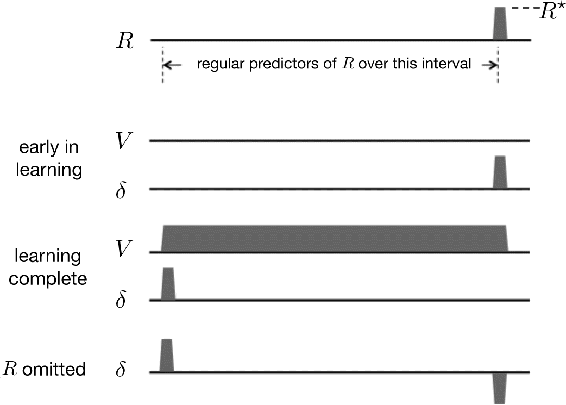

# 15.6  TD Error/Dopamine Correspondence

This section explains the correspondence between the TD error *δ* and the phasic responses of dopamine neurons observed in the experiments just described. We examine how *δ* changes over the course of learning in a task something like the one described above where a monkey first sees an instruction cue and then a fixed time later has to respond correctly to a trigger cue in order to obtain reward. We use a simple idealized version of this task, but we go into a lot more detail than is usual because we want to emphasize the theoretical basis of the parallel between TD errors and dopamine neuron activity.

The first simplifying assumption is that the agent has already learned the actions required to obtain reward. Then its task is just to learn accurate predictions of future reward for the sequence of states it experiences. This is then a prediction task, or more technically, a policy-evaluation task: learning the value function for a fixed policy (Sections 4.1 and 6.1). The value function to be learned assigns to each state a value that predicts the return that will follow that state if the agent selects actions according to the given policy, where the return is the (possibly discounted) sum of all the future rewards. This is unrealistic as a model of the monkey’s situation because the monkey would likely learn these predictions at the same time that it is learning to act correctly (as would a reinforcement learning algorithm that learns policies as well as value functions, such as an actor–critic algorithm), but this scenario is simpler to describe than one in which a policy and a value function are learned simultaneously.

Now imagine that the agent’s experience divides into multiple trials, in each of which the same sequence of states repeats, with a distinct state occurring on each time step during the trial. Further imagine that the return being predicted is limited to the return over a trial, which makes a trial analogous to a reinforcement learning episode as we have defined it. In reality, of course, the returns being predicted are not confined to single trials, and the time interval between trials is an important factor in determining what an animal learns. This is true for TD learning as well, but here we assume that returns do not accumulate over multiple trials. Given this, then, a trial in experiments like those conducted by Schultz and colleagues is equivalent to an episode of reinforcement learning. (Though in this discussion, we will use the term trial instead of episode to relate better to the experiments.)

As usual, we also need to make an assumption about how states are represented as inputs to the learning algorithm, an assumption that influences how closely the TD error corresponds to dopamine neuron activity. We discuss this issue later, but for now we assume the same CSC representation used by Montague et al. (1996) in which there is a separate internal stimulus for each state visited at each time step in a trial. This reduces the process to the tabular case covered in the first part of this book. Finally, we assume that the agent uses TD(0) to learn a value function, *V*, stored in a lookup table initialized to be zero for all the states. We also assume that this is a deterministic task and that the discount factor, *γ*, is very nearly one so that we can ignore it.

[Figure 15.4](part0025_split_006.html#fig15-4) shows the time courses of *R*, *V*, and *δ* at several stages of learning in this policy-evaluation task. The time axes represent the time interval over which a sequence of states is visited in a trial (where for clarity we omit showing individual states). The reward signal is zero throughout each trial except when the agent reaches the rewarding state, shown near the right end of the time line, when the reward signal becomes some positive number, say *R*⋆. The goal of TD learning is to predict the return for each state visited in a trial, which in this undiscounted case and given our assumption that predictions are confined to individual trials, is simply *R*⋆ for each state.

[Figure 15.4](part0025_split_006.html#C_fig15-4): The behavior of the TD error *δ* during TD learning is consistent with features of the phasic activation of dopamine neurons. (Here *δ* is the TD error *available* at time *t*, i.e., *δ**t*−1). *Top*: a sequence of states, shown as an interval of regular predictors, is followed by a non-zero reward *R*⋆. *Early in learning*: the initial value function, *V*, and initial *δ*, which at first is equal to *R*⋆. *Learning complete*: the value function accurately predicts future reward, *δ* is positive at the earliest predictive state, and *δ* = 0 at the time of the non-zero reward. *R*⋆ *omitted*: at the time the predicted reward is omitted, *δ* becomes negative. See text for a complete explanation of why this happens.

Preceding the rewarding state is a sequence of reward-predicting states, with the *earliest reward-predicting state* shown near the left end of the time line. This is like the state near the start of a trial, for example like the state marked by the instruction cue in a trial of the monkey experiment of Schultz et al. (1993) described above. It is the first state in a trial that reliably predicts that trial’s reward. (Of course, in reality states visited on preceding trials are even earlier reward-predicting states, but because we are confining predictions to individual trials, these do not qualify as predictors of *this* trial’s reward. Below we give a more satisfactory, though more abstract, description of an earliest reward-predicting state.) The *latest reward-predicting state* in a trial is the state immediately preceding the trial’s rewarding state. This is the state near the far right end of the time line in [Figure 15.4](part0025_split_006.html#fig15-4). Note that the rewarding state of a trial does not predict the return for that trial: the value of this state would come to predict the return over all the *following* trials, which here we are assuming to be zero in this episodic formulation.

[Figure 15.4](part0025_split_006.html#fig15-4) shows the first-trial time courses of *V* and *δ* as the graphs labeled ‘early in learning.’ Because the reward signal is zero throughout the trial except when the rewarding state is reached, and all the *V*-values are zero, the TD error is also zero until it becomes *R*⋆ at the rewarding state. This follows because *δ**t*−1 = *R**t* + *V**t* − *V**t*−1 = *R**t* + 0 − 0 = *R**t*, which is zero until it equals *R*⋆ when the reward occurs. Here *V**t* and *V**t*−1 are respectively the estimated values of the states visited at times *t* and *t* − 1 in a trial. The TD error at this stage of learning is analogous to a dopamine neuron responding to an unpredicted reward; for example, a drop of apple juice at the start of training.

Throughout this first trial and all successive trials, TD(0) updates occur at each state transition as described in Chapter 6. This successively increases the values of the reward-predicting states, with the increases spreading backwards from the rewarding state, until the values converge to the correct return predictions. In this case (because we are assuming no discounting) the correct predictions are equal to *R*⋆ for all the reward-predicting states. This can be seen in [Figure 15.4](part0025_split_006.html#fig15-4) as the graph of *V* labeled ‘learning complete’ where the values of all the states from the earliest to the latest reward-predicting states all equal *R*⋆. The values of the states preceding the earliest reward-predicting state remain low (which [Figure 15.4](part0025_split_006.html#fig15-4) shows as zero) because they are not reliable predictors of reward.

When learning is complete, that is, when *V* attains its correct values, the TD errors associated with transitions *from* any reward-predicting state are zero because the predictions are now accurate. This is because for a transition from a reward-predicting state to another reward-predicting state, we have *δ**t*−1 = *R**t* + *V**t* − *V**t*−1 = 0 + *R*⋆ − *R*⋆ = 0, and for the transition from the latest reward-predicting state to the rewarding state, we have *δ**t*−1 = *R**t* + *V**t* − *V**t*−1 = *R*⋆ + 0 − *R*⋆ = 0. On the other hand, the TD error on a transition from any state *to* the earliest reward-predicting state is positive because of the mismatch between this state’s low value and the larger value of the following reward-predicting state. Indeed, if the value of a state preceding the earliest reward-predicting state were zero, then after the transition to the earliest reward-predicting state, we would have that *δ**t*−1 = *R**t* + *V**t* −*V**t*−1 = 0 + *R*⋆− 0 = *R*⋆. The ‘learning complete’ graph of *δ* in [Figure 15.4](part0025_split_006.html#fig15-4) shows this positive value at the earliest reward-predicting state, and zeros everywhere else.

The positive TD error upon transitioning to the earliest reward-predicting state is analogous to the persistence of dopamine responses to the earliest stimuli predicting reward. By the same token, when learning is complete, a transition from the latest reward-predicting state to the rewarding state produces a zero TD error because the latest reward-predicting state’s value, being correct, cancels the reward. This parallels the observation that fewer dopamine neurons generate a phasic response to a fully predicted reward than to an unpredicted reward.

After learning, if the reward is suddenly omitted, the TD error goes negative at the usual time of reward because the value of the latest reward-predicting state is then too high: *δ**t*−1 = *R**t* + *V**t* −*V**t*−1 = 0 + 0 −*R*⋆ = −*R*⋆, as shown at the right end of the ‘*R* omitted’ graph of *δ* in [Figure 15.4](part0025_split_006.html#fig15-4). This is like dopamine neuron activity decreasing below baseline at the time an expected reward is omitted as seen in the experiment of Schultz et al. (1993) described above and shown in [Figure 15.3](part0025_split_005.html#fig15-3).

The idea of an *earliest reward-predicting state* deserves more attention. In the scenario described above, because experience is divided into trials, and we assumed that predictions are confined to individual trials, the earliest reward-predicting state is always the first state of a trial. Clearly this is artificial. A more general way to think of an earliest reward-predicting state is that it is an *unpredicted predictor* of reward, and there can be many such states. In an animal’s life, many different states may precede an earliest reward-predicting state. However, because these states are more often followed by *other* states that do not predict reward, their reward-predicting powers, that is, their values, remain low. A TD algorithm, if operating throughout the animal’s life, would update the values of these states too, but the updates would not consistently accumulate because, by assumption, none of these states reliably precedes an earliest reward-predicting state. If any of them did, they would be reward-predicting states as well. This might explain why with overtraining, dopamine responses decrease to even the earliest reward-predicting stimulus in a trial. With overtraining one would expect that even a formerly-unpredicted predictor state would become predicted by stimuli associated with earlier states: the animal’s interaction with its environment both inside and outside of an experimental task would become commonplace. Upon breaking this routine with the introduction of a new task, however, one would see TD errors reappear, as indeed is observed in dopamine neuron activity.

The example described above explains why the TD error shares key features with the phasic activity of dopamine neurons when the animal is learning in a task similar to the idealized task of our example. But not every property of the phasic activity of dopamine neurons coincides so neatly with properties of *δ*. One of the most troubling discrepancies involves what happens when a reward occurs *earlier* than expected. We have seen that the omission of an expected reward produces a negative prediction error at the reward’s expected time, which corresponds to the activity of dopamine neurons decreasing below baseline when this happens. If the reward arrives later than expected, it is then an unexpected reward and generates a positive prediction error. This happens with both TD errors and dopamine neuron responses. But when reward arrives earlier than expected, dopamine neurons do not do what the TD error does—at least with the CSC representation used by Montague et al. (1996) and by us in our example. Dopamine neurons do respond to the early reward, which is consistent with a positive TD error because the reward is not predicted to occur then. However, at the later time when the reward is expected but omitted, the TD error is negative whereas, in contrast to this prediction, dopamine neuron activity does not drop below baseline in the way the TD model predicts (Hollerman and Schultz, 1998). Something more complicated is going on in the animal’s brain than simply TD learning with a CSC representation.

Some of the mismatches between the TD error and dopamine neuron activity can be addressed by selecting suitable parameter values for the TD algorithm and by using stimulus representations other than the CSC representation. For instance, to address the early-reward mismatch just described, Suri and Schultz (1999) proposed a CSC representation in which the sequences of internal signals initiated by earlier stimuli are cancelled by the occurrence of a reward. Another proposal by Daw, Courville, and Touretzky (2006) is that the brain’s TD system uses representations produced by statistical modeling carried out in sensory cortex rather than simpler representations based on raw sensory input. Ludvig, Sutton, and Kehoe (2008) found that TD learning with a microstimulus (MS) representation ([Figure 14.1](part0024_split_006.html#fig14-1)) fits the activity of dopamine neurons in the early-reward and other situations better than when a CSC representation is used. Pan, Schmidt, Wickens, and Hyland (2005) found that even with the CSC representation, prolonged eligibility traces improve the fit of the TD error to some aspects of dopamine neuron activity. In general, many fine details of TD-error behavior depend on subtle interactions between eligibility traces, discounting, and stimulus representations. Findings like these elaborate and refine the reward prediction error hypothesis without refuting its core claim that the phasic activity of dopamine neurons is well characterized as signaling TD errors.

On the other hand, there are other discrepancies between the TD theory and experimental data that are not so easily accommodated by selecting parameter values and stimulus representations (we mention some of these discrepancies in the Bibliographical and Historical Remarks section at the end of this chapter), and more mismatches are likely to be discovered as neuroscientists conduct ever more refined experiments. But the reward prediction error hypothesis has been functioning very effectively as a catalyst for improving our understanding of how the brain’s reward system works. Intricate experiments have been designed to validate or refute predictions derived from the hypothesis, and experimental results have, in turn, led to refinement and elaboration of the TD error/dopamine hypothesis.

A remarkable aspect of these developments is that the reinforcement learning algorithms and theory that connect so well with properties of the dopamine system were developed from a computational perspective in total absence of any knowledge about the relevant properties of dopamine neurons—remember, TD learning and its connections to optimal control and dynamic programming were developed many years before any of the experiments were conducted that revealed the TD-like nature of dopamine neuron activity. This unplanned correspondence, despite not being perfect, suggests that the TD error/dopamine parallel captures something significant about brain reward processes.

In addition to accounting for many features of the phasic activity of dopamine neurons, the reward prediction error hypothesis links neuroscience to other aspects of reinforcement learning, in particular, to learning algorithms that use TD errors as reinforcement signals. Neuroscience is still far from reaching complete understanding of the circuits, molecular mechanisms, and functions of the phasic activity of dopamine neurons, but evidence supporting the reward prediction error hypothesis, along with evidence that phasic dopamine responses are reinforcement signals for learning, suggest that the brain might implement something like an actor–critic algorithm in which TD errors play critical roles. Other reinforcement learning algorithms are plausible candidates too, but actor–critic algorithms fit the anatomy and physiology of the mammalian brain particularly well, as we describe in the following two sections.
