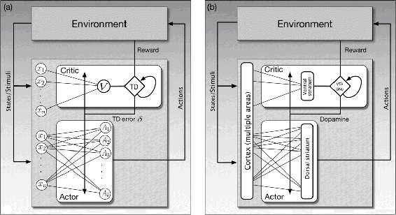

# 15.7  Neural Actor–Critic

Actor–critic algorithms learn both policies and value functions. The ‘actor’ is the component that learns policies, and the ‘critic’ is the component that learns about whatever policy is currently being followed by the actor in order to ‘criticize’ the actor’s action choices. The critic uses a TD algorithm to learn the state-value function for the actor’s current policy. The value function allows the critic to critique the actor’s action choices by sending TD errors, *δ*, to the actor. A positive *δ* means that the action was ‘good’ because it led to a state with a better-than-expected value; a negative *δ* means that the action was ‘bad’ because it led to a state with a worse-than-expected value. Based on these critiques, the actor continually updates its policy.

Two distinctive features of actor–critic algorithms are responsible for thinking that the brain might implement an algorithm like this. First, the two components of an actor–critic algorithm—the actor and the critic—suggest that two parts of the striatum—the dorsal and ventral subdivisions (Section 15.4), both critical for reward-based learning—may function respectively something like an actor and a critic. A second property of actor–critic algorithms that suggests a brain implementation is that the TD error has the dual role of being the reinforcement signal for both the actor and the critic, though it has a different influence on learning in each of these components. This fits well with several properties of the neural circuitry: axons of dopamine neurons target both the dorsal and ventral subdivisions of the striatum; dopamine appears to be critical for modulating synaptic plasticity in both structures; and how a neuromodulator such as dopamine acts on a target structure depends on properties of the target structure and not just on properties of the neuromodulator.

Section 13.5 presents actor–critic algorithms as policy gradient methods, but the actor–critic algorithm of Barto, Sutton, and Anderson (1983) was simpler and was presented as an artificial neural network (ANN). Here we describe an ANN implementation something like that of Barto et al., and we follow Takahashi, Schoenbaum, and Niv (2008) in giving a schematic proposal for how this ANN might be implemented by real neural networks in the brain. We postpone discussion of the actor and critic learning rules until Section 15.8, where we present them as special cases of the policy-gradient formulation and discuss what they suggest about how dopamine might modulate synaptic plasticity.

[Figure 15.5a](part0025_split_007.html#fig15-5) shows an implementation of an actor–critic algorithm as an ANN with component networks implementing the actor and the critic. The critic consists of a single neuron-like unit, *V*, whose output activity represents state values, and a component shown as the diamond labeled TD that computes TD errors by combining *V*’s output with reward signals and with previous state values (as suggested by the loop from the TD diamond to itself). The actor network has a single layer of *k* actor units labeled *A**i*, *i* = 1,..., *k*. The output of each actor unit is a component of a *k*-dimensional action vector. An alternative is that there are *k* separate actions, one commanded by each actor unit, that compete with one another to be executed, but here we will think of the entire *A*-vector as an action.

[Figure 15.5](part0025_split_007.html#C_fig15-5): Actor–critic ANN and a hypothetical neural implementation. a) Actor–critic algorithm as an ANN. The actor adjusts a policy based on the TD error *δ* it receives from the critic; the critic adjusts state-value parameters using the same *δ*. The critic produces a TD error from the reward signal, *R*, and the current change in its estimate of state values. The actor does not have direct access to the reward signal, and the critic does not have direct access to the action. b) Hypothetical neural implementation of an actor–critic algorithm. The actor and the value-learning part of the critic are respectively placed in the dorsal and ventral subdivisions of the striatum. The TD error is transmitted by dopamine neurons located in the VTA and SNpc to modulate changes in synaptic efficacies of input from cortical areas to the ventral and dorsal striatum. Adapted from Frontiers in Neuroscience, vol. 2(1), 2008, Y. Takahashi, G. Schoenbaum, and Y. Niv, Silencing the critics: Understanding the effects of cocaine sensitization on dorsolateral and ventral striatum in the context of an Actor/Critic model.

Both the critic and actor networks receive input consisting of multiple features representing the state of the agent’s environment. (Recall from Chapter 1 that the environment of a reinforcement learning agent includes components both inside and outside of the ‘organism’ containing the agent.) The figure shows these features as the circles labeled *x*1, *x*2,..., *x*n, shown twice just to keep the figure simple. A weight representing the efficacy of a synapse is associated with each connection from each feature *x**i* to the critic unit, *V*, and to each of the action units, *A**i*. The weights in the critic network parameterize the value function, and the weights in the actor network parameterize the policy. The networks learn as these weights change according to the critic and actor learning rules that we describe in the following section.

The TD error produced by circuitry in the critic is the reinforcement signal for changing the weights in both the critic and the actor networks. This is shown in [Figure 15.5a](part0025_split_007.html#fig15-5) by the line labeled ‘TD error *δ*’ extending across all of the connections in the critic and actor networks. This aspect of the network implementation, together with the reward prediction error hypothesis and the fact that the activity of dopamine neurons is so widely distributed by the extensive axonal arbors of these neurons, suggests that an actor–critic network something like this may not be too farfetched as a hypothesis about how reward-related learning might happen in the brain.

[Figure 15.5b](part0025_split_007.html#fig15-5) suggests—very schematically—how the ANN on the figure’s left might map onto structures in the brain according to the hypothesis of Takahashi et al. (2008). The hypothesis puts the actor and the value-learning part of the critic respectively in the dorsal and ventral subdivisions of the striatum, the input structure of the basal ganglia. Recall from Section 15.4 that the dorsal striatum is primarily implicated in influencing action selection, and the ventral striatum is thought to be critical for different aspects of reward processing, including the assignment of affective value to sensations. The cerebral cortex, along with other structures, sends input to the striatum conveying information about stimuli, internal states, and motor activity.

In this hypothetical actor–critic brain implementation, the ventral striatum sends value information to the VTA and SNpc, where dopamine neurons in these nuclei combine it with information about reward to generate activity corresponding to TD errors (though exactly how dopaminergic neurons calculate these errors is not yet understood). The ‘TD error *δ*’ line in [Figure 15.5a](part0025_split_007.html#fig15-5) becomes the line labeled ‘Dopamine’ in [Figure 15.5b](part0025_split_007.html#fig15-5), which represents the widely branching axons of dopamine neurons whose cell bodies are in the VTA and SNpc. Referring back to [Figure 15.1](part0025_split_004.html#fig15-1), these axons make synaptic contact with the spines on the dendrites of medium spiny neurons, the main input/output neurons of both the dorsal and ventral divisions of the striatum. Axons of the cortical neurons that send input to the striatum make synaptic contact on the tips of these spines. According to the hypothesis, it is at these spines where changes in the efficacies of the synapses from cortical regions to the striatum are governed by learning rules that critically depend on a reinforcement signal supplied by dopamine.

An important implication of the hypothesis illustrated in [Figure 15.5b](part0025_split_007.html#fig15-5) is that the dopamine signal is not the ‘master’ reward signal like the scalar *R**t* of reinforcement learning. In fact, the hypothesis implies that one should not necessarily be able to probe the brain and record any signal like *R**t* in the activity of any single neuron. Many interconnected neural systems generate reward-related information, with different structures being recruited depending on different types of rewards. Dopamine neurons receive information from many different brain areas, so the input to the SNpc and VTA labeled ‘Reward’ in [Figure 15.5b](part0025_split_007.html#fig15-5) should be thought of as vector of reward-related information arriving to neurons in these nuclei along multiple input channels. What the theoretical scalar reward signal *R**t* might correspond to, then, is the net contribution of all reward-related information to dopamine neuron activity. It is the result of a pattern of activity across many neurons in different areas of the brain.

Although the actor–critic neural implementation illustrated in [Figure 15.5b](part0025_split_007.html#fig15-5) may be correct on some counts, it clearly needs to be refined, extended, and modified to qualify as a full-fledged model of the function of the phasic activity of dopamine neurons. The Historical and Bibliographic Remarks section at the end of this chapter cites publications that discuss in more detail both empirical support for this hypothesis and places where it falls short. We now look in detail at what the actor and critic learning algorithms suggest about the rules governing changes in synaptic efficacies of corticostriatal synapses.
