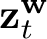
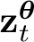
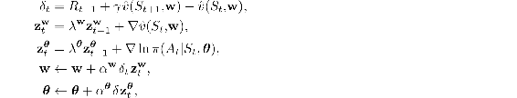
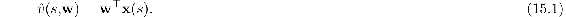
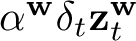
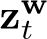
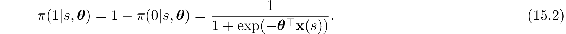
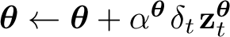
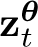
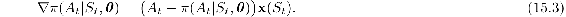

# 15.8  Actor and Critic Learning Rules

If the brain does implement something like the actor–critic algorithm—and assuming populations of dopamine neurons broadcast a common reinforcement signal to the corticostriatal synapses of both the dorsal and ventral striatum as illustrated in [Figure 15.5b](part0025_split_007.html#fig15-5) (which is likely an oversimplification as we mentioned above)—then this reinforcement signal affects the synapses of these two structures in different ways. The learning rules for the critic and the actor use the same reinforcement signal, the TD error *δ*, but its effect on learning is different for these two components. The TD error (combined with eligibility traces) tells the actor how to update action probabilities in order to reach higher-valued states. Learning by the actor is like instrumental conditioning using a Law-of-Effect-type learning rule (Section 1.7): the actor works to keep *δ* as positive as possible. On the other hand, the TD error (when combined with eligibility traces) tells the critic the direction and magnitude in which to change the parameters of the value function in order to improve its predictive accuracy. The critic works to reduce *δ*’s magnitude to be as close to zero as possible using a learning rule like the TD model of classical conditioning (Section 14.2). The difference between the critic and actor learning rules is relatively simple, but this difference has a profound effect on learning and is essential to how the actor–critic algorithm works. The difference lies solely in the eligibility traces each type of learning rule uses.

More than one set of learning rules can be used in actor–critic neural networks like those in [Figure 15.5b](part0025_split_007.html#fig15-5) but, to be specific, here we focus on the actor–critic algorithm for continuing problems with eligibility traces presented in Section 13.6. On each transition from state *S**t* to state *S**t*+1, taking action *A**t* and receiving action *R**t*+1, that algorithm computes the TD error (*δ*) and then updates the eligibility trace vectors ( and ) and the parameters for the critic and actor (**w** and ***θ***), according to

where *γ* ∈ [0, 1) is a discount-rate parameter, *λ**w**c* ∈ [0, 1] and *λ**w**a* ∈ [0, 1] are bootstrapping parameters for the critic and the actor respectively, and *α***w** > 0 and *α****θ*** > 0 are analogous step-size parameters.

Think of the approximate value function  as the output of a single linear neuron-like unit, called the *critic unit* and labeled *V* in [Figure 15.5a](part0025_split_007.html#fig15-5). Then the value function is a linear function of the feature-vector representation of state s, **x**(*s*) = (*x*1(*s*),..., *xn*(*s*))⊤, parameterized by a weight vector **w** = (*w*1,..., *wn*)⊤:

Each *x**i*(*s*) is like the presynaptic signal to a neuron’s synapse whose efficacy is *w**i*. The weights of the critic are incremented according to the rule above by , where the reinforcement signal, *δ**t*, corresponds to a dopamine signal being broadcast to all of the critic unit’s synapses. The eligibility trace vector, , for the critic unit is a trace (average of recent values) of ∇ (*S**t*, **w**). Because  (*s,* **w**) is linear in the weights, ∇ (*S**t*, **w**) = **x**(*S**t*).

In neural terms, this means that each synapse has its own eligibility trace, which is one component of the vector . A synapse’s eligibility trace accumulates according to the level of activity arriving at that synapse, that is, the level of presynaptic activity, represented here by the component of the feature vector **x**(*S**t*) arriving at that synapse. The trace otherwise decays toward zero at a rate governed by the fraction *λ***w**. A synapse is *eligible for modification* as long as its eligibility trace is non-zero. How the synapse’s efficacy is actually modified depends on the reinforcement signals that arrive while the synapse is eligible. We call eligibility traces like these of the critic unit’s synapses *non-contingent eligibility traces* because they only depend on presynaptic activity and are not contingent in any way on postsynaptic activity.

The non-contingent eligibility traces of the critic unit’s synapses mean that the critic unit’s learning rule is essentially the TD model of classical conditioning described in Section 14.2. With the definition we have given above of the critic unit and its learning rule, the critic in [Figure 15.5a](part0025_split_007.html#fig15-5) is the same as the critic in the ANN actor–critic of Barto et al. (1983). Clearly, a critic like this consisting of just one linear neuron-like unit is the simplest starting point; this critic unit is a proxy for a more complicated neural network able to learn value functions of greater complexity.

The actor in [Figure 15.5a](part0025_split_007.html#fig15-5) is a one-layer network of *k* neuron-like actor units, each receiving at time *t* the same feature vector, **x**(*S**t*), that the critic unit receives. Each actor unit *j*, *j* = 1*, …, k*, has its own weight vector, ***θ****j*, but because the actor units are all identical, we describe just one of the units and omit the subscript. One way for these units to follow the actor–critic algorithm given in the equations above is for each to be a *Bernoulli-logistic unit*. This means that the output of each actor unit at each time is a random variable, *A**t*, taking value 0 or 1. Think of value 1 as the neuron firing, that is, emitting an action potential. The weighted sum, ***θ***⊤**x**(*S**t*), of a unit’s input vector determines the unit’s action probabilities via the exponential soft-max distribution ([13.2](part0022_split_001.html#x1-150001r2)), which for two actions is the logistic function:

The weights of each actor unit are incremented, as above, by: , where *δ* again corresponds to the dopamine signal: the same reinforcement signal that is sent to all the critic unit’s synapses. [Figure 15.5a](part0025_split_007.html#fig15-5) shows *δ**t* being broadcast to all the synapses of all the actor units (which makes this actor network a *team* of reinforcement learning agents, something we discuss in Section 15.10 below). The actor eligibility trace vector  is a trace (average of recent values) of ∇ ln*π*(*A**t*|*S**t*, ***θ***). To understand this eligibility trace refer to [Exercise 13.5](part0022_split_007.html#sec1-120), which defines this kind of unit and asks you to give a learning rule for it. That exercise asked you to express ∇ ln*π*(*a*|*s,* ***θ***) in terms of *a*, **x**(*s*), and *π*(*a*|*s,* ***θ***) (for arbitrary state *s* and action *a*) by calculating the gradient. For the action and state actually occurring at time *t*, the answer is

Unlike the non-contingent eligibility trace of a critic synapse that only accumulates the presynaptic activity **x**(*S**t*), the eligibility trace of an actor unit’s synapse in addition depends on the activity of the actor unit itself. We call this a *contingent eligibility trace* because it is contingent on this postsynaptic activity. The eligibility trace at each synapse continually decays, but increments or decrements depending on the activity of the presynaptic neuron *and* whether or not the postsynaptic neuron fires. The factor *A**t* − *π*(*A**t*|*S**t*, ***θ***) in ([15.3](part0025_split_008.html#x1-181003r3)) is positive when *A**t* = 1 and negative otherwise. *The postsynaptic contingency in the eligibility traces of actor units is the only difference between the critic and actor learning rules.* By keeping information about what actions were taken in what states, contingent eligibility traces allow credit for reward (positive *δ*), or blame for punishment (negative *δ*), to be apportioned among the policy parameters (the efficacies of the actor units’ synapses) according to the contributions these parameters made to the units’ outputs that could have influenced later values of *δ*. Contingent eligibility traces mark the synapses as to how they should be modified to alter the units’ future responses to favor positive values of *δ*.

What do the critic and actor learning rules suggest about how efficacies of corticostriatal synapses change? Both learning rules are related to Donald Hebb’s classic proposal that whenever a presynaptic signal participates in activating the postsynaptic neuron, the synapse’s efficacy increases (Hebb, 1949). The critic and actor learning rules share with Hebb’s proposal the idea that changes in a synapse’s efficacy depend on the interaction of several factors. In the critic learning rule the interaction is between the reinforcement signal *δ* and eligibility traces that depend only on presynaptic signals. Neuroscientists call this a *two-factor learning rule* because the interaction is between two signals or quantities. The actor learning rule, on the other hand, is a *three-factor learning rule* because, in addition to depending on *δ*, its eligibility traces depend on both presynaptic and postsynaptic activity. Unlike Hebb’s proposal, however, the relative timing of the factors is critical to how synaptic efficacies change, with eligibility traces intervening to allow the reinforcement signal to affect synapses that were active in the recent past.

Some subtleties about signal timing for the actor and critic learning rules deserve closer attention. In defining the neuron-like actor and critic units, we ignored the small amount of time it takes synaptic input to effect the firing of a real neuron. When an action potential from the presynaptic neuron arrives at a synapse, neurotransmitter molecules are released that diffuse across the synaptic cleft to the postsynaptic neuron, where they bind to receptors on the postsynaptic neuron’s surface; this activates molecular machinery that causes the postsynaptic neuron to fire (or to inhibit its firing in the case of inhibitory synaptic input). This process can take several tens of milliseconds. According to ([15.1](part0025_split_008.html#x1-181001r1)) and ([15.2](part0025_split_008.html#x1-181002r2)), though, the input to a critic and actor unit instantaneously produces the unit’s output. Ignoring activation time like this is common in abstract models of Hebbian-style plasticity in which synaptic efficacies change according to a simple product of simultaneous pre- and postsynaptic activity. More realistic models must take activation time into account.

Activation time is especially important for a more realistic actor unit because it influences how contingent eligibility traces have to work in order to properly apportion credit for reinforcement to the appropriate synapses. The expression (*A**t* − *π*(*A**t*|*S**t*, ***θ***))**x**(*S**t*) defining contingent eligibility traces for the actor unit’s learning rule given above includes the postsynaptic factor (*A**t* −*π*(*A**t*|*S**t*, ***θ***)) and the presynaptic factor **x**(*S**t*). This works because by ignoring activation time, the presynaptic activity **x**(*S**t*) participates in *causing* the postsynaptic activity appearing in (*A**t* − *π*(*A**t*|*S**t*, ***θ***)). To assign credit for reinforcement correctly, the presynaptic factor defining the eligibility trace must be a cause of the postsynaptic factor that also defines the trace. Contingent eligibility traces for a more realistic actor unit would have to take activation time into account. (Activation time should not be confused with the time required for a neuron to receive a reinforcement signal influenced by that neuron’s activity. The function of eligibility traces is to span this time interval which is generally much longer than the activation time. We discuss this further in the following section.)

There are hints from neuroscience for how this process might work in the brain. Neuroscientists have discovered a form of Hebbian plasticity called *spike-timing-dependent plasticity* (STDP) that lends plausibility to the existence of actor-like synaptic plasticity in the brain. STDP is a Hebbian-style plasticity, but changes in a synapse’s efficacy depend on the relative timing of presynaptic and postsynaptic action potentials. The dependence can take different forms, but in the one most studied, a synapse increases in strength if spikes incoming via that synapse arrive shortly before the postsynaptic neuron fires. If the timing relation is reversed, with a presynaptic spike arriving shortly after the postsynaptic neuron fires, then the strength of the synapse decreases. STDP is a type of Hebbian plasticity that takes the activation time of a neuron into account, which is one of the ingredients needed for actor-like learning.

The discovery of STDP has led neuroscientists to investigate the possibility of a three-factor form of STDP in which neuromodulatory input must follow appropriately-timed pre- and postsynaptic spikes. This form of synaptic plasticity, called *reward-modulated STDP*, is much like the actor learning rule discussed here. Synaptic changes that would be produced by regular STDP only occur if there is neuromodulatory input within a time window after a presynaptic spike is closely followed by a postsynaptic spike. Evidence is accumulating that reward-modulated STDP occurs at the spines of medium spiny neurons of the dorsal striatum, with dopamine providing the neuromodulatory factor—the sites where actor learning takes place in the hypothetical neural implementation of an actor–critic algorithm illustrated in [Figure 15.5b](part0025_split_007.html#fig15-5). Experiments have demonstrated reward-modulated STDP in which lasting changes in the efficacies of corticostriatal synapses occur only if a neuromodulatory pulse arrives within a time window that can last up to 10 seconds after a presynaptic spike is closely followed by a postsynaptic spike (Yagishita et al. 2014). Although the evidence is indirect, these experiments point to the existence of contingent eligibility traces having prolonged time courses. The molecular mechanisms producing these traces, as well as the much shorter traces that likely underly STDP, are not yet understood, but research focusing on time-dependent and neuromodulator-dependent synaptic plasticity is continuing.

The neuron-like actor unit that we have described here, with its Law-of-Effect-style learning rule, appeared in somewhat simpler form in the actor–critic network of Barto et al. (1983). That network was inspired by the “hedonistic neuron” hypothesis proposed by physiologist A. H. Klopf (1972, 1982). Not all the details of Klopf’s hypothesis are consistent with what has been learned about synaptic plasticity, but the discovery of STDP and the growing evidence for a reward-modulated form of STDP suggest that Klopf’s ideas may not have been far off the mark. We discuss Klopf’s hedonistic neuron hypothesis next.
