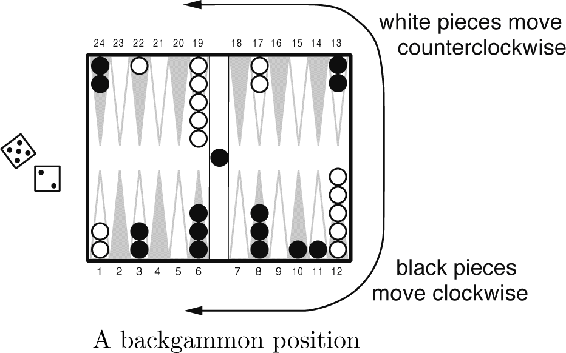
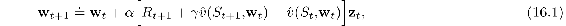
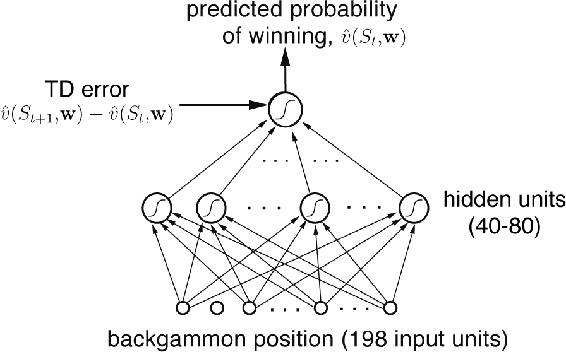
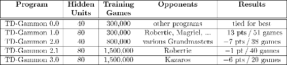

# 16.1  TD-Gammon

One of the most impressive applications of reinforcement learning to date is that by Gerald Tesauro to the game of backgammon (Tesauro, 1992, 1994, 1995, 2002). Tesauro’s program, *TD-Gammon*, required little backgammon knowledge, yet learned to play extremely well, near the level of the world’s strongest grandmasters. The learning algorithm in TD-Gammon was a straightforward combination of the TD(*λ*) algorithm and nonlinear function approximation using a multilayer artificial neural network (ANN) trained by backpropagating TD errors.

Backgammon is a major game in the sense that it is played throughout the world, with numerous tournaments and regular world championship matches. It is in part a game of chance, and it is a popular vehicle for waging significant sums of money. There are probably more professional backgammon players than there are professional chess players. The game is played with 15 white and 15 black pieces on a board of 24 locations, called *points*. To the right on the next page is shown a typical position early in the game, seen from the perspective of the white player. White here has just rolled the dice and obtained a 5 and a 2. This means that he can move one of his pieces 5 steps and one (possibly the same piece) 2 steps. For example, he could move two pieces from the 12 point, one to the 17 point, and one to the 14 point. White’s objective is to advance all of his pieces into the last quadrant (points 19–24) and then off the board. The first player to remove all his pieces wins. One complication is that the pieces interact as they pass each other going in different directions. For example, if it were black’s move, he could use the dice roll of 2 to move a piece from the 24 point to the 22 point, “hitting” the white piece there. Pieces that have been hit are placed on the “bar” in the middle of the board (where we already see one previously hit black piece), from whence they reenter the race from the start. However, if there are two pieces on a point, then the opponent cannot move to that point; the pieces are protected from being hit. Thus, white cannot use his 5–2 dice roll to move either of his pieces on the 1 point, because their possible resulting points are occupied by groups of black pieces. Forming contiguous blocks of occupied points to block the opponent is one of the elementary strategies of the game.

Backgammon involves several further complications, but the above description gives the basic idea. With 30 pieces and 24 possible locations (26, counting the bar and off-the-board) it should be clear that the number of possible backgammon positions is enormous, far more than the number of memory elements one could have in any physically realizable computer. The number of moves possible from each position is also large. For a typical dice roll there might be 20 different ways of playing. In considering future moves, such as the response of the opponent, one must consider the possible dice rolls as well. The result is that the game tree has an effective branching factor of about 400. This is far too large to permit effective use of the conventional heuristic search methods that have proved so effective in games like chess and checkers.

On the other hand, the game is a good match to the capabilities of TD learning methods. Although the game is highly stochastic, a complete description of the game’s state is available at all times. The game evolves over a sequence of moves and positions until finally ending in a win for one player or the other, ending the game. The outcome can be interpreted as a final reward to be predicted. On the other hand, the theoretical results we have described so far cannot be usefully applied to this task. The number of states is so large that a lookup table cannot be used, and the opponent is a source of uncertainty and time variation.

TD-Gammon used a nonlinear form of TD(*λ*). The estimated value,  (*s,* **w**), of any state (board position) *s* was meant to estimate the probability of winning starting from state *s*. To achieve this, rewards were defined as zero for all time steps except those on which the game is won. To implement the value function, TD-Gammon used a standard multilayer ANN, much like that shown to the right on the next page. (The real network had two additional units in its final layer to estimate the probability of each player’s winning in a special way called a “gammon” or “backgammon.”) The network consisted of a layer of input units, a layer of hidden units, and a final output unit. The input to the network was a representation of a backgammon position, and the output was an estimate of the value of that position.

In the first version of TD-Gammon, TD-Gammon 0.0, backgammon positions were represented to the network in a relatively direct way that involved little backgammon knowledge. It did, however, involve substantial knowledge of how ANNs work and how information is best presented to them. It is instructive to note the exact representation Tesauro chose. There were a total of 198 input units to the network. For each point on the backgammon board, four units indicated the number of white pieces on the point. If there were no white pieces, then all four units took on the value zero. If there was one piece, then the first unit took on the value 1. This encoded the elementary concept of a “blot,” i.e., a piece that can be hit by the opponent. If there were two or more pieces, then the second unit was set to 1. This encoded the basic concept of a “made point” on which the opponent cannot land. If there were exactly three pieces on the point, then the third unit was set to 1. This encoded the basic concept of a “single spare,” i.e., an extra piece in addition to the two pieces that made the point. Finally, if there were more than three pieces, the fourth unit was set to a value proportionate to the number of additional pieces beyond three. Letting *n* denote the total number of pieces on the point, if *n >* 3, then the fourth unit took on the value (*n* − 3)/2. This encoded a linear representation of “multiple spares” at the given point.

With four units for white and four for black at each of the 24 points, that made a total of 192 units. Two additional units encoded the number of white and black pieces on the bar (each took the value *n/*2, where *n* is the number of pieces on the bar), and two more encoded the number of black and white pieces already successfully removed from the board (these took the value *n/*15, where *n* is the number of pieces already borne off). Finally, two units indicated in a binary fashion whether it was white’s or black’s turn to move. The general logic behind these choices should be clear. Basically, Tesauro tried to represent the position in a straightforward way, while keeping the number of units relatively small. He provided one unit for each conceptually distinct possibility that seemed likely to be relevant, and he scaled them to roughly the same range, in this case between 0 and 1.

Given a representation of a backgammon position, the network computed its estimated value in the standard way. Corresponding to each connection from an input unit to a hidden unit was a real-valued weight. Signals from each input unit were multiplied by their corresponding weights and summed at the hidden unit. The output, *h*(*j*), of hidden unit *j* was a nonlinear sigmoid function of the weighted sum:

where *x**i* is the value of the *i*th input unit and *w**ij* is the weight of its connection to the *j*th hidden unit (all the weights in the network together make up the parameter vector **w**). The output of the sigmoid is always between 0 and 1, and has a natural interpretation as a probability based on a summation of evidence. The computation from hidden units to the output unit was entirely analogous. Each connection from a hidden unit to the output unit had a separate weight. The output unit formed the weighted sum and then passed it through the same sigmoid nonlinearity.

TD-Gammon used the semi-gradient form of the TD(*λ*) algorithm described in Section 12.2, with the gradients computed by the error backpropagation algorithm (Rumelhart, Hinton, and Williams, 1986). Recall that the general update rule for this case is

where **w***t* is the vector of all modifiable parameters (in this case, the weights of the network) and **z***t* is a vector of eligibility traces, one for each component of **w***t*, updated by

with **z**0 ≐ **0**. The gradient in this equation can be computed efficiently by the backpropagation procedure. For the backgammon application, in which *γ* = 1 and the reward is always zero except upon winning, the TD error portion of the learning rule is usually just  (*S**t*+1, **w**) − (*S**t*, **w**), as suggested in [Figure **16.1**](part0026_split_001.html#fig16-1).

[Figure 16.1](part0026_split_001.html#C_fig16-1): The TD-Gammon ANN

To apply the learning rule we need a source of backgammon games. Tesauro obtained an unending sequence of games by playing his learning backgammon player against itself. To choose its moves, TD-Gammon considered each of the 20 or so ways it could play its dice roll and the corresponding positions that would result. The resulting positions are *afterstates* as discussed in Section 6.8. The network was consulted to estimate each of their values. The move was then selected that would lead to the position with the highest estimated value. Continuing in this way, with TD-Gammon making the moves for both sides, it was possible to easily generate large numbers of backgammon games. Each game was treated as an episode, with the sequence of positions acting as the states, *S*0*, S*1*, S*2*, …*. Tesauro applied the nonlinear TD rule ([16.1](part0026_split_001.html#x1-189001r1)) fully incrementally, that is, after each individual move.

The weights of the network were set initially to small random values. The initial evaluations were thus entirely arbitrary. Because the moves were selected on the basis of these evaluations, the initial moves were inevitably poor, and the initial games often lasted hundreds or thousands of moves before one side or the other won, almost by accident. After a few dozen games however, performance improved rapidly.

After playing about 300,000 games against itself, TD-Gammon 0.0 as described above learned to play approximately as well as the best previous backgammon computer programs. This was a striking result because all the previous high-performance computer programs had used extensive backgammon knowledge. For example, the reigning champion program at the time was, arguably, *Neurogammon*, another program written by Tesauro that used an ANN but not TD learning. Neurogammon’s network was trained on a large training corpus of exemplary moves provided by backgammon experts, and, in addition, started with a set of features specially crafted for backgammon. Neurogammon was a highly tuned, highly effective backgammon program that decisively won the World Backgammon Olympiad in 1989. TD-Gammon 0.0, on the other hand, was constructed with essentially zero backgammon knowledge. That it was able to do as well as Neurogammon and all other approaches is striking testimony to the potential of self-play learning methods.

The tournament success of TD-Gammon 0.0 with zero expert backgammon knowledge suggested an obvious modification: add the specialized backgammon features but keep the self-play TD learning method. This produced TD-Gammon 1.0. TD-Gammon 1.0 was clearly substantially better than all previous backgammon programs and found serious competition only among human experts. Later versions of the program, TD-Gammon 2.0 (40 hidden units) and TD-Gammon 2.1 (80 hidden units), were augmented with a selective two-ply search procedure. To select moves, these programs looked ahead not just to the positions that would immediately result, but also to the opponent’s possible dice rolls and moves. Assuming the opponent always took the move that appeared immediately best for him, the expected value of each candidate move was computed and the best was selected. To save computer time, the second ply of search was conducted only for candidate moves that were ranked highly after the first ply, about four or five moves on average. Two-ply search affected only the moves selected; the learning process proceeded exactly as before. The final versions of the program, TD-Gammon 3.0 and 3.1, used 160 hidden units and a selective three-ply search. TD-Gammon illustrates the combination of learned value functions and decision-time search as in heuristic search and MCTS methods. In follow-on work, Tesauro and Galperin (1997) explored trajectory sampling methods as an alternative to full-width search, which reduced the error rate of live play by large numerical factors (4x–6x) while keeping the think time reasonable at *∼* 5–10 seconds per move.

During the 1990s, Tesauro was able to play his programs in a significant number of games against world-class human players. A summary of the results is given in [Table 16.1](part0026_split_001.html#tab16-1). Based on these results and analyses by backgammon grandmasters (Robertie, 1992; see Tesauro, 1995), TD-Gammon 3.0 appeared to play at close to, or possibly better than, the playing strength of the best human players in the world. Tesauro reported in a subsequent article (Tesauro, 2002) the results of an extensive rollout analysis of the move decisions and doubling decisions of TD-Gammon relative to top human players. The conclusion was that TD-Gammon 3.1 had a “lopsided advantage” in piece-movement decisions, and a “slight edge” in doubling decisions, over top humans.

[Table 16.1](part0026_split_001.html#cross-Table-16-1): Summary of TD-Gammon Results

TD-Gammon had a significant impact on the way the best human players play the game. For example, it learned to play certain opening positions differently than was the convention among the best human players. Based on TD-Gammon’s success and further analysis, the best human players now play these positions as TD-Gammon does (Tesauro, 1995). The impact on human play was greatly accelerated when several other self-teaching ANN backgammon programs inspired by TD-Gammon, such as Jellyfish, Snowie, and GNUBackgammon, became widely available. These programs enabled wide dissemination of new knowledge generated by the ANNs, resulting in great improvements in the overall caliber of human tournament play (Tesauro, 2002).
