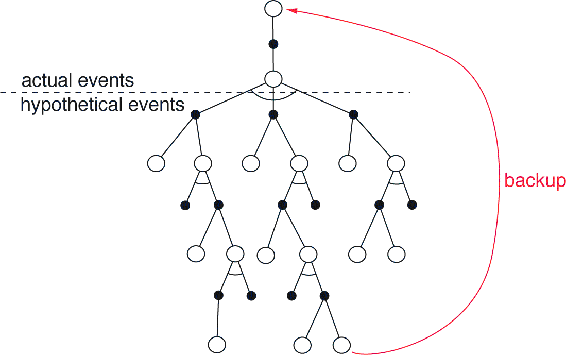

# 16.2  Samuel’s Checkers Player

An important precursor to Tesauro’s TD-Gammon was the seminal work of Arthur Samuel (1959, 1967) in constructing programs for learning to play checkers. Samuel was one of the first to make effective use of heuristic search methods and of what we would now call temporal-difference learning. His checkers players are instructive case studies in addition to being of historical interest. We emphasize the relationship of Samuel’s methods to modern reinforcement learning methods and try to convey some of Samuel’s motivation for using them.

Samuel first wrote a checkers-playing program for the IBM 701 in 1952. His first *learning* program was completed in 1955 and was demonstrated on television in 1956. Later versions of the program achieved good, though not expert, playing skill. Samuel was attracted to game-playing as a domain for studying machine learning because games are less complicated than problems “taken from life” while still allowing fruitful study of how heuristic procedures and learning can be used together. He chose to study checkers instead of chess because its relative simplicity made it possible to focus more strongly on learning.

Samuel’s programs played by performing a lookahead search from each current position. They used what we now call heuristic search methods to determine how to expand the search tree and when to stop searching. The terminal board positions of each search were evaluated, or “scored,” by a value function, or “scoring polynomial,” using linear function approx. In this and other respects Samuel’s work seems to have been inspired by the suggestions of Shannon (1950). In particular, Samuel’s program was based on Shannon’s minimax procedure to find the best move from the current position. Working backward through the search tree from the scored terminal positions, each position was given the score of the position that would result from the best move, assuming that the machine would always try to maximize the score, while the opponent would always try to minimize it. Samuel called this the “backed-up score” of the position. When the minimax procedure reached the search tree’s root—the current position—it yielded the best move under the assumption that the opponent would be using the same evaluation criterion, shifted to its point of view. Some versions of Samuel’s programs used sophisticated search control methods analogous to what are known as “alpha-beta” cutoffs (e.g., see Pearl, 1984).

Samuel used two main learning methods, the simplest of which he called *rote learning*. It consisted simply of saving a description of each board position encountered during play together with its backed-up value determined by the minimax procedure. The result was that if a position that had already been encountered were to occur again as a terminal position of a search tree, the depth of the search was effectively amplified because this position’s stored value cached the results of one or more searches conducted earlier. One initial problem was that the program was not encouraged to move along the most direct path to a win. Samuel gave it a “a sense of direction” by decreasing a position’s value a small amount each time it was backed up a level (called a ply) during the minimax analysis. “If the program is now faced with a choice of board positions whose scores differ only by the ply number, it will automatically make the most advantageous choice, choosing a low-ply alternative if winning and a high-ply alternative if losing” (Samuel, 1959, p. 80). Samuel found this discounting-like technique essential to successful learning. Rote learning produced slow but continual improvement that was most effective for opening and endgame play. His program became a “better-than-average novice” after learning from many games against itself, a variety of human opponents, and from book games in a supervised learning mode.

Rote learning and other aspects of Samuel’s work strongly suggest the essential idea of temporal-difference learning—that the value of a state should equal the value of likely following states. Samuel came closest to this idea in his second learning method, his “learning by generalization” procedure for modifying the parameters of the value function. Samuel’s method was the same in concept as that used much later by Tesauro in TD-Gammon. He played his program many games against another version of itself and performed an update after each move. The idea of Samuel’s update is suggested by the backup diagram in [Figure 16.2](part0026_split_002.html#fig16-2). Each open circle represents a position where the program moves next, an *on-move* position, and each solid circle represents a position where the opponent moves next. An update was made to the value of each on-move position after a move by each side, resulting in a second on-move position. The update was toward the minimax value of a search launched from the second on-move position. Thus, the overall effect was that of a backing-up over one full move of real events and then a search over possible events, as suggested by [Figure 16.2](part0026_split_002.html#fig16-2). Samuel’s actual algorithm was significantly more complex than this for computational reasons, but this was the basic idea.

[Figure 16.2](part0026_split_002.html#C_fig16-2): The backup diagram for Samuel’s checkers player.

Samuel did not include explicit rewards. Instead, he fixed the weight of the most important feature, the *piece advantage* feature, which measured the number of pieces the program had relative to how many its opponent had, giving higher weight to kings, and including refinements so that it was better to trade pieces when winning than when losing. Thus, the goal of Samuel’s program was to improve its piece advantage, which in checkers is highly correlated with winning.

However, Samuel’s learning method may have been missing an essential part of a sound temporal-difference algorithm. Temporal-difference learning can be viewed as a way of making a value function consistent with itself, and this we can clearly see in Samuel’s method. But also needed is a way of tying the value function to the true value of the states. We have enforced this via rewards and by discounting or giving a fixed value to the terminal state. But Samuel’s method included no rewards and no special treatment of the terminal positions of games. As Samuel himself pointed out, his value function could have become consistent merely by giving a constant value to all positions. He hoped to discourage such solutions by giving his piece-advantage term a large, nonmodifiable weight. But although this may decrease the likelihood of finding useless evaluation functions, it does not prohibit them. For example, a constant function could still be attained by setting the modifiable weights so as to cancel the effect of the nonmodifiable one.

Because Samuel’s learning procedure was not constrained to find useful evaluation functions, it should have been possible for it to become worse with experience. In fact, Samuel reported observing this during extensive self-play training sessions. To get the program improving again, Samuel had to intervene and set the weight with the largest absolute value back to zero. His interpretation was that this drastic intervention jarred the program out of local optima, but another possibility is that it jarred the program out of evaluation functions that were consistent but had little to do with winning or losing the game.

Despite these potential problems, Samuel’s checkers player using the generalization learning method approached “better-than-average” play. Fairly good amateur opponents characterized it as “tricky but beatable” (Samuel, 1959). In contrast to the rote-learning version, this version was able to develop a good middle game but remained weak in opening and endgame play. This program also included an ability to search through sets of features to find those that were most useful in forming the value function. A later version (Samuel, 1967) included refinements in its search procedure, such as alpha-beta pruning, extensive use of a supervised learning mode called “book learning,” and hierarchical lookup tables called signature tables (Griffith, 1966) to represent the value function instead of linear function approx. This version learned to play much better than the 1959 program, though still not at a master level. Samuel’s checkers-playing program was widely recognized as a significant achievement in artificial intelligence and machine learning.
