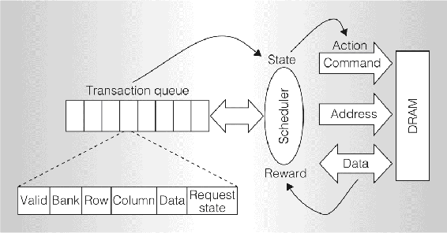
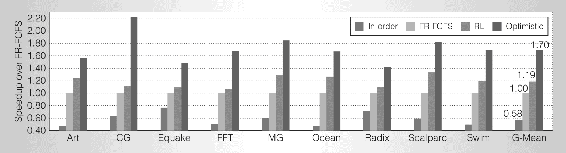

# 16.4  Optimizing Memory Control

Most computers use dynamic random access memory (DRAM) as their main memory because of its low cost and high capacity. The job of a DRAM memory controller is to efficiently use the interface between the processor chip and an off-chip DRAM system to provide the high-bandwidth and low-latency data transfer necessary for high-speed program execution. A memory controller needs to deal with dynamically changing patterns of read/write requests while adhering to a large number of timing and resource constraints required by the hardware. This is a formidable scheduling problem, especially with modern processors with multiple cores sharing the same DRAM.

İpek, Mutlu, Martínez, and Caruana (2008) (also Martínez and İpek, 2009) designed a reinforcement learning memory controller and demonstrated that it can significantly improve the speed of program execution over what was possible with conventional controllers at the time of their research. They were motivated by limitations of existing state-of-the-art controllers that used policies that did not take advantage of past scheduling experience and did not account for long-term consequences of scheduling decisions. İpek et al.’s project was carried out by means of simulation, but they designed the controller at the detailed level of the hardware needed to implement it—including the learning algorithm—directly on a processor chip.

Accessing DRAM involves a number of steps that have to be done according to strict time constraints. DRAM systems consist of multiple DRAM chips, each containing multiple rectangular arrays of storage cells arranged in rows and columns. Each cell stores a bit as the charge on a capacitor. Because the charge decreases over time, each DRAM cell needs to be recharged—refreshed—every few milliseconds to prevent memory content from being lost. This need to refresh the cells is why DRAM is called “dynamic.”

Each cell array has a row buffer that holds a row of bits that can be transferred into or out of one of the array’s rows. An *activate* command “opens a row,” which means moving the contents of the row whose address is indicated by the command into the row buffer. With a row open, the controller can issue *read* and *write* commands to the cell array. Each read command transfers a word (a short sequence of consecutive bits) in the row buffer to the external data bus, and each write command transfers a word in the external data bus to the row buffer. Before a different row can be opened, a *precharge* command must be issued which transfers the (possibly updated) data in the row buffer back into the addressed row of the cell array. After this, another activate command can open a new row to be accessed. Read and write commands are *column commands* because they sequentially transfer bits into or out of columns of the row buffer; multiple bits can be transferred without re-opening the row. Read and write commands to the currently-open row can be carried out more quickly than accessing a different row, which would involve additional *row commands*: precharge and activate; this is sometimes referred to as “row locality.” A memory controller maintains a *memory transaction queue* that stores memory-access requests from the processors sharing the memory system. The controller has to process requests by issuing commands to the memory system while adhering to a large number of timing constraints.

A controller’s policy for scheduling access requests can have a large effect on the performance of the memory system, such as the average latency with which requests can be satisfied and the throughput the system is capable of achieving. The simplest scheduling strategy handles access requests in the order in which they arrive by issuing all the commands required by the request before beginning to service the next one. But if the system is not ready for one of these commands, or executing a command would result in resources being underutilized (e.g., due to timing constraints arising from servicing that one command), it makes sense to begin servicing a newer request before finishing the older one. Policies can gain efficiency by reordering requests, for example, by giving priority to read requests over write requests, or by giving priority to read/write commands to already open rows. The policy called First-Ready, First-Come-First-Serve (FR-FCFS), gives priority to column commands (read and write) over row commands (activate and precharge), and in case of a tie gives priority to the oldest command. FR-FCFS was shown to outperform other scheduling policies in terms of average memory-access latency under conditions commonly encountered (Rixner, 2004).

[Figure 16.3](part0026_split_004.html#fig16-3) is a high-level view of İpek et al.’s reinforcement learning memory controller. They modeled the DRAM access process as an MDP whose states are the contents of the transaction queue and whose actions are commands to the DRAM system: *precharge*, *activate*, *read*, *write*, and *NoOp*. The reward signal is 1 whenever the action is *read* or *write*, and otherwise it is 0. State transitions were considered to be stochastic because the next state of the system not only depends on the scheduler’s command, but also on aspects of the system’s behavior that the scheduler cannot control, such as the workloads of the processor cores accessing the DRAM system.

[Figure 16.3](part0026_split_004.html#C_fig16-3): High-level view of the reinforcement learning DRAM controller. The scheduler is the reinforcement learning agent. Its environment is represented by features of the transaction queue, and its actions are commands to the DRAM system. Ⓒ2009 IEEE. Reprinted, with permission, from J. F. Martínez and E. İpek, Dynamic multicore resource management: A machine learning approach, *Micro, IEEE, 29*(5), p. 12.

Critical to this MDP are constraints on the actions available in each state. Recall from Chapter 3 that the set of available actions can depend on the state: *A**t* ∈𝒜(*S**t*), where *A**t* is the action at time step *t* and 𝒜(*S**t*) is the set of actions available in state *S**t*. In this application, the integrity of the DRAM system was assured by not allowing actions that would violate timing or resource constraints. Although İpek et al. did not make it explicit, they effectively accomplished this by pre-defining the sets 𝒜(*S**t*) for all possible states *S**t*.

These constraints explain why the MDP has a *NoOp* action and why the reward signal is 0 except when a *read* or *write* command is issued. *NoOp* is issued when it is the sole legal action in a state. To maximize utilization of the memory system, the controller’s task is to drive the system to states in which either a *read* or a *write* action can be selected: only these actions result in sending data over the external data bus, so it is only these that contribute to the throughput of the system. Although *precharge* and *activate* produce no immediate reward, the agent needs to select these actions to make it possible to later select the rewarded *read* and *write* actions.

The scheduling agent used Sarsa (Section 6.4) to learn an action-value function. States were represented by six integer-valued features. To approximate the action-value function, the algorithm used linear function approx. implemented by tile coding with hashing (Section 9.5.4). The tile coding had 32 tilings, each storing 256 action values as 16-bit fixed point numbers. Exploration was *ε*-greedy with *ε* = 0.05.

State features included the number of read requests in the transaction queue, the number of write requests in the transaction queue, the number of write requests in the transaction queue waiting for their row to be opened, and the number of read requests in the transaction queue waiting for their row to be opened that are the oldest issued by their requesting processors. (The other features depended on how the DRAM interacts with cache memory, details we omit here.) The selection of the state features was based on İpek et al.’s understanding of factors that impact DRAM performance. For example, balancing the rate of servicing reads and writes based on how many of each are in the transaction queue can help avoid stalling the DRAM system’s interaction with cache memory. The authors in fact generated a relatively long list of potential features, and then pared them down to a handful using simulations guided by stepwise feature selection.

An interesting aspect of this formulation of the scheduling problem as an MDP is that the features input to the tile coding for defining the action-value function were different from the features used to specify the action-constraint sets 𝒜(*S**t*). Whereas the tile coding input was derived from the contents of the transaction queue, the constraint sets depended on a host of other features related to timing and resource constraints that had to be satisfied by the hardware implementation of the entire system. In this way, the action constraints ensured that the learning algorithm’s exploration could not endanger the integrity of the physical system, while learning was effectively limited to a “safe” region of the much larger state space of the hardware implementation.

Because an objective of this work was that the learning controller could be implemented on a chip so that learning could occur online while a computer is running, hardware implementation details were important considerations. The design included two five-stage pipelines to calculate and compare two action values at every processor clock cycle, and to update the appropriate action value. This included accessing the tile coding which was stored on-chip in static RAM. For the configuration İpek et al. simulated, which was a 4GHz 4-core chip typical of high-end workstations at the time of their research, there were 10 processor cycles for every DRAM cycle. Considering the cycles needed to fill the pipes, up to 12 actions could be evaluated in each DRAM cycle. İpek et al. found that the number of legal commands for any state was rarely greater than this, and that performance loss was negligible if enough time was not always available to consider all legal commands. These and other clever design details made it feasible to implement the complete controller and learning algorithm on a multi-processor chip.

İpek et al. evaluated their learning controller in simulation by comparing it with three other controllers: 1) the FR-FCFS controller mentioned above that produces the best on-average performance, 2) a conventional controller that processes each request in order, and 3) an unrealizable ideal controller, called the Optimistic controller, able to sustain 100% DRAM throughput if given enough demand by ignoring all timing and resource constraints, but otherwise modeling DRAM latency (as row buffer hits) and bandwidth. They simulated nine memory-intensive parallel workloads consisting of scientific and data-mining applications. [Figure 16.4](part0026_split_004.html#fig16-4) shows the performance (the inverse of execution time normalized to the performance of FR-FCFS) of each controller for the nine applications, together with the geometric mean of their performances over the applications. The learning controller, labeled RL in the figure, improved over that of FR-FCFS by from 7% to 33% over the nine applications, with an average improvement of 19%. Of course, no realizable controller can match the performance of Optimistic, which ignores all timing and resource constraints, but the learning controller’s performance closed the gap with Optimistic’s upper bound by an impressive 27%.

[Figure 16.4](part0026_split_004.html#C_fig16-4): Performances of four controllers over a suite of 9 simulated benchmark applications. The controllers are: the simplest ‘in-order’ controller, FR-FCFS, the learning controller RL, and the unrealizable Optimistic controller which ignores all timing and resource constraints to provide a performance upper bound. Performance, normalized to that of FR-FCFS, is the inverse of execution time. At far right is the geometric mean of performances over the 9 benchmark applications for each controller. Controller RL comes closest to the ideal performance. Ⓒ2009 IEEE. Reprinted, with permission, from J. F. Martínez and E. İpek, Dynamic multicore resource management: A machine learning approach, *Micro, IEEE, 29*(5), p. 13.

Because the rationale for on-chip implementation of the learning algorithm was to allow the scheduling policy to adapt online to changing workloads, İpek et al. analyzed the impact of online learning compared to a previously-learned fixed policy. They trained their controller with data from all nine benchmark applications and then held the resulting action values fixed throughout the simulated execution of the applications. They found that the average performance of the controller that learned online was 8% better than that of the controller using the fixed policy, leading them to conclude that online learning is an important feature of their approach.

This learning memory controller was never committed to physical hardware because of the large cost of fabrication. Nevertheless, İpek et al. could convincingly argue on the basis of their simulation results that a memory controller that learns online via reinforcement learning has the potential to improve performance to levels that would otherwise require more complex and more expensive memory systems, while removing from human designers some of the burden required to manually design efficient scheduling policies. Mukundan and Martínez (2012) took this project forward by investigating learning controllers with additional actions, other performance criteria, and more complex reward functions derived using genetic algorithms. They considered additional performance criteria related to energy efficiency. The results of these studies surpassed the earlier results described above and significantly surpassed the 2012 state-of-the-art for all of the performance criteria they considered. The approach is especially promising for developing sophisticated power-aware DRAM interfaces.
