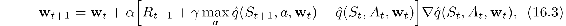
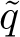

# 16.5  Human-level Video Game Play

One of the greatest challenges in applying reinforcement learning to real-world problems is deciding how to represent and store value functions and/or policies. Unless the state set is finite and small enough to allow exhaustive representation by a lookup table—as in many of our illustrative examples—one must use a parameterized function approximation scheme. Whether linear or nonlinear, function approximation relies on features that have to be readily accessible to the learning system and able to convey the information necessary for skilled performance. Most successful applications of reinforcement learning owe much to sets of features carefully handcrafted based on human knowledge and intuition about the specific problem to be tackled.

A team of researchers at Google DeepMind developed an impressive demonstration that a deep multi-layer ANN can automate the feature design process (Mnih et al., 2013, 2015). Multi-layer ANNs have been used for function approximation in reinforcement learning ever since the 1986 popularization of the backpropagation algorithm as a method for learning internal representations (Rumelhart, Hinton, and Williams, 1986; see Section 9.7). Striking results have been obtained by coupling reinforcement learning with backpropagation. The results obtained by Tesauro and colleages with TD-Gammon and WATSON discussed above are notable examples. These and other applications benefited from the ability of multi-layer ANNs to learn task-relevant features. However, in all the examples of which we are aware, the most impressive demonstrations required the network’s input to be represented in terms of specialized features handcrafted for the given problem. This is vividly apparent in the TD-Gammon results. TD-Gammon 0.0, whose network input was essentially a “raw”representation of the backgammon board, meaning that it involved very little knowledge of backgammon, learned to play approximately as well as the best previous backgammon computer programs. Adding specialized backgammon features produced TD-Gammon 1.0 which was substantially better than all previous backgammon programs and competed well against human experts.

Mnih et al. developed a reinforcement learning agent called *deep Q-network* (DQN) that combined Q-learning with a *deep convolutional* ANN, a many-layered, or deep, ANN specialized for processing spatial arrays of data such as images. We describe deep convolutional ANNs in Section 9.7. By the time of Mnih et al.’s work with DQN, deep ANNs, including deep convolutional ANNs, had produced impressive results in many applications, but they had not been widely used in reinforcement learning.

Mnih et al. used DQN to show how a reinforcement learning agent can achieve a high level of performance on any of a collection of different problems without having to use different problem-specific feature sets. To demonstrate this, they let DQN learn to play 49 different Atari 2600 video games by interacting with a game emulator. DQN learned a different policy for each of the 49 games (because the weights of its ANN were reset to random values before learning on each game), but it used the same raw input, network architecture, and parameter values (e.g., step size, discount rate, exploration parameters, and many more specific to the implementation) for all of the games. DQN achieved levels of play at or beyond human level on a large fraction of these games. Although the games were alike in being played by watching streams of video images, they varied widely in other respects. Their actions had different effects, they had different state-transition dynamics, and they needed different policies for learning high scores. The deep convolutional ANN learned to transform the raw input common to all the games into features specialized for representing the action values required for playing at the high level DQN achieved for most of the games.

The Atari 2600 is a home video game console that was sold in various versions by Atari Inc. from 1977 to 1992. It introduced or popularized many arcade video games that are now considered classics, such as Pong, Breakout, Space Invaders, and Asteroids. Although much simpler than modern video games, Atari 2600 games are still entertaining and challenging for human players, and they have been attractive as testbeds for developing and evaluating reinforcement learning methods (Diuk, Cohen, Littman, 2008; Naddaf, 2010; Cobo, Zang, Isbell, and Thomaz, 2011; Bellemare, Veness, and Bowling, 2013). Bellemare, Naddaf, Veness, and Bowling (2012) developed the publicly available Arcade Learning Environment (ALE) to encourage and simplify using Atari 2600 games to study learning and planning algorithms.

These previous studies and the availability of ALE made the Atari 2600 game collection a good choice for Mnih et al.’s demonstration, which was also influenced by the impressive human-level performance that TD-Gammon was able to achieve in backgammon. DQN is similar to TD-Gammon in using a multi-layer ANN as the function approximation method for a semi-gradient form of a TD algorithm, with the gradients computed by the backpropagation algorithm. However, instead of using TD(*λ*) as TD-Gammon did, DQN used the semi-gradient form of Q-learning. TD-Gammon estimated the values of afterstates, which were easily obtained from the rules for making backgammon moves. To use the same algorithm for the Atari games would have required generating the next states for each possible action (which would not have been afterstates in that case). This could have been done by using the game emulator to run single-step simulations for all the possible actions (which ALE makes possible). Or a model of each game’s state-transition function could have been learned and used to predict next states (Oh, Guo, Lee, Lewis, and Singh, 2015). While these methods might have produced results comparable to DQN’s, they would have been more complicated to implement and would have significantly increased the time needed for learning. Another motivation for using Q-learning was that DQN used the *experience replay* method, described below, which requires an off-policy algorithm. Being model-free and off-policy made Q-learning a natural choice.

Before describing the details of DQN and how the experiments were conducted, we look at the skill levels DQN was able to achieve. Mnih et al. compared the scores of DQN with the scores of the best performing learning system in the literature at the time, the scores of a professional human games tester, and the scores of an agent that selected actions at random. The best system from the literature used linear function approx. with features designed using some knowledge about Atari 2600 games (Bellemare, Naddaf, Veness, and Bowling, 2013). DQN learned on each game by interacting with the game emulator for 50 million frames, which corresponds to about 38 days of experience with the game. At the start of learning on each game, the weights of DQN’s network were reset to random values. To evaluate DQN’s skill level after learning, its score was averaged over 30 sessions on each game, each lasting up to 5 minutes and beginning with a random initial game state. The professional human tester played using the same emulator (with the sound turned off to remove any possible advantage over DQN which did not process audio). After 2 hours of practice, the human played about 20 episodes of each game for up to 5 minutes each and was not allowed to take any break during this time. DQN learned to play better than the best previous reinforcement learning systems on all but 6 of the games, and played better than the human player on 22 of the games. By considering any performance that scored at or above 75% of the human score to be comparable to, or better than, human-level play, Mnih et al. concluded that the levels of play DQN learned reached or exceeded human level on 29 of the 46 games. See Mnih et al. (2015) for a more detailed account of these results.

For an artificial learning system to achieve these levels of play would be impressive enough, but what makes these results remarkable—and what many at the time considered to be breakthrough results for artificial intelligence—is that the very same learning system achieved these levels of play on widely varying games without relying on any game-specific modifications.

A human playing any of these 49 Atari games sees 210 × 160 pixel image frames with 128 colors at 60Hz. In principle, exactly these images could have formed the raw input to DQN, but to reduce memory and processing requirements, Mnih et al. preprocessed each frame to produce an 84 × 84 array of luminance values. Because the full states of many of the Atari games are not completely observable from the image frames, Mnih et al. “stacked” the four most recent frames so that the inputs to the network had dimension 84 × 84 × 4. This did not eliminate partial observability for all of the games, but it was helpful in making many of them more Markovian.

An essential point here is that these preprocessing steps were exactly the same for all 46 games. No game-specific prior knowledge was involved beyond the general understanding that it should still be possible to learn good policies with this reduced dimension and that stacking adjacent frames should help with the partial observability of some of the games. Because no game-specific prior knowledge beyond this minimal amount was used in preprocessing the image frames, we can think of the 84 × 84 × 4 input vectors as being “raw” input to DQN.

The basic architecture of DQN is similar to the deep convolutional ANN illustrated in [Figure 9.15](part0018_split_012.html#fig9-15) (though unlike that network, subsampling in DQN is treated as part of each convolutional layer, with feature maps consisting of units having only a selection of the possible receptive fields). DQN has three hidden convolutional layers, followed by one fully connected hidden layer, followed by the output layer. The three successive hidden convolutional layers of DQN produce 32 20 × 20 feature maps, 64 9 × 9 feature maps, and 64 7 × 7 feature maps. The activation function of the units of each feature map is a rectifier nonlinearity ( max(0*, x*)). The 3,136 (64 × 7 × 7) units in this third convolutional layer all connect to each of 512 units in the fully connected hidden layer, which then each connect to all 18 units in the output layer, one for each possible action in an Atari game.

The activation levels of DQN’s output units were the estimated optimal action values of the corresponding state–action pairs, for the state represented by the network’s input. The assignment of output units to a game’s actions varied from game to game, and because the number of valid actions varied between 4 and 18 for the games, not all output units had functional roles in all of the games. It helps to think of the network as if it were 18 separate networks, one for estimating the optimal action value of each possible action. In reality, these networks shared their initial layers, but the output units learned to use the features extracted by these layers in different ways.

DQN’s reward signal indicated how a games’s score changed from one time step to the next: + 1 whenever it increased, − 1 whenever it decreased, and 0 otherwise. This standardized the reward signal across the games and made a single step-size parameter work well for all the games despite their varying ranges of scores. DQN used an *ε*-greedy policy, with *ε* decreasing linearly over the first million frames and remaining at a low value for the rest of the learning session. The values of the various other parameters, such as the learning step size, discount rate, and others specific to the implementation, were selected by performing informal searches to see which values worked best for a small selection of the games. These values were then held fixed for all of the games.

After DQN selected an action, the action was executed by the game emulator, which returned a reward and the next video frame. The frame was preprocessed and added to the four-frame stack that became the next input to the network. Skipping for the moment the changes to the basic Q-learning procedure made by Mnih et al., DQN used the following semi-gradient form of Q-learning to update the network’s weights:

where **w***t* is the vector of the network’s weights, *A**t* is the action selected at time step *t*, and *S**t* and *S**t*+1 are respectively the preprocessed image stacks input to the network at time steps *t* and *t* + 1.

The gradient in ([16.3](part0026_split_005.html#x1-193001r3)) was computed by backpropagation. Imagining again that there was a separate network for each action, for the update at time step *t*, backpropagation was applied only to the network corresponding to *A**t*. Mnih et al. took advantage of techniques shown to improve the basic backpropagation algorithm when applied to large networks. They used a *mini-batch method* that updated weights only after accumulating gradient information over a small batch of images (here after 32 images). This yielded smoother sample gradients compared to the usual procedure that updates weights after each action. They also used a gradient-ascent algorithm called RMSProp (Tieleman and Hinton, 2012) that accelerates learning by adjusting the step-size parameter for each weight based on a running average of the magnitudes of recent gradients for that weight.

Mnih et al. modified the basic Q-learning procedure in three ways. First, they used a method called *experience replay* first studied by Lin (1992). This method stores the agent’s experience at each time step in a replay memory that is accessed to perform the weight updates. It worked like this in DQN. After the game emulator executed action *A**t* in a state represented by the image stack *S**t*, and returned reward *R**t*+1 and image stack *S**t*+1, it added the tuple (*S**t**, A**t**, R**t*+1*, S**t*+1) to the replay memory. This memory accumulated experiences over many plays of the same game. At each time step multiple Q-learning updates—a mini-batch—were performed based on experiences sampled uniformly at random from the replay memory. Instead of *S**t*+1 becoming the new *S**t* for the next update as it would in the usual form of Q-learning, a new unconnected experience was drawn from the replay memory to supply data for the next update. Because Q-learning is an off-policy algorithm, it does not need to be applied along connected trajectories.

Q-learning with experience replay provided several advantages over the usual form of Q-learning. The ability to use each stored experience for many updates allowed DQN to learn more efficiently from its experiences. Experience replay reduced the variance of the updates because successive updates were not correlated with one another as they would be with standard Q-learning. And by removing the dependence of successive experiences on the current weights, experience replay eliminated one source of instability.

Mnih et al. modified standard Q-learning in a second way to improve its stability. As in other methods that bootstrap, the target for a Q-learning update depends on the current action-value function estimate. When a parameterized function approximation method is used to represent action values, the target is a function of the same parameters that are being updated. For example, the target in the update given by ([16.3](part0026_split_005.html#x1-193001r3)) is *γ* max*a* (*S**t*+1*, a,* **w***t*). Its dependence on **w***t* complicates the process compared to the simpler supervised-learning situation in which the targets do not depend on the parameters being updated. As discussed in Chapter 11 this can lead to oscillations and/or divergence.

To address this problem Mnih et al. used a technique that brought Q-learning closer to the simpler supervised-learning case while still allowing it to bootstrap. Whenever a certain number, *C*, of updates had been done to the weights **w** of the action-value network, they inserted the network’s current weights into another network and held these duplicate weights fixed for the next *C* updates of **w**. The outputs of this duplicate network over the next *C* updates of **w** were used as the Q-learning targets. Letting  denote the output of this duplicate network, then instead of ([16.3](part0026_split_005.html#x1-193001r3)) the update rule was:

A final modification of standard Q-learning was also found to improve stability. They clipped the error term *R**t*+1 + *γ* max*a* (*S**t*+1*, a,* **w***t*) − (*S**t**, A**t*, **w***t*) so that it remained in the interval [−1, 1].

Mnih et al. conducted a large number of learning runs on 5 of the games to gain insight into the effect that various of DQN’s design features had on its performance. They ran DQN with the four combinations of experience replay and the duplicate target network being included or not included. Although the results varied from game to game, each of these features alone significantly improved performance, and very dramatically improved performance when used together. Mnih et al. also studied the role played by the deep convolutional ANN in DQN’s learning ability by comparing the deep convolutional version of DQN with a version having a network of just one linear layer, both receiving the same stacked preprocessed video frames. Here, the improvement of the deep convolutional version over the linear version was particularly striking across all 5 of the test games.

Creating artificial agents that excel over a diverse collection of challenging tasks has been an enduring goal of artificial intelligence. The promise of machine learning as a means for achieving this has been frustrated by the need to craft problem-specific representations. DeepMind’s DQN stands as a major step forward by demonstrating that a single agent can learn problem-specific features enabling it to acquire human-competitive skills over a range of tasks. This demonstration did not produce one agent that simultaneously excelled at all the tasks (because learning occurred separately for each task), but it showed that deep learning can reduce, and possibly eliminate, the need for problem-specific design and tuning. As Mnih et al. point out, however, DQN is not a complete solution to the problem of task-independent learning. Although the skills needed to excel on the Atari games were markedly diverse, all the games were played by observing video images, which made a deep convolutional ANN a natural choice for this collection of tasks. In addition, DQN’s performance on some of the Atari 2600 games fell considerably short of human skill levels on these games. The games most difficult for DQN—especially Montezuma’s Revenge on which DQN learned to perform about as well as the random player—require deep planning beyond what DQN was designed to do. Further, learning control skills through extensive practice, like DQN learned how to play the Atari games, is just one of the types of learning humans routinely accomplish. Despite these limitations, DQN advanced the state-of-the-art in machine learning by impressively demonstrating the promise of combining reinforcement learning with modern methods of deep learning.
