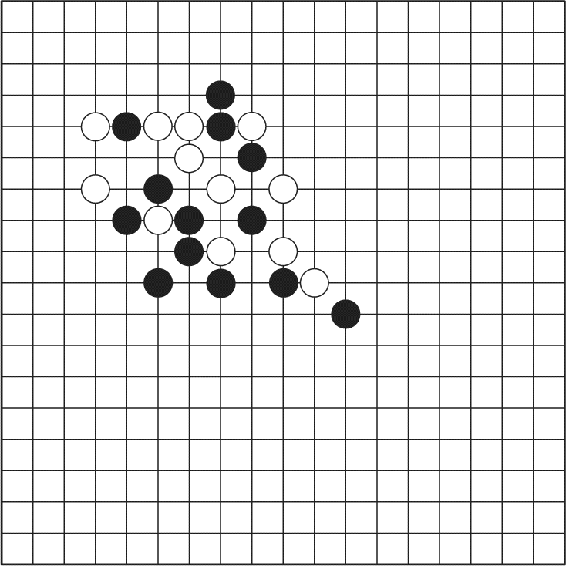
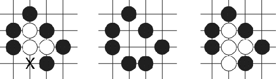

# 16.6  Mastering the Game of Go

The ancient Chinese game of Go has challenged artificial intelligence researchers for many decades. Methods that achieve human-level skill, or even superhuman-level skill, in other games have not been successful in producing strong Go programs. Thanks to a very active community of Go programmers and international competitions, the level of Go program play has improved significantly over the years. Until recently, however, no Go program had been able to play anywhere near the level of a human Go master.

A team at DeepMind (Silver et al., 2016) developed the program *AlphaGo* that broke this barrier by combining deep ANNs (Section 9.7), supervised learning, Monte Carlo tree search (MCTS, Section 8.11), and reinforcement learning. By the time of Silver et al.’s 2016 publication, *AlphaGo* had been shown to be decisively stronger than other current Go programs, and it had defeated the European Go champion Fan Hui 5 games to 0. These were the first victories of a Go program over a professional human Go player without handicap in full Go games. Shortly thereafter, a similar version of *AlphaGo* won stunning victories over the 18-time world champion Lee Sedol, winning 4 out of a 5 games in a challenge match, making worldwide headline news. Artificial intelligence researchers thought that it would be many more years, perhaps decades, before a program reached this level of play.

Here we describe *AlphaGo* and a successor program called *AlphaGo Zero* (Silver et al. 2017a). Where in addition to reinforcement learning, *AlphaGo* relied on supervised learning from a large database of expert human moves, *AlphaGo Zero* used only reinforcement learning and no human data or guidance beyond the basic rules of the game (hence the *Zero* in its name). We first describe *AlphaGo* in some detail in order to highlight the relative simplicity of *AlphaGo Zero*, which is both higher-performing and more of a pure reinforcement learning program.

In many ways, both *AlphaGo* and *AlphaGo Zero* are descendants of Tesauro’s TD-Gammon (Section 16.1), itself a descendant of Samuel’s checkers player (Section 16.2). All these programs included reinforcement learning over simulated games of self-play. *AlphaGo* and *AlphaGo Zero* also built upon the progress made by DeepMind on playing Atari games with the program DQN (Section 16.5) that used deep convolutional ANNs to approximate optimal value functions.

A Go board configuration

Go is a game between two players who alternately place black and white ‘stones’ on unoccupied intersections, or ‘points,’ on a board with a grid of 19 horizontal and 19 vertical lines to produce positions like that shown to the right. The game’s goal is to capture an area of the board larger than that captured by the opponent. Stones are captured according to simple rules. A player’s stones are captured if they are completely surrounded by the other player’s stones, meaning that there is no horizontally or vertically adjacent point that is unoccupied. For example, [Figure 16.5](part0026_split_006.html#fig16-5) shows on the left three white stones with an unoccupied adjacent point (labeled X). If player black places a stone on X, the three white stones are captured and taken off the board ([Figure 16.5](part0026_split_006.html#fig16-5) middle). However, if player white were to place a stone on point X first, then the possibility of this capture would be blocked ([Figure 16.5](part0026_split_006.html#fig16-5) right). Other rules are needed to prevent infinite capturing/recapturing loops. The game ends when neither player wishes to place another stone. These rules are simple, but they produce a very complex game that has had wide appeal for thousands of years.

[Figure 16.5](part0026_split_006.html#C_fig16-5): Go capturing rule. Left: the three white stones are not surrounded because point X is unoccupied. Middle: if black places a stone on X, the three white stones are captured and removed from the board. Right: if white places a stone on point X first, the capture is blocked.

Methods that produce strong play for other games, such as chess, have not worked as well for Go. The search space for Go is significantly larger than that of chess because Go has a larger number of legal moves per position than chess ( ≈ 250 versus ≈ 35) and Go games tend to involve more moves than chess games ( ≈ 150 versus ≈ 80). But the size of the search space is not the major factor that makes Go so difficult. Exhaustive search is infeasible for both chess and Go, and Go on smaller boards (e.g., 9 × 9) has proven to be exceedingly difficult as well. Experts agree that the major stumbling block to creating stronger-than-amateur Go programs is the difficulty of defining an adequate position evaluation function. A good evaluation function allows search to be truncated at a feasible depth by providing relatively easy-to-compute predictions of what deeper search would likely yield. According to Müller (2002): “No simple yet reasonable evaluation function will ever be found for Go.” A major step forward was the introduction of MCTS to Go programs. The strongest programs at the time of *AlphaGo*’s development all included MCTS, but master-level skill remained elusive.

Recall from Section 8.11 that MCTS is a decision-time planning procedure that does not attempt to learn and store a global evaluation function. Like a rollout algorithm (Section 8.10), it runs many Monte Carlo simulations of entire episodes (here, entire Go games) to select each action (here, each Go move: where to place a stone or to resign). Unlike a simple rollout algorithm, however, MCTS is an iterative procedure that incrementally extends a search tree whose root node represents the current environment state. As illustrated in [Figure 8.10](part0016_split_011.html#fig8-10), each iteration traverses the tree by simulating actions guided by statistics associated with the tree’s edges. In its basic version, when a simulation reaches a leaf node of the search tree, MCTS expands the tree by adding some, or all, of the leaf node’s children to the tree. From the leaf node, or one of its newly added child nodes, a rollout is executed: a simulation that typically proceeds all the way to a terminal state, with actions selected by a rollout policy. When the rollout completes, the statistics associated with the search tree’s edges that were traversed in this iteration are updated by backing up the return produced by the rollout. MCTS continues this process, starting each time at the search tree’s root at the current state, for as many iterations as possible given the time constraints. Then, finally, an action from the root node (which still represents the current environment state) is selected according to statistics accumulated in the root node’s outgoing edges. This is the action the agent takes. After the environment transitions to its next state, MCTS is executed again with the root node set to represent the new current state. The search tree at the start of this next execution might be just this new root node, or it might include descendants of this node left over from MCTS’s previous execution. The remainder of the tree is discarded.
