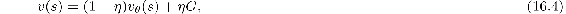
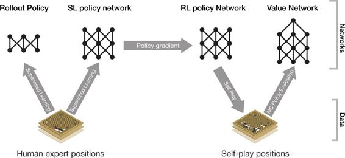

## 16.6.1  AlphaGo

The main innovation that made *AlphaGo* such a strong player is that it selected moves by a novel version of MCTS that was guided by both a policy and a value function learned by reinforcement learning with function approximation provided by deep convolutional ANNs. Another key feature is that instead of reinforcement learning starting from random network weights, it started from weights that were the result of previous supervised learning from a large collection of human expert moves.

The DeepMind team called *AlphaGo*’s modification of basic MCTS “asynchronous policy and value MCTS,” or APV-MCTS. It selected actions via basic MCTS as described above but with some twists in how it extended its search tree and how it evaluated action edges. In contrast to basic MCTS, which expands its current search tree by using stored action values to select an unexplored edge from a leaf node, APV-MCTS, as implemented in *AlphaGo*, expanded its tree by choosing an edge according to probabilities supplied by a 13-layer deep convolutional ANN, called the *SL-policy network*, trained previously by supervised learning to predict moves contained in a database of nearly 30 million human expert moves.

Then, also in contrast to basic MCTS, which evaluates the newly-added state node solely by the return of a rollout initiated from it, APV-MCTS evaluated the node in two ways: by this return of the rollout, but also by a value function, *v**θ*, learned previously by a reinforcement learning method. If *s* was the newly-added node, its value became

where *G* was the return of the rollout and *η* controlled the mixing of the values resulting from these two evaluation methods. In *AlphaGo*, these values were supplied by the *value network*, another 13-layer deep convolutional ANN that was trained as we describe below to output estimated values of board positions. APV-MCTS’s rollouts in *AlphaGo* were simulated games with both players using a fast *rollout policy* provided by a simple linear network, also trained by supervised learning before play. Throughout its execution, APV-MCTS kept track of how many simulations passed through each edge of the search tree, and when its execution completed, the most-visited edge from the root node was selected as the action to take, here the move *AlphaGo* actually made in a game.

The value network had the same structure as the deep convolutional SL policy network except that it had a single output unit that gave estimated values of game positions instead of the SL policy network’s probability distributions over legal actions. Ideally, the value network would output optimal state values, and it might have been possible to approximate the optimal value function along the lines of TD-Gammon described above: self-play with nonlinear TD(*λ*) coupled to a deep convolutional ANN. But the DeepMind team took a different approach that held more promise for a game as complex as Go. They divided the process of training the value network into two stages. In the first stage, they created the best policy they could by using reinforcement learning to train an *RL policy network*. This was a deep convolutional ANN with the same structure as the SL policy network. It was initialized with the final weights of the SL policy network that were learned via supervised learning, and then policy-gradient reinforcement learning was used to improve upon the SL policy. In the second stage of training the value network, the team used Monte Carlo policy evaluation on data obtained from a large number of simulated self-play games with moves selected by the RL policy network.

[Figure 16.6](part0026_split_007.html#fig16-6) illustrates the networks used by *AlphaGo* and the steps taken to train them in what the DeepMind team called the “*AlphaGo* pipeline.” All these networks were trained before any live game play took place, and their weights remained fixed throughout live play.

[Figure 16.6](part0026_split_007.html#C_fig16-6): *AlphaGo* pipeline. Adapted with permission from Macmillan Publishers Ltd: *Nature*, vol. 529(7587), p. 485, Ⓒ2016.

Here is some more detail about *AlphaGo*’s ANNs and their training. The identically-structured SL and RL policy networks were similar to DQN’s deep convolutional network described in Section 16.5 for playing Atari games, except that they had 13 convolutional layers with the final layer consisting of a soft-max unit for each point on the 19 × 19 Go board. The networks’ input was a 19 × 19 × 48 image stack in which each point on the Go board was represented by the values of 48 binary or integer-valued features. For example, for each point, one feature indicated if the point was occupied by one of *AlphaGo*’s stones, one of its opponent’s stones, or was unoccupied, thus providing the “raw” representation of the board configuration. Other features were based on the rules of Go, such as the number of adjacent points that were empty, the number of opponent stones that would be captured by placing a stone there, the number of turns since a stone was placed there, and other features that the design team considered to be important.

Training the SL policy network took approximately 3 weeks using a distributed implementation of stochastic gradient ascent on 50 processors. The network achieved 57% accuracy, where the best accuracy achieved by other groups at the time of publication was 44.4%. Training the RL policy network was done by policy gradient reinforcement learning over simulated games between the RL policy network’s current policy and opponents using policies randomly selected from policies produced by earlier iterations of the learning algorithm. Playing against a randomly selected collection of opponents prevented overfitting to the current policy. The reward signal was + 1 if the current policy won, − 1 if it lost, and zero otherwise. These games directly pitted the two policies against one another without involving MCTS. By simulating many games in parallel on 50 processors, the DeepMind team trained the RL policy network on a million games in a single day. In testing the final RL policy, they found that it won more than 80% of games played against the SL policy, and it won 85% of games played against a Go program using MCTS that simulated 100,000 games per move.

The value network, whose structure was similar to that of the SL and RL policy networks except for its single output unit, received the same input as the SL and RL policy networks with the exception that there was an additional binary feature giving the current color to play. Monte Carlo policy evaluation was used to train the network from data obtained from a large number of self-play games played using the RL policy. To avoid overfitting and instability due to the strong correlations between positions encountered in self-play, the DeepMind team constructed a data set of 30 million positions each chosen randomly from a unique self-play game. Then training was done using 50 million mini-batches each of 32 positions drawn from this data set. Training took one week on 50 GPUs.

The rollout policy was learned prior to play by a simple linear network trained by supervised learning from a corpus of 8 million human moves. The rollout policy network had to output actions quickly while still being reasonably accurate. In principle, the SL or RL policy networks could have been used in the rollouts, but the forward propagation through these deep networks took too much time for either of them to be used in rollout simulations, a great many of which had to be carried out for each move decision during live play. For this reason, the rollout policy network was less complex than the other policy networks, and its input features could be computed more quickly than the features used for the policy networks. The rollout policy network allowed approximately 1,000 complete game simulations per second to be run on each of the processing threads that *AlphaGo* used.

One may wonder why the SL policy was used instead of the better RL policy to select actions in the expansion phase of APV-MCTS. These policies took the same amount of time to compute because they used the same network architecture. The team actually found that *AlphaGo* played better against human opponents when APV-MCTS used as the SL policy instead of the RL policy. They conjectured that the reason for this was that the latter was tuned to respond to optimal moves rather than to the broader set of moves characteristic of human play. Interestingly, the situation was reversed for the value function used by APV-MCTS. They found that when APV-MCTS used the value function derived from the RL policy, it performed better than if it used the value function derived from the SL policy.

Several methods worked together to produce *AlphaGo*’s impressive playing skill. The DeepMind team evaluated different versions of *AlphaGo* in order to assess the contributions made by these various components. The parameter *η* in ([16.4](part0026_split_007.html#x1-195001r4)) controlled the mixing of game state evaluations produced by the value network and by rollouts. With *η* = 0, *AlphaGo* used just the value network without rollouts, and with *η* = 1, evaluation relied just on rollouts. They found that *AlphaGo* using just the value network played better than the rollout-only *AlphaGo*, and in fact played better than the strongest of all other Go programs existing at the time. The best play resulted from setting *η* = 0.5, indicating that combining the value network with rollouts was particularly important to *AlphaGo*’s success. These evaluation methods complemented one another: the value network evaluated the high-performance RL policy that was too slow to be used in live play, while rollouts using the weaker but much faster rollout policy were able to add precision to the value network’s evaluations for specific states that occurred during games.

Overall, *AlphaGo*’s remarkable success fueled a new round of enthusiasm for the promise of artificial intelligence, specifically for systems combining reinforcement learning with deep ANNs, to address problems in other challenging domains.
