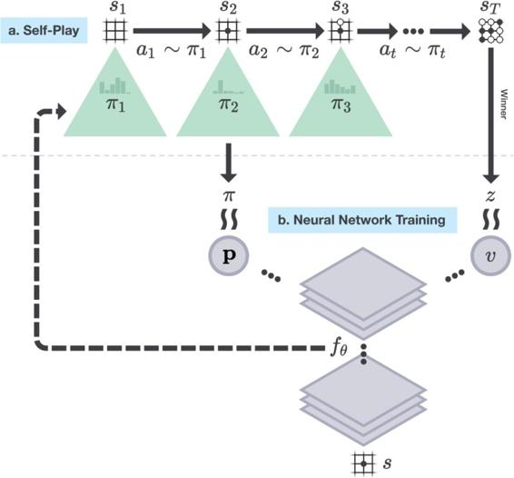

## 16.6.2  AlphaGo Zero

Building upon the experience with *AlphaGo*, a DeepMind team developed *AlphaGo Zero* (Silver et al. 2017a). In contrast to *AlphaGo*, this program used *no human data or guidance beyond the basic rules of the game* (hence the *Zero* in its name). It learned exclusively from self-play reinforcement learning, with input giving just “raw” descriptions of the placements of stones on the Go board. *AlphaGo Zero* implemented a form of policy iteration (Section 4.3), interleaving policy evaluation with policy improvement. [Figure 16.7](part0026_split_008.html#fig16-7) is an overview of *AlphaGo Zero*’s algorithm. A significant difference between *AlphaGo Zero* and *AlphaGo* is that *AlphaGo Zero* used MCTS to select moves throughout self-play reinforcement learning, whereas *AlphaGo* used MCTS for live play after—but not during—learning. Other differences besides not using any human data or human-crafted features are that *AlphaGo Zero* used only one deep convolutional ANN and used a simpler version of MCTS.

[Figure 16.7](part0026_split_008.html#C_fig16-7): *AlphaGo Zero* self-play reinforcement learning. a) The program played many games against itself, one shown here as a sequence of board positions *s**i*, *i* = 1, 2,..., *T*, with moves *a**i*, *i* = 1, 2,..., *T*, and winner *z*. Each move *a**i* was determined by action probabilities *π**i* returned by MCTS executed from root node *s**i* and guided by a deep convolutional network, here labeled *f**θ*, with latest weights *θ*. Shown here for just one position *s* but repeated for all *s**i*, the network’s inputs were raw representations of board positions *s**i* (together with several past positions, though not shown here), and its outputs were vectors **p** of move probabilities that guided MCTS’s forward searches, and scalar values *v* that estimated the probability of the current player winning from each position *s**i*. b) Deep convolutional network training. Training examples were randomly sampled steps from recent self-play games. Weights *θ* were updated to move the policy vector **p** toward the probabilities *π* returned by MCTS, and to include the winners *z* in the estimated win probability *v*. Reprinted from draft of Silver et al. (2017a) with permission of the authors and DeepMind.

*AlphaGo Zero*’s MCTS was simpler than the version used by *AlphaGo* in that it did not include rollouts of complete games, and therefore did not need a rollout policy. Each iteration of *AlphaGo Zero*’s MCTS ran a simulation that ended at a leaf node of the current search tree instead of at the terminal position of a complete game simulation. But as in *AlphaGo*, each iteration of MCTS in *AlphaGo Zero* was guided by the output of a deep convolutional network, labeled *f**θ* in [Figure 16.7](part0026_split_008.html#fig16-7), were *θ* is the network’s weight vector. The input to the network, whose architecture we describe below, consisted of raw representations of board positions, and its output had two parts: a scalar value, *v*, an estimate of the probability that the current player will win from from the current board position, and a vector, **p**, of move probabilities, one for each possible stone placement on the current board, plus the pass, or resign, move.

Instead of selecting self-play actions according to the probabilities **p**, however, *AlphaGo Zero* used these probabilities, together with the network’s value output, to direct each execution of MCTS, which returned new move probabilities, shown in [Figure 16.7](part0026_split_008.html#fig16-7) as the policies *π**i*. These policies benefitted from the many simulations that MCTS conducted each time it executed. The result was that the policy actually followed by *AlphaGo Zero* was an improvement over the policy given by the network’s outputs **p**. Silver et al. (2017a) wrote that “MCTS may therefore be viewed as a powerful *policy improvement* operator.”

Here is more detail about *AlphaGo Zero*’s ANN and how it was trained. The network took as input a 19 × 19 × 17 image stack consisting of 17 binary feature planes. The first 8 feature planes were raw representations of the positions of the current player’s stones in the current and seven past board configurations: a feature value was 1 if a player’s stone was on the corresponding point, and was 0 otherwise. The next 8 feature planes similarly coded the positions of the opponent’s stones. A final input feature plane had a constant value indicating the color of the current play: 1 for black; 0 for white. Because repetition is not allowed in Go and one player is given some number of “compensation points” for not getting the first move, the current board position is not a Markov state of Go. This is why features describing past board positions and the color feature were needed.

The network was “two-headed,” meaning that after a number of initial layers, the network split into two separate “heads” of additional layers that separately fed into two sets of output units. In this case, one head fed 362 output units producing 192 + 1 move probabilities **p**, one for each possible stone placement plus pass; the other head fed just one output unit producing the scalar *v*, an estimate of the probability that the current player will win from the current board position. The network before the split consisted of 41 convolutional layers, each followed by batch normalization, and with skip connections added to implement residual learning by pairs of layers (see Section 9.7). Overall, move probabilities and values were computed by 43 and 44 layers respectively.

Starting with random weights, the network was trained by stochastic gradient descent (with momentum, regularization, and step-size parameter decreasing as training continues) using batches of examples sampled uniformly at random from all the steps of the most recent 500,000 games of self-play with the current best policy. Extra noise was added to the network’s output **p** to encourage exploration of all possible moves. At periodic checkpoints during training, which Silver et al. (2017a) chose to be at every 1,000 training steps, the policy output by the ANN with the latest weights was evaluated by simulating 400 games (using MCTS with 1,600 iterations to select each move) against the current best policy. If the new policy won (by a margin set to reduce noise in the outcome), then it became the best policy to be used in subsequent self-play. The network’s weights were updated to make the network’s policy output **p** more closely match the policy returned by MCTS, and to make its value output, *v*, more closely match the probability that the current best policy wins from the board position represented by the network’s input.

The DeepMind team trained *AlphaGo Zero* over 4.9 million games of self-play, which took about 3 days. Each move of each game was selected by running MCTS for 1,600 iterations, taking approximately 0.4 second per move. Network weights were updated over 700,000 batches each consisting of 2,048 board configurations. They then ran tournaments with the trained *AlphaGo Zero* playing against the version of *AlphaGo* that defeated Fan Hui by 5 games to 0, and against the version that defeated Lee Sedol by 4 games to 1. They used the Elo rating system to evaluate the relative performances of the programs. The difference between two Elo ratings is meant to predict the outcome of games between the players. The Elo ratings of *AlphaGo Zero*, the version of *AlphaGo* that played against Fan Hui, and the version that played against Lee Sedol were respectively 4,308, 3,144, and 3,739. The gaps in these Elo ratings translate into predictions that *AlphaGo Zero* would defeat these other programs with probabilities very close to one. In a match of 100 games between *AlphaGo Zero*, trained as described, and the exact version of *AlphaGo* that defeated Lee Sedol held under the same conditions that were used in that match, *AlphaGo Zero* defeated *AlphaGo* in all 100 games.

The DeepMind team also compared *AlphaGo Zero* with a program using an ANN with the same architecture but trained by supervised learning to predict human moves in a data set containing nearly 30 million positions from 160,000 games. They found that the supervised-learning player initially played better than *AlphaGo Zero*, and was better at predicting human expert moves, but played less well after *AlphaGo Zero* was trained for a day. This suggested that *AlphaGo Zero* had discovered a strategy for playing that was different from how humans play. In fact, *AlphaGo Zero* discovered, and came to prefer, some novel variations of classical move sequences.

Final tests of *AlphaGo Zero*’s algorithm were conducted with a version having a larger ANN and trained over 29 million self-play games, which took about 40 days, again starting with random weights. This version achieved an Elo rating of 5,185. The team pitted this version of *AlphaGo Zero* against a program called *AlphaGo Master*, the strongest program at the time, that was identical to *AlphaGo Zero* but, like *AlphaGo*, used human data and features. *AlphaGo Master*’s Elo rating was 4,858, and it had defeated the strongest human professional players 60 to 0 in online games. In a 100 game match, *AlphaGo Zero* with the larger network and more extensive learning defeated *AlphaGo Master* 89 games to 11, thus providing a convincing demonstration of the problem-solving power of *AlphaGo Zero*’s algorithm.

*AlphaGo Zero* soundly demonstrated that superhuman performance can be achieved by pure reinforcement learning, augmented by a simple version of MCTS, and deep ANNs with very minimal knowledge of the domain and no reliance on human data or guidance. We will surely see systems inspired by the DeepMind accomplishments of both *AlphaGo* and *AlphaGo Zero* applied to challenging problems in other domains.

Recently, yet a better program, *AlphaZero*, was described by Silver et al. (2017b) that does not even incorporate knowledge of Go. *AlphaZero* is a general reinforcement learning algorithm that improves over the world’s hitherto best programs in the diverse games of Go, chess, and shogi.
