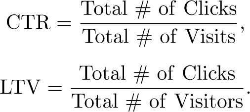
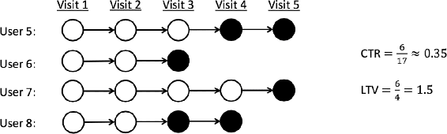

# 16.7  Personalized Web Services

Personalizing web services such as the delivery of news articles or advertisements is one approach to increasing users’ satisfaction with a website or to increase the yield of a marketing campaign. A policy can recommend content considered to be the best for each particular user based on a profile of that user’s interests and preferences inferred from their history of online activity. This is a natural domain for machine learning, and in particular, for reinforcement learning. A reinforcement learning system can improve a recommendation policy by making adjustments in response to user feedback. One way to obtain user feedback is by means of website satisfaction surveys, but for acquiring feedback in real time it is common to monitor user clicks as indicators of interest in a link.

A method long used in marketing called *A/B testing* is a simple type of reinforcement learning used to decide which of two versions, A or B, of a website users prefer. Because it is non-associative, like a two-armed bandit problem, this approach does not personalize content delivery. Adding context consisting of features describing individual users and the content to be delivered allows personalizing service. This has been formalized as a contextual bandit problem (or an associative reinforcement learning problem, Section 2.9) with the objective of maximizing the total number of user clicks. Li, Chu, Langford, and Schapire (2010) applied a contextual bandit algorithm to the problem of personalizing the Yahoo! Front Page Today webpage (one of the most visited pages on the internet at the time of their research) by selecting the news story to feature. Their objective was to maximize the *click-through rate* (CTR), which is the ratio of the total number of clicks all users make on a webpage to the total number of visits to the page. Their contextual bandit algorithm improved over a standard non-associative bandit algorithm by 12.5%.

Theocharous, Thomas, and Ghavamzadeh (2015) argued that better results are possible by formulating personalized recommendation as a Markov decision problem (MDP) with the objective of maximizing the total number of clicks users make over repeated visits to a website. Policies derived from the contextual bandit formulation are greedy in the sense that they do not take long-term effects of actions into account. These policies effectively treat each visit to a website as if it were made by a new visitor uniformly sampled from the population of the website’s visitors. By not using the fact that many users repeatedly visit the same websites, greedy policies do not take advantage of possibilities provided by long-term interactions with individual users.

As an example of how a marketing strategy might take advantage of long-term user interaction, Theocharous et al. contrasted a greedy policy with a longer-term policy for displaying ads for buying a product, say a car. The ad displayed by the greedy policy might offer a discount if the user buys the car immediately. A user either takes the offer or leaves the website, and if they ever return to the site, they would likely see the same offer. A longer-term policy, on the other hand, can transition the user “down a sales funnel” before presenting the final deal. It might start by describing the availability of favorable financing terms, then praise an excellent service department, and then, on the next visit, offer the final discount. This type of policy can result in more clicks by a user over repeated visits to the site, and if the policy is suitably designed, more eventual sales.

Working at Adobe Systems Incorporated, Theocharous et al. conducted experiments to see if policies designed to maximize clicks over the long term could in fact improve over short-term greedy policies. The Adobe Marketing Cloud, a set of tools that many companies use to run digital marketing campaigns, provides infrastructure for automating user-targed advertising and fund-raising campaigns. Actually deploying novel policies using these tools entails significant risk because a new policy may end up performing poorly. For this reason, the research team needed to assess what a policy’s performance would be if it were to be actually deployed, but to do so on the basis of data collected under the execution of other policies. A critical aspect of this research, then, was off-policy evaluation. Further, the team wanted to do this with high confidence to reduce the risk of deploying a new policy. Although high confidence off-policy evaluation was a central component of this research (see also Thomas, 2015; Thomas, Theocharous, and Ghavamzadeh, 2015), here we focus only on the algorithms and their results.

Theocharous et al. compared the results of two algorithms for learning ad recommendation policies. The first algorithm, which they called *greedy optimization*, had the goal of maximizing only the probability of immediate clicks. As in the standard contextual bandit formulation, this algorithm did not take the long-term effects of recommendations into account. The other algorithm, a reinforcement learning algorithm based on an MDP formulation, aimed at improving the number of clicks users made over multiple visits to a website. They called this latter algorithm *life-time value* (LTV) optimization. Both algorithms faced challenging problems because the reward signal in this domain is very sparse because users usually do not click on ads, and user clicking is very random so that returns have high variance.

Data sets from the banking industry were used for training and testing these algorithms. The data sets consisted of many complete trajectories of customer interaction with a bank’s website that showed each customer one out of a collection of possible offers. If a customer clicked, the reward was 1, and otherwise it was 0. One data set contained approximately 200,000 interactions from a month of a bank’s campaign that randomly offered one of 7 offers. The other data set from another bank’s campaign contained 4,000,000 interactions involving 12 possible offers. All interactions included customer features such as the time since the customer’s last visit to the website, the number of their visits so far, the last time the customer clicked, geographic location, one of a collection of interests, and features giving demographic information.

Greedy optimization was based on a mapping estimating the probability of a click as a function of user features. The mapping was learned via supervised learning from one of the data sets by means of a random forest (RF) algorithm (Breiman, 2001). RF algorithms have been widely used for large-scale applications in industry because they are effective predictive tools that tend not to overfit and are relatively insensitive to outliers and noise. Theocharous et al. then used the mapping to define an *ε*-greedy policy that selected with probability 1-*ε* the offer predicted by the RF algorithm to have the highest probability of producing a click, and otherwise selected from the other offers uniformly at random.

LTV optimization used a batch-mode reinforcement learning algorithm called *fitted Q iteration* (FQI). It is a variant of *fitted value iteration* (Gordon, 1999) adapted to Q-learning. Batch mode means that the entire data set for learning is available from the start, as opposed to the online mode of the algorithms we focus on in this book in which data are acquired sequentially while the learning algorithm executes. Batch-mode reinforcement learning algorithms are sometimes necessary when online learning is not practical, and they can use any batch-mode supervised learning regression algorithm, including algorithms known to scale well to high-dimensional spaces. The convergence of FQI depends on properties of the function approximation algorithm (Gordon, 1999). For their application to LTV optimization, Theocharous et al. used the same RF algorithm they used for the greedy optimization approach. Because in this case FQI convergence is not monotonic, Theocharous et al. kept track of the best FQI policy by off-policy evaluation using a validation training set. The final policy for testing the LTV approach was the *ε*-greedy policy based on the best policy produced by FQI with the initial action-value function set to the mapping produced by the RF for the greedy optimization approach.

To measure the performance of the policies produced by the greedy and LTV approaches, Theocharous et al. used the CTR metric and a metric they called the LTV metric. These metrics are similar, except that the LTV metric critically distinguishes between individual website visitors:

[Figure 16.8](part0026_split_009.html#fig16-8) illustrates how these metrics differ. Each circle represents a user visit to the site; black circles are visits at which the user clicks. Each row represents visits by a particular user. By not distinguishing between visitors, the CTR for these sequences is 0.35, whereas the LTV is 1.5. Because LTV is larger than CTR to the extent that individual users revisit the site, it is an indicator of how successful a policy is in encouraging users to engage in extended interactions with the site.

[Figure 16.8](part0026_split_009.html#C_fig16-8): Click through rate (CTR) versus life-time value (LTV). Each circle represents a user visit; black circles are visits at which the user clicks. Adapted from Theocharous et al. (2015).

Testing the policies produced by the greedy and LTV approaches was done using a high confidence off-policy evaluation method on a test data set consisting of real-world interactions with a bank website served by a random policy. As expected, results showed that greedy optimization performed best as measured by the CTR metric, while LTV optimization performed best as measured by the LTV metric. Furthermore—although we have omitted its details—the high confidence off-policy evaluation method provided probabilistic guarantees that the LTV optimization method would, with high probability, produce policies that improve upon policies currently deployed. Assured by these probabilistic guarantees, Adobe announced in 2016 that the new LTV algorithm would be a standard component of the Adobe Marketing Cloud so that a retailer could issue a sequence of offers following a policy likely to yield higher return than a policy that is insensitive to long-term results.
