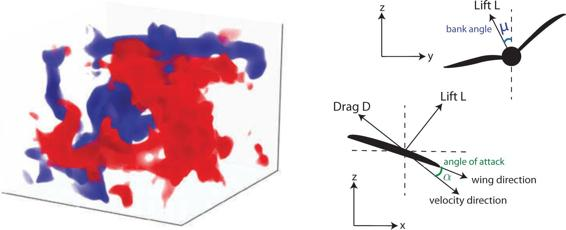
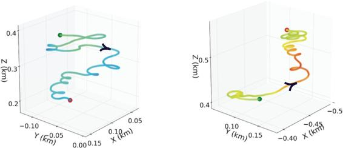

# 16.8  Thermal Soaring

Birds and gliders take advantage of upward air currents—thermals—to gain altitude in order to maintain flight while expending little, or no, energy. Thermal soaring, as this behavior is called, is a complex skill requiring responding to subtle environmental cues to increase altitude by exploiting a rising column of air for as long as possible. Reddy, Celani, Sejnowski, and Vergassola (2016) used reinforcement learning to investigate thermal soaring policies that are effective in the strong atmospheric turbulence usually accompanying rising air currents. Their primary goal was to provide insight into the cues birds sense and how they use them to achieve their impressive thermal soaring performance, but the results also contribute to technology relevant to autonomous gliders. Reinforcement learning had previously been applied to the problem of navigating efficiently to the vicinity of a thermal updraft (Woodbury, Dunn, and Valasek, 2014) but not to the more challenging problem of soaring within the turbulence of the updraft itself.

Reddy et al. modeled the soaring problem as a continuing MDP with discounting. The agent interacted with a detailed model of a glider flying in turbulent air. They devoted significant effort toward making the model generate realistic thermal soaring conditions, including investigating several different approaches to atmospheric modeling. For the learning experiments, air flow in a three-dimensional box with one kilometer sides, one of which was at ground level, was modeled by a sophisticated physics-based set of partial differential equations involving air velocity, temperature, and pressure. Introducing small random perturbations into the numerical simulation caused the model to produce analogs of thermal updrafts and accompanying turbulence ([Figure 16.9](part0026_split_010.html#fig16-9) Left) Glider flight was modeled by aerodynamic equations involving velocity, lift, drag, and other factors governing powerless flight of a fixed-wing aircraft. Maneuvering the glider involved changing its angle of attack (the angle between the glider’s wing and the direction of air flow) and its bank angle ([Figure 16.9](part0026_split_010.html#fig16-9) Right).

[Figure 16.9](part0026_split_010.html#C_fig16-9): Thermal soaring model: Left: snapshot of the vertical velocity field of the simulated cube of air: in red (blue) is a region of large upward (downward) flow. Right: diagram of powerless flight showing bank angle *μ* and angle of attack *α*. Adapted with permission From PNAS vol. 113(22), p. E4879, 2016, Reddy, Celani, Sejnowski, and Vergassola, Learning to Soar in Turbulent Environments.

The interface between the agent and the environment required defining the agent’s actions, the state information the agent receives from the environment, and the reward signal. By experimenting with various possibilities, Reddy et al. decided that three actions each for the angle of attack and the bank angle were enough for their purposes: increment or decrement the current bank angle and angle of attack by 5*°* and 2.5*°*, respectively, or leave them unchanged. This resulted in 32 possible actions. The bank angle was bounded to remain between − 15*°* and + 15*°*.

Because a goal of their study was to try to determine what minimal set of sensory cues are necessary for effective soaring, both to shed light on the cues birds might use for soaring and to minimize the sensing complexity required for automated glider soaring, the authors tried various sets of signals as input to the reinforcement learning agent. They started by using state aggregation (Section 9.3) of a four-dimensional state space with dimensions giving local vertical wind speed, local vertical wind acceleration, torque depending on the difference between the vertical wind velocities at the left and right wing tips, and the local temperature. Each dimension was discretized into three bins: positive high, negative high, and small. Results, described below, showed that only two of these dimensions were critical for effective soaring behavior.

The overall objective of thermal soaring is to gain as much altitude as possible from each rising column of air. Reddy et al. tried a straightforward reward signal that rewarded the agent at the end of each episode based on the altitude gained over the episode, a large negative reward signal if the glider touched the ground, and zero otherwise. They found that learning was not successful with this reward signal for episodes of realistic duration and that eligibility traces did not help. By experimenting with various reward signals, they found that learning was best with a reward signal that at each time step linearly combined the vertical wind velocity and vertical wind acceleration observed on the previous time step.

Learning was by one-step Sarsa, with actions selected according to a soft-max distribution based on normalized action values. Specifically, the action probabilities were computed according to ([13.2](part0022_split_001.html#x1-150001r2)) with action preferences:

where ***θ*** is a parameter vector with one component for each action and aggregated group of states, and  (*s, a,* ***θ***) merely returned the component corresponding to *s, a* in the usual way for state aggregation methods. The above equation forms the action preferences by normalizing the approximate action values to the interval [0, 1] then dividing by *τ*, a positive “temperature parameter.”[3](part0026_split_011.html#fn3x19) As *τ* increases, the probability of selecting an action becomes less dependent on its preference; as *τ* decreases toward zero, the probability of selecting the most highly-preferred action approaches one, making the policy approach the greedy policy. The temperature parameter *τ* was initialized to 2.0 and incrementally decreased to 0.2 during learning. Action preferences were computed from the current estimates of the action values. The action with the maximum estimated action value was given preference 1*/τ*, the action with the minimum estimated action value was given preference 0, and the preferences of the other actions were scaled between these extremes. The step-size and discount-rate parameters were fixed at 0.1 and 0.98 respectively.

Each learning episode took place with the agent controlling simulated flight in an independently generated period of simulated turbulent air currents. Each episode lasted 2.5 minutes simulated with a 1 second time step. Learning effectively converged after a few hundred episodes. The left panel of [Figure 16.10](part0026_split_010.html#fig16-10) shows a sample trajectory before learning where the agent selects actions randomly. Starting at the top of the volume shown, the glider’s trajectory is in the direction indicated by the arrow and quickly loses altitude. [Figure 16.10](part0026_split_010.html#fig16-10)’s right panel is a trajectory after learning. The glider starts at the same place (here appearing at the bottom of the volume) and gains altitude by spiraling within the rising column of air. Although Reddy et al. found that performance varied widely over different simulated periods of air flow, the number of times the glider touched the ground consistently decreased to nearly zero as learning progressed.

[Figure 16.10](part0026_split_010.html#C_fig16-10): Sample thermal soaring trajectories, with arrows showing the direction of flight from the same starting point (note that the altitude scales are shifted). Left: before learning: the agent selects actions randomly and the glider descends. Right: after learning: the glider gains altitude by following a spiral trajectory. Adapted with permission from PNAS vol. 113(22), p. E4879, 2016, Reddy, Celani, Sejnowski, and Vergassola, Learning to Soar in Turbulent Environments.

After experimenting with different sets of features available to the learning agent, it turned out that the combination of just vertical wind acceleration and torques worked best. The authors conjectured that because these features give information about the gradient of vertical wind velocity in two different directions, they allow the controller to select between turning by changing the bank angle or continuing along the same course by leaving the bank angle alone. This allows the glider to stay within a rising column of air. Vertical wind velocity is indicative of the strength of the thermal but does not help in staying within the flow. They found that sensitivity to temperature was of little help. They also found that controlling the angle of attack is not helpful in staying within a particular thermal, being useful instead for traveling between thermals when covering large distances, as in cross-country gliding and bird migration.

Due to the fact that soaring in different levels of turbulence requires different policies, training was done in conditions ranging from weak to strong turbulence. In strong turbulence the rapidly changing wind and glider velocities allowed less time for the controller to react. This reduced the amount of control possible compared to what was possible for maneuvering when fluctuations were weak. Reddy et al. examined the policies Sarsa learned under these different conditions. Common to policies learned in all regimes were these features: when sensing negative wind acceleration, bank sharply in the direction of the wing with the higher lift; when sensing large positive wind acceleration and no torque, do nothing. However, different levels of turbulence led to policy differences. Policies learned in strong turbulence were more conservative in that they preferred small bank angles, whereas in weak turbulence, the best action was to turn as much as possible by banking sharply. Systematic study of the bank angles preferred by the policies learned under the different conditions led the authors to suggest that by detecting when vertical wind acceleration crosses a certain threshold the controller can adjust its policy to cope with different turbulence regimes.

Reddy et al. also conducted experiments to investigate the effect of the discount-rate parameter *γ* on the performance of the learned policies. They found that the altitude gained in an episode increased as *γ* increased, reaching a maximum for *γ* =.99, suggesting that effective thermal soaring requires taking into account long-term effects of control decisions.

This computational study of thermal soaring illustrates how reinforcement learning can further progress toward different kinds of objectives. Learning policies having access to different sets of environmental cues and control actions contributes to both the engineering objective of designing autonomous gliders and the scientific objective of improving understanding of the soaring skills of birds. In both cases, hypotheses resulting from the learning experiments can be tested in the field by instrumenting real gliders and by comparing predictions with observed bird soaring behavior.
