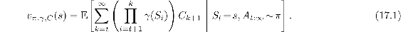

# 17.1  General Value Functions and Auxiliary Tasks

Over the course of this book, our notion of value function has become quite general. With off-policy learning we allowed a value function to be conditional on an arbitrary target policy. Then in Section 12.8 we generalized discounting to a *termination function γ* : 𝒮 ⟼ [0, 1], so that a different discount rate could be applied at each time step in determining the return ([12.17](part0021_split_008.html#x1-142001r17)). This allowed us to express predictions about how much reward we will get over an arbitrary, state-dependent horizon. The next, and perhaps final, step is to generalize beyond rewards to permit predictions about arbitrary signals. Rather than predicting the sum of future rewards, we might predict the sum of the future values of a sound or color sensation, or of an internal, highly processed signal such as another prediction. Whatever signal is added up in this way in a value-function-like prediction, we call it the *cumulant* of that prediction. We formalize it in a *cumulant signal C**t* ∈ ℝ. Using this, a *general value function*, or GVF, is written

As with conventional value functions (such as *vπ* or *q*\*) this is an ideal function that we seek to approximate with a parameterized form, which we might continue to denote  (*s,* **w**), although of course there would have to be a different **w** for each prediction, that is, for each choice of *π*, *γ*, and *C**t*. Because a GVF has no necessary connection to reward, it is perhaps a misnomer to call it a *value* function. One could simply call it a prediction or, to make it more distinctive, a *forecast* (Ring, in preparation). Whatever it is called, it is in the form of a value function and thus can be learned in the usual ways using the methods developed in this book for learning approximate value functions. Along with the learned predictions, we might also learn policies to maximize the predictions in the usual ways by Generalized Policy Iteration (Section 4.6) or by actor–critic methods. In this way an agent could learn to predict and control great numbers of signals, not just long-term reward.

Why might it be useful to predict and control signals other than long-term reward? These are *auxiliary* tasks in that they are extra, in-addition-to, the main task of maximizing reward. One answer is that the ability to predict and control a diverse multitude of signals can constitute a powerful kind of environmental model. As we saw in Chapter 8, a good model can enable the agent to get reward more efficiently. It takes a couple of further concepts to develop this answer clearly, so we postpone it to the next section. First let’s consider two simpler ways in which a multitude of diverse predictions can be helpful to a reinforcement learning agent.

One simple way in which auxiliary tasks can help on the main task is that they may require some of the same representations as are needed on the main task. Some of the auxiliary tasks may be easier, with less delay and a clearer connection between actions and outcomes. If good features can be found early on easy auxilary tasks, then those features may significantly speed learning on the main task. There is no necessary reason why this has to be true, but in many cases it seems plausible. For example, if you learn to predict and control your sensors over short time scales, say seconds, then you might plausibly come up with part of the idea of objects, which would then greatly help with the prediction and control of long-term reward.

We might imagine an artificial neural network (ANN) in which the last layer is split into multiple parts, or *heads*, each working on a different task. One head might produce the approximate value function for the main task (with reward as its cumulant) whereas the others would produce solutions to various auxilary tasks. All heads could propagate errors by stochastic gradient descent into the same body—the shared preceding part of the network—which would then try to form representations, in its next-to-last layer, to support all the heads. Researchers have experimented with auxiliary tasks such as predicting change in pixels, predicting the next time step’s reward, and predicting the distribution of the return. In many cases this approach has been shown to greatly accelerate learning on the main task (Jaderberg et al., 2017). Multiple predictions have similarly been repeatedly proposed as a way of directing the construction of state estimates (see Section 17.3).

Another simple way in which the learning of auxiliary tasks can improve performance is best explained by analogy to the psychological phenomena of classical conditioning (Section 14.2). One way of understanding classical conditioning is that evolution has built in a reflexive (non-learned) association to a particular action from the prediction of a particular signal. For example, humans and many other animals appear to have a built-in reflex to blink whenever their prediction of being poked in the eye exceeds some threshold. The prediction is learned, but the association from prediction to eye closure is built in, and thus the animal is saved many unprotected pokes in its eye. Similarly, the association from fear to increased heart rate, or to freezing, can be built in. Agent designers can do something similar, connecting by design (without learning) predictions of specific events to predetermined actions. For example, a self-driving car that learns to predict whether going forward will produce a collision could be given a built-in reflex to stop, or to turn away, whenever the prediction is above some threshold. Or consider a vacuum-cleaning robot that learned to predict whether it might run out of battery power before returning to the charger and that reflexively headed back to the charger whenever the prediction became non-zero. The correct prediction would depend on the size of the house, the room the robot was in, and the age of the battery, all of which would be hard for the robot designer to know. It would be difficult for the designer to build in a reliable algorithm for deciding whether to head back to the charger in sensory terms, but it might be easy to do this in terms of the learned prediction. We foresee many possible ways like this in which learned predictions might combine usefully with built-in algorithms for controlling behavior.

Finally, perhaps the most important role for auxiliary tasks is in moving beyond the assumption we have made throughout this book that the state representation is fixed and given to the agent. To explain this role, we first have to take a few steps back to appreciate the magnitude of this assumption and the implications of removing it. We do that in Section 17.3.
