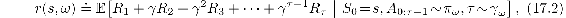
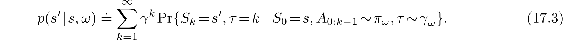
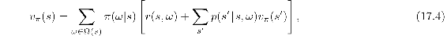
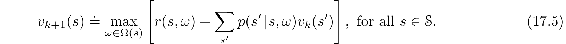

# 17.2  Temporal Abstraction via Options

An appealing aspect of the MDP formalism is that it can be applied usefully to tasks at many different time scales. One can use it to formalize the task of deciding which muscles to twitch to grasp an object, which airplane flight to take to arrive conveniently at a distant city, and which job to take to lead a satisfying life. These tasks differ greatly in their time scales, yet each can be usefully formulated as an MDP that can be solved by planning or learning processes as described in this book. All involve interaction with the world, sequential decision making, and a goal usefully conceived of as accumulating rewards over time, and so all can be formulated as MDPs.

Although all these tasks can be formulated as MDPs, one might think that they cannot be formulated as a *single* MDP. They involve such different time scales, such different notions of choice and action! It would be no good, for example, to plan a flight across a continent at the level of muscle twitches. Yet for other tasks, grasping, throwing darts, or hitting a baseball, low-level muscle twitches may be just the right level. People do all these things seamlessly without appearing to switch between levels. Can the MDP framework be stretched to cover all the levels simultaneously?

Perhaps it can. One popular idea is to formalize an MDP at a detailed level, with a small time step, yet enable planning at higher levels using extended courses of action that correspond to many base-level time steps. To do this we need a notion of course of action that extends over many time steps and includes a notion of termination. A general way to formulate these two ideas is as a policy, *π*, and a state-dependent termination function, *γ*, as in GVFs. We define a pair of these as a generalized notion of action termed an *option*. To execute an option *ω* = ⟨*π**ω**, γ**ω*⟩ at time *t* is to obtain the action to take, *A**t*, from *π**ω*(·|*S**t*), then terminate at time *t* + 1 with probability *γ**ω*(*S**t*+1). If the option does not terminate at *t* + 1, then *A**t*+1 is selected from *π**ω*(·|*S**t*+1), and the option terminates at *t* + 2 with probability *γ**ω*(*S**t*+2), and so on until eventual termination. It is convenient to consider low-level actions to be special cases of options—each action *a* corresponds to an option ⟨*π**ω**, γ**ω*⟩ whose policy picks the action (*π**ω*(*s*) = *a* for all *s* ∈𝒮) and whose termination function is zero (*γ**ω*(*s*) = 0 for all *s* ∈𝒮+). Options effectively extend the action space. The agent can either select a low-level action/option, terminating after one time step, or select an extended option that might execute for many time steps before terminating.

Options are designed so that they are interchangable with low-level actions. For example, the notion of an action-value function *qπ* naturally generalizes to an *option*-value function that takes a state and option as input and returns the expected return starting from that state, executing that option to termination, and thereafter following the policy, *π*. We can also generalize the notion of policy to a *hierarchical policy* that selects from options rather than actions, where options, when selected, execute until termination. With these ideas, many of the algorithms in this book can be generalized to learn approximate option-value functions and hierarchical policies. In the simplest case, the learning process ‘jumps’ from option initiation to option termination, with an update only occurring when an option terminates. More subtly, updates can be made on each time step, using “intra-option” learning algorithms, which in general require off-policy learning.

Perhaps the most important generalization made possible by option ideas is that of the environmental model as developed in Chapters 3, 4, and 8. The conventional model of an action is the state-transition probabilities and the expected immediate reward for taking the action in each state. How do conventional action models generalize to *option models*? For options, the appropriate model is again of two parts, one corresponding to the state transition resulting from executing the option and one corresponding to the expected cumulative reward along the way. The reward part of an option model, analogous to the expected reward for state–action pairs ([3.5](part0011_split_001.html#x1-28010r5)), is

for all options *ω* and all states *s* ∈ 𝒮, where *τ* is the random time step at which the option terminates according to *γ**ω*. Note the role of the overall discounting parameter *γ* in this equation—discounting is according to *γ*, but termination of the option is according to *γ**ω*. The state-transition part of an option model is a little more subtle. This part of the model characterizes the probability of each possible resulting state (as in ([3.4](part0011_split_001.html#x1-28009r4))), but now this state may result after various numbers of time steps, each of which must be discounted differently. The model for option *ω* specifies, for each state *s* that *ω* might start executing in, and for each state *s*′ that *ω* might terminate in,

Note that, because of the factor of *γ**k*, this *p*(*s*′|*s, ω*) is no longer a transition probability and no longer sums to one over all values of *s*′. (Nevertheless, we continue to use the ‘|’ notation in *p*.)

The above definition of the transition part of an option model allows us to formulate Bellman equations and dynamic programming algorithms that apply to all options, including low-level actions as a special case. For example, the general Bellman equation for the state values of a hierarchical policy *π* is

where Ω(*s*) denotes the set of options available in state *s*. If Ω(*s*) includes only the low-level actions, then this equation reduces to a version of the usual Bellman equation ([3.14](part0011_split_005.html#x1-32005r14)), except of course *γ* is included in the new *p* ([17.3](part0027_split_002.html#x1-201002r3)) and thus does not appear. Similarly, the corresponding planning algorithms also have no *γ*. For example, the value iteration algorithm with options, analogous to (4.10), is

If Ω(*s*) includes all the low-level actions available in each *s*, then this algorithm converges to the conventional *v*\*, from which the optimal policy can be computed. However, it is particularly useful to plan with options when only a subset of the possible options are considered (in Ω(*s*)) in each state. Value iteration will then converge to the best hierarchical policy limited to the restricted set of options. Although this policy may be sub-optimal, convergence can be much faster because fewer options are considered and because each option can jump over many time steps.

To plan with options, one must either be given the option models, or learn them. One natural way to learn an option model is to formulate it as a collection of GVFs (as defined in the preceding section) and then learn the GVFs using the methods presented in this book. It is not difficult to see how this could be done for the reward part of the option model. One merely chooses one GVF’s cumulant to be the reward (*C**t* = *R**t*), its policy to be the the option’s policy (*π* = *π**ω*), and its termination function to be the discount rate times the option’s termination function (*γ*(*s*) = *γ* · *γ**ω*(*s*)). The true GVF then equals the reward part of the option model, *v**π, γ , C*(*s*) = *r*(*s, ω*), and the learning methods described in this book can be used to approximate it. The state-transition part of the option model is only a little more complicated. One needs to allocate one GVF for each state that the option might terminate in. We don’t want these GVFs to accumulate anything except when the option terminates, and then only when the termination is in the appropriate state. This can be achieved by choosing the cumulant of the GVF that predicts transition to state *s*′ to be *C**t* = *γ* (*S**t*) ·𝟙*S**t* = . The GVF’s policy and termination functions are chosen the same as for the reward part of the option model. The true GVF then equals the *s*′ portion of the option’s state-transition model, *v**π, γ , C*(*s*) = *p*(*s*′ | *s, ω*), and again this book’s methods could be employed to learn it. Although each of these steps is seemingly natural, putting them all together (including function approximation and other essential components) is quite challenging and beyond the current state of the art.

*Exercise 17.1* This section has presented options for the discounted case, but discounting is arguably inappropriate for control when using function approximation (Section 10.4). What is the natural Bellman equation for a hierarchical policy, analogous to ([17.4](part0027_split_002.html#x1-201003r4)), but for the average reward setting (Section 10.3)? What are the two parts of the option model, analogous to ([17.2](part0027_split_002.html#x1-201001r2)) and ([17.3](part0027_split_002.html#x1-201002r3)), for the average reward setting?

□
