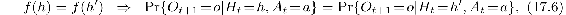
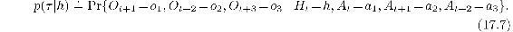
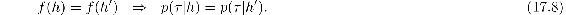
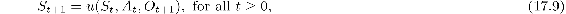
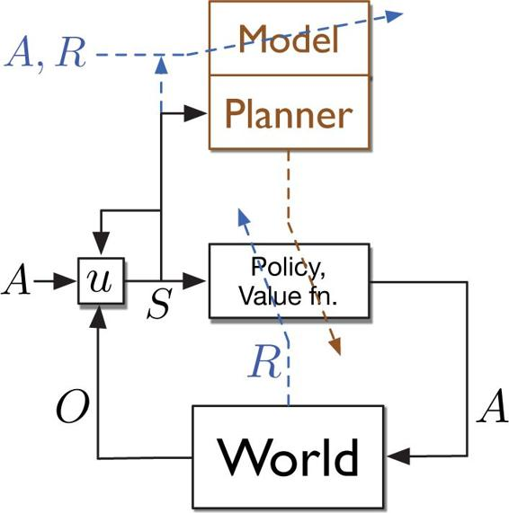
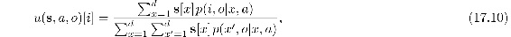

# 17.3  Observations and State

Throughout this book we have written the learned approximate value functions (and the policies in Chapter 13) as functions of the environment’s state. This is a significant limitation of the methods presented in Part I, in which the learned value function was implemented as a table such that any value function could be exactly approximated; that case is tantamount to assuming that the state of the environment is completely observed by the agent. But in many cases of interest, and certainly in the lives of all natural intelligences, the sensory input gives only partial information about the state of the world. Some objects may be occluded by others, or behind the agent, or miles away. In these cases, potentially important aspects of the environment’s state are not directly observable, and it is a strong, unrealistic, and limiting assumption to assume that the learned value function is implemented as a table over the environment’s state space.

The framework of parametric function approximation that we developed in Part II is far less restrictive and, arguably, no limitation at all. In Part II we retained the assumption that the learned value functions (and policies) are functions of the environment’s state, but allowed these functions to be arbitrarily restricted by the parameterization. It is somewhat surprising and not widely recognized that function approximation includes important aspects of partial observability. For example, if there is a state variable that is not observable, then the parameterization can be chosen such that the approximate value does not depend on that state variable. The effect is just as if the state variable were not observable. Because of this, all the results obtained for the parameterized case apply to partial observability without change. In this sense, the case of parameterized function approximation includes the case of partial observability.

Nevertheless, there are many issues that cannot be investigated without a more explicit treatment of partial observability. Although we cannot give them a full treatment here, we can outline the changes that would be needed to do so. There are four steps.

First, we would change the problem. The environment would emit not its states, but only *observations*—signals that depend on its state but, like a robot’s sensors, provide only partial information about it. For convenience, without loss of generality, we assume that the reward is a direct, known function of the observation (perhaps the observation is a vector, and the reward is one of is components). The environmental interaction would then have no explicit states or rewards, but would simply be an alternating sequence of actions *A**t* ∈ 𝒜 and observations *O**t* ∈ 𝒪:

going on forever (cf. [Equation 3.1](part0011_split_001.html#x1-28006r1)) or forming episodes each ending with a special terminal observation.

Second, we can recover the idea of state as used in this book from the sequence of observations and actions. Let us use the word *history*, and the notation *H**t*, for an initial portion of the trajectory up to an observation: *H**t* ≐ *A*0*, O*1*, …, A**t*−1*, O**t*. The history represents the most that we can know about the past without looking outside of the data stream (because the history is the whole past data stream). Of course, the history grows with *t* and can become large and unwieldy. The idea of state is that of some compact summary of the history that is as useful as the actual history for predicting the future. Let us be clear about exactly what this means. To be a summary of the history, the state must be a function of history, *S**t* = *f*(*H**t*), and to be as useful for predicting the future as the whole history, it must have what is known as the *Markov property*. Formally, this is a property of the function *f*. A function *f* has the Markov property if and only if any two histories *h* and *h*′ that are mapped by *f* to the same state (*f*(*h*) = *f*(*h*′)) also have the same probabilities for their next observation,

for all *o* ∈ 𝒪 and *a* ∈ 𝒜. If *f* is Markov, then *S**t* = *f*(*H**t*) is a state as we have used the term in this book. Let us henceforth call it a *Markov state* to distinguish it from states that are summaries of the history but fall short of the Markov property (which we will consider shortly).

A Markov state is a good basis for predicting the next observation ([17.6](part0027_split_003.html#x1-202002r6)) but, more importantly, it is also a good basis for predicting or controlling *anything*. For example, let a *test* be any specific sequence of alternating actions and observations that might occur in the future. For example, a three-step test is denoted *τ* = *a*1 *o*1 *a*2*, o*2*, a*3*, o*3. The probability of this test given a specific history *h* is defined as

If *f* is Markov and *h* and *h*′ are any two histories that map to the same state under *f*, then for any test *τ* of any length, its probabilities given the two histories must also be the same:

In other words, a Markov state summarizes all the information in the history necessary for determining any test’s probability. In fact, it summarizes all that is necessary for making *any prediction*, including any GVF, and for behaving optimally (if *f* is Markov, then there is always a deterministic function *π* such that choosing *A**t* ≐ *π*(*f*(*H**t*)) is optimal).

The third step in extending reinforcement learning to partial observability is to deal with certain computational considerations. In particular, we want the state to be a *compact* summary of the history. For example, the identity function completely satisfies the conditions for a Markov *f*, but would nevertheless be of little use because the corresponding state *S**t* = *H**t* would grow with time and become unwieldy, as mentioned earlier, but more fundamentally because it would never recur; the agent would never encounter the same state twice (in a continuing task) and thus could never benefit from a tabular learning method. We want our states to be compact as well as Markov. There is a similar issue regarding how state is obtained and updated. We don’t really want a function *f* that takes whole histories. Instead, for computational reasons we prefer to obtain the same effect as *f* with an incremental, recursive update that computes *S**t*+1 from *S**t*, incorporating the next increment of data, *A**t* and *O**t*+1:

with the first state *S*0 given. The function *u* is called the *state-update* function. For example, if *f* were the identity (*S**t* = *H**t*), then *u* would merely extend *S**t* by appending *A**t* and *O**t*+1 to it. Given *f*, it is always possible to construct a corresponding *u*, but it may not be computationally convenient and, as in the identity example, it may not produce a compact state. The state-update function is a central part of any agent architecture that handles partial observability. It must be efficiently computable, as no actions or predictions can be made until the state is available. An overall diagram of such an agent architecture is given in [Figure 17.1](part0027_split_003.html#fig17-1).

[Figure 17.1](part0027_split_003.html#C_fig17-1): A conceptual agent architecture including a model, a planner, and a state-update function. The world in this case receives actions *A* and emits observations *O*. The observations and a copy of the action are used by the state-update function *u* to produce the new state. The new state is input to the policy and value function, producing the next action, and is also input to the planner (and to *u*). The information flows most responsible for learning are shown by dashed lines that pass diagonally across the boxes that they change. The reward *R* directly changes the policy and value function. The action, reward, and state change the model, which works closely with the planner to also change the policy and value function. Note that the operation of the planner can be decoupled from the agent–environment interaction, whereas the other processes should operate in lock step with this interaction to keep up with the arrival of new data. Also note that the model and planner do not deal with observations directly, but only with the states produced by *u*, which can act as targets for model learning.

An example of obtaining Markov states through a state-update function is provided by the popular Bayesian approach known as *Partially Observable MDPs*, or *POMDPs*. In this approach the environment is assumed to have a well defined *latent state X**t* that underlies and produces the environment’s observations, but is never available to the agent (and is not to be confused with the state *S**t* used by the agent to make predictions and decisions). The natural Markov state, *S**t*, for a POMDP is the *distribution* over the latent states given the history, called the *belief state*. For concreteness, assume the usual case in which there are a finite number of hidden states, *X**t* ∈{1, 2*, …, d*}. Then the belief state is the vector *S**t* ≐ **s***t* ∈ ℝ*d* with components

The belief state remains the same size (same number of components) however *t* grows. It can also be incrementally updated by Bayes’ rule, assuming one has complete knowledge of the internal workings of the environment. Specifically, the *i*th component of the belief-state update function is

for all *a* ∈ 𝒜, *o* ∈ 𝒪, and belief states **s** ∈ ℝ*d* with components **s**[*x*], where the four-argument *p* function here is not the usual one for MDPs (as in Chapter 3), but the analogous one for POMDPs, in terms of the *latent* state: *p*(*x*', *o*|*x*, *a*) ≐ Pr{*X**t* = *x*', *O**t* = *o* |*X**t*–11 = *x*, *A**t–1* = *a*}. This approach is popular in theoretical work and has many significant applications, but its assumptions and computational complexity scale poorly and we do not recommend it as an approach to artificial intelligence.

Another example of Markov states is provided by *Predictive State Representations*, or *PSRs*. PSRs address the weakness of the POMDP approach that the semantics of its agent state *S**t* are grounded in the environment state, *X**t*, which is never observed and thus is difficult to learn about. In PSRs and related approaches, the semantics of the agent state is instead grounded in predictions about future observations and actions, which are readily observable. In PSRs, a Markov state is defined as a *d*-vector of the probabilities of *d* specially chosen “core” tests as defined above ([17.7](part0027_split_003.html#x1-202003r7)). The vector is then updated by a state-update function *u* that is analogous to Bayes rule, but with a semantics grounded in observable data, which arguably makes it easier to learn. This approach has been extended in many ways, including end-tests, compositional tests, powerful “spectral” methods, and closed-loop and temporally abstract tests learned by TD methods. Some of the best theoretical developments are for systems known as *Observable Operator Models* (OOMs) and Sequential Systems (Thon, 2017).

The fourth and final step in our brief outline of how to handle partial observability in reinforcement learning is to re-introduce approximation. As discussed in the introduction to Part II, to approach artificial intelligence ambitiously one must embrace approximation. This is just as true for states as it is for value functions. We must accept and work with an approximate notion of state. The approximate state will play the same role in our algorithms as before, so we continue to use the notation *S**t* for the state used by the agent, even though it may not be Markov.

Perhaps the simplest example of an approximate state is just the latest observation, *S**t* ≐ *O**t*. Of course this approach cannot handle any hidden state information. It would be better to use the last *k* observations and actions, *S**t* ≐ *O**t**, A**t*−1*, O**t*−1*, …, A**t*−*k*, for some *k* ≥ 1, which can be achieved by a state-update function that just shifts the new data in and the oldest data out. This *kth-order history* approach is still very simple, but can greatly increase the agent’s capabilities compared to trying to use the single immediate observation directly as the state.

What happens when the Markov property ([17.6](part0027_split_003.html#x1-202002r6)) is only approximately satisfied? Unfortunately, long-term prediction performance can degrade dramatically when the one-step predictions defining the Markov property become even slightly inaccurate. Longer-term tests, GVFs, and state-update functions may all approximate poorly. The short-term and long-term approximation objectives are just different, and there are no useful theoretical guarantees at present.

Nevertheless, there are still reasons to think that the general idea outlined in this section applies to the approximate case. The general idea is that a state that is good for some predictions is also good for others (in particular, that a Markov state, sufficient for one-step predictions, is also sufficient for all others). If we step back from that specific result for the Markov case, the general idea is similar to what we discussed in Section 17.1 with multi-headed learning and auxiliary tasks. We discussed how representations that were good for the auxiliary tasks were often also good for the main task. Taken together, these suggest an approach to both partial observability and representation learning in which multiple predictions are pursued and used to direct the construction of state features. The guarantee provided by the perfect-but-impractical Markov property is replaced by the heuristic that what’s good for some predictions may be good for others. This approach scales well with computational resources. With a large machine one could experiment with large numbers of predictions, perhaps favoring those that are most similar to the ones of ultimate interest or that are easiest to learn reliably, or according to some other criteria. It is important here to move beyond selecting the predictions manually. The agent should do it. This would require a general language for predictions, so that the agent can systematically explore a large space of possible predictions, sifting through them for the ones that are most useful.

In particular, both POMDP and PSR approaches can be applied with approximate states. The semantics of the state is useful in forming the state-update function, as it is in these two approaches and in the *k*-order approach. There is not a strong need for the semantics to be correct in order to retain useful information in the state. Some approaches to state augmentation, such as Echo state networks (Jaeger, 2002), keep almost arbitrary information about the history and can nevertheless perform well. There are many possibilities and we expect more work and ideas in this area. Learning the state-update function for an approximate state is a major part of the representation learning problem as it arises in reinforcement learning.
