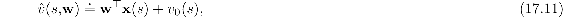

# 17.4  Designing Reward Signals

A major advantage of reinforcement learning over supervised learning is that reinforcement learning does not rely on detailed instructional information: generating a reward signal does not depend on knowledge of what the agent’s correct actions should be. But the success of a reinforcement learning application strongly depends on how well the reward signal frames the goal of the application’s designer and how well the signal assesses progress in reaching that goal. For these reasons, designing a reward signal is a critical part of any application of reinforcement learning.

By designing a reward signal we mean designing the part of an agent’s environment that is responsible for computing each scalar reward *R**t* and sending it to the agent at each time *t*. In our discussion of terminology at the end of Chapter 14, we said that *R**t* is more like a signal generated inside an animal’s brain than it is like an object or event in the animal’s external environment. The parts of our brains that generate these signals for us evolved over millions of years to be well suited to the challenges our ancestors had to face in their struggles to propagate their genes to future generations. We should therefore not think that designing a good reward signal is always an easy thing to do!

One challenge is to design a reward signal so that as an agent learns, its behavior approaches, and ideally eventually achieves, what the application’s designer actually desires. This can be easy if the designer’s goal is simple and easy to identify, such as finding the solution to a well-defined problem or earning a high score in a well-defined game. In cases like these, it is usual to reward the agent according to its success in solving the problem or its success in improving its score. But some problems involve goals that are difficult to translate into reward signals. This is especially true when the problem requires the agent to skillfully perform a complex task or set of tasks, such as would be required of a useful household robotic assistant. Further, reinforcement learning agents can discover unexpected ways to make their environments deliver reward, some of which might be undesirable, or even dangerous. This is a longstanding and critical challenge for any method, like reinforcement learning, that is based on optimization. We discuss this issue more in Section 17.6, the final section of this book.

Even when there is a simple and easily identifiable goal, the problem of *sparse reward* often arises. Delivering non-zero reward frequently enough to allow the agent to achieve the goal once, let alone to learn to achieve it efficiently from multiple initial conditions, can be a daunting challenge. State–action pairs that clearly deserve to trigger reward may be few and far between, and rewards that mark progress toward a goal can be infrequent because progress is difficult or even impossible to detect. The agent may wander aimlessly for long periods of time (what Minsky, 1961, called the “plateau problem”).

In practice, designing a reward signal is often left to an informal trial-and-error search for a signal that produces acceptable results. If the agent fails to learn, learns too slowly, or learns the wrong thing, then the designer tweaks the reward signal and tries again. To do this, the designer judges the agent’s performance by criteria that he or she is attempting to translate into a reward signal so that the agent’s goal matches his or her own. And if learning is too slow, the designer may try to design a non-sparse reward signal that effectively guides learning throughout the agent’s interaction with its environment.

It is tempting to address the sparse reward problem by rewarding the agent for achieving subgoals that the designer thinks are important way stations to the overall goal. But augmenting the reward signal with well-intentioned supplemental rewards may lead the agent to behave very differently from what is intended; the agent may end up not achieving the overall goal at all. A better way to provide such guidance is to leave the reward signal alone and instead augment the value-function approximation with an initial guess of what it should ultimately be, or augment it with initial guesses as to what certain parts of it should be. For example, suppose one wants to offer *v*0 : 𝒮 *→* ℝ as an initial guess at the true optimal value function *v*\*, and that one is using linear function approx. with features **x** : 𝒮 *→* ℝ*d*. Then one would define the initial value function approximation to be

and update the weights **w** as usual. If the initial weight vector is **0**, then the initial value function will be *v*0, but the asymptotic solution quality will be determined by the feature vectors as usual. This initialization can be done for arbitrary nonlinear approximators and arbitrary forms of *v*0, though it is not guaranteed to always accelerate learning.

A particularly effective approach to the sparse reward problem is the *shaping* technique introduced by the psychologist B. F. Skinner and described in Section 14.3. The effectiveness of this technique relies on the fact that sparse reward problems are not just problems with the reward signal; they are also problems with an agent’s policy in preventing the agent from frequently encountering rewarding states. Shaping involves changing the reward signal as learning proceeds, starting from a reward signal that is not sparse given the agent’s initial behavior, and gradually modifying it toward the reward signal suited to problem of original interest. Each modification is made so that the agent is frequently rewarded given its current behavior. The agent faces a sequence of increasingly-difficult reinforcement learning problems, where what is learned at each stage makes the next-harder problem relatively easy because the agent now encounters reward more frequently than it would if it did not have prior experience with easier problems. This kind of shaping is an essential technique in training animals, and it is effective in computational reinforcement learning as well.

What if one has no idea what the rewards should be but there is another agent, perhaps a person, who is already expert at the task and whose behavior can be observed? In this case one can use methods known variously as “imitation learning,” “learning from demonstration,” and “apprenticeship learning.” The idea here is to benefit from the expert agent but leave open the possibility of eventually performing better. Learning from an expert’s behavior can be done either by learning directly by supervised learning or by extracting a reward signal using what is known as “inverse reinforcement learning” and then using a reinforcement learning algorithm with that reward signal to learn a policy. The task of inverse reinforcement learning as explored by Ng and Russell (2000) is to try to recover the expert’s reward signal from the expert’s behavior alone. This cannot be done exactly because a policy can be optimal with respect to many different reward signals (for example, any reward signal that gives the same reward for all states and actions), but it is possible to find plausible reward signal candidates. Unfortunately, strong assumptions are required, including knowledge of the environment’s dynamics and of the feature vectors in which the reward signal is linear. The method also requires completely solving the problem (e.g., by dynamic programming methods) multiple times. These difficulties notwithstanding, Abbeel and Ng (2004) argue that the inverse reinforcement learning approach can sometimes be more effective than supervised learning for benefiting from the behavior of an expert.

Another approach to finding a good reward signal is to automate the trial-and-error search for a good signal that we mentioned above. From an application perspective, the reward signal is a parameter of the learning algorithm. As is true for other algorithm parameters, the search for a good reward signal can be automated by defining a space of feasible candidates and applying an optimization algorithm. The optimization algorithm evaluates each candidate reward signal by running the reinforcement learning system with that signal for some number of steps, and then scoring the overall result by a “high-level” objective function intended to encode the designer’s true goal, ignoring the limitations of the agent. Reward signals can even be improved via online gradient ascent, where the gradient is that of the high-level objective function (Sorg, Lewis, and Singh, 2010). Relating this approach to the natural world, the algorithm for optimizing the high-level objective function is analogous to evolution, where the high-level objective function is an animal’s evolutionary fitness determined by the number of its offspring that survive to reproductive age.

Computational experiments with this bilevel optimization approach—one level analogous to evolution, and the other due to reinforcement learning by individual agents—have confirmed that intuition alone is not always adequate to devise a good reward signal (Singh, Lewis, and Barto, 2009). The performance of a reinforcement learning agent as evaluated by the high-level objective function can be very sensitive to details of the agent’s reward signal in subtle ways determined by the agent’s limitations and the environments in which it acts and learns. These experiments also demonstrated that an agent’s goal should not always be the same as the goal of the agent’s designer.

At first this seems counterintuitive, but it may be impossible for the agent to achieve the designer’s goal no matter what its reward signal is. The agent has to learn under various kinds of constraints, such as limited computational power, limited access to information about its environment, or limited time to learn. When there are constraints like these, learning to achieve a goal that is different from the designer’s goal can sometimes end up getting closer to the designer’s goal than if that goal were pursued directly (Sorg, Singh, and Lewis, 2010; Sorg, 2011). Examples of this in the natural world are easy to find. Because we cannot directly assess the nutritional value of most foods, evolution—the designer of our reward signal—gave us a reward signal that makes us seek certain tastes. Though certainly not infallible (indeed, possibly detrimental in environments that differ in certain ways from ancestral environments), this compensates for many of our limitations: our limited sensory abilities, the limited time over which we can learn, and the risks involved in finding a healthy diet through personal experimentation. Similarly, because an animal cannot observe its own evolutionary fitness, that objective function does not work as a reward signal for learning. Evolution instead provides reward signals that are sensitive to observable predictors of evolutionary fitness.

Finally, remember that a reinforcement learning agent is not necessarily like a complete organism or robot; it can be a component of a larger behaving system. This means that reward signals may be influenced by things inside the larger behaving agent, such as motivational states, memories, ideas, or even hallucinations. Reward signals may also depend on properties of the learning process itself, such as measures of how much progress learning is making. Making reward signals sensitive to information about internal factors such as these makes it possible for an agent to learn how to control the “cognitive architecture” of which it is a part, as well as to acquire knowledge and skills that would be difficult to learn from a reward signal that depended only on external events. Possibilities like these led to the idea of “intrinsically-motivated reinforcement learning” that we briefly discuss further at the end of the following section.
